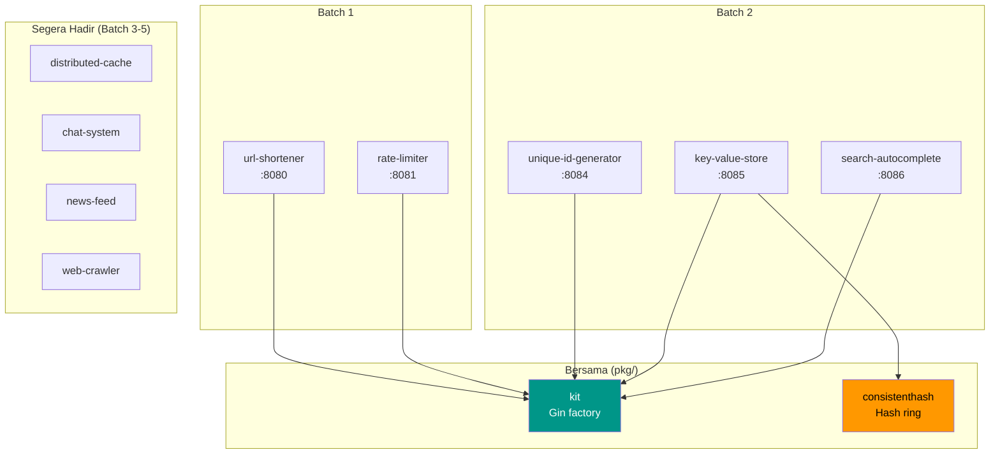
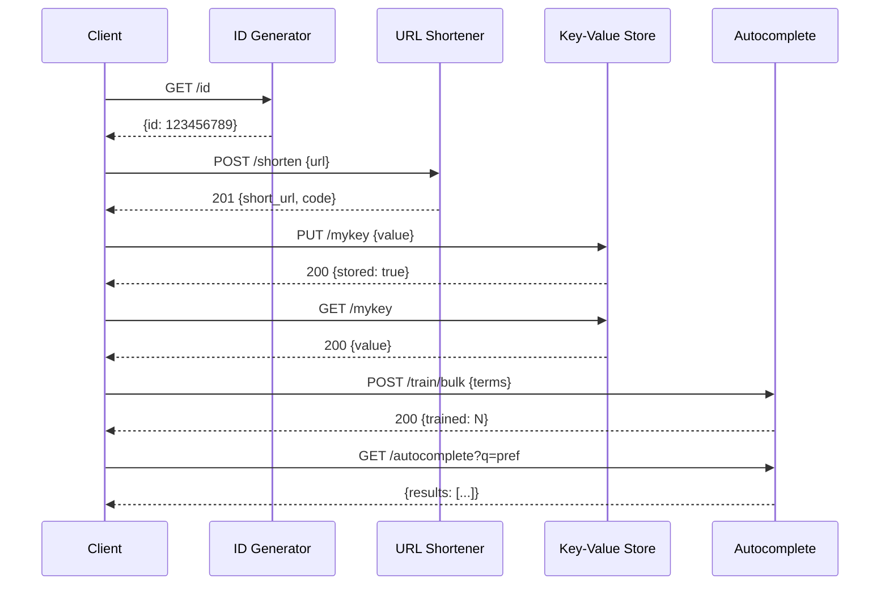

# faisalaffan-design-system

[English](README.md)

## 01_LOGO

<p align="center">
  
</p>

## 02_BANNER

<p align="center">
  
</p>

---

Go monorepo berisi implementasi latihan system design. Setiap folder adalah service standalone dengan entrypoint sendiri.

## Arsitektur





## Struktur

```
├── url-shortener/          # Layanan URL shortener (:8080)
│   ├── handler/            # Gin HTTP handler
│   ├── service/            # Logika bisnis
│   ├── storage/            # Interface storage + in-memory
│   └── shortcode/          # Generator kode acak base62
├── rate-limiter/           # Layanan rate limiter (:8081)
│   ├── algorithm/          # Token bucket, sliding window, fixed window
│   └── storage/            # Interface counter store + in-memory
├── unique-id-generator/    # Generator ID Snowflake (:8084)
│   ├── snowflake/          # ID 64-bit: timestamp + worker + sequence
│   └── handler/            # GET /id
├── key-value-store/        # KV store terdistribusi (:8085)
│   ├── storage/            # Interface store + in-memory
│   ├── shard/              # Shard manager dengan consistent hashing
│   └── handler/            # GET/PUT/DELETE /:key
├── search-autocomplete/    # Layanan autocomplete (:8086)
│   ├── trie/               # Prefix tree concurrent-safe
│   └── handler/            # GET /autocomplete, POST /train
├── distributed-cache/      # — segera
├── chat-system/            # — segera
└── pkg/                    # Komponen bersama
    ├── kit/                # Gin factory, config, response helper, middleware
    └── consistenthash/     # Consistent hashing dengan virtual nodes
```

## Menjalankan

```bash
go run ./url-shortener          # :8080
go run ./rate-limiter           # :8081
go run ./unique-id-generator    # :8084
go run ./key-value-store        # :8085
go run ./search-autocomplete    # :8086

go test ./...                   # 48 tes di 25 package
go build ./...                  # Build semua
go vet ./...                    # Vet semua
```

## Dependensi

```bash
docker compose up -d       # Redis + Postgres (untuk problem mendatang)
```

## Keputusan Teknis

| Keputusan | Alasan |
|-----------|--------|
| **Gin Gonic** | Framework HTTP Go tercepat. Ekosistem middleware kuat. Produktif tanpa korbankan performa. |
| **Interface-first storage** | Setiap layanan mendefinisikan interface `Storage`. Default in-memory, bisa ditukar ke Redis/Postgres tanpa ubah handler. |
| **Single `go.mod`** | Repo portfolio solo. Versi dependency bersama. Multi-module berlebihan untuk skala ini. |
| **Base62 random shortcode** | 7 karakter dari [a-zA-Z0-9] = ~3.5 triliun kombinasi. Acak + retry lebih simpel dari hash URL. |
| **Sliding window rate limiting** | Lebih presisi dari fixed window. Profil memori lebih baik dari token bucket untuk high-cardinality keys. |
| **Virtual nodes (150 replika)** | Consistent hashing dengan 150 virtual node. `crc32` untuk kecepatan — cukup uniform. |
| **Snowflake 64-bit ID** | Timestamp(41) + Worker(10) + Sequence(12) = 4096 ID/ms/worker, ~69 tahun masa pakai. Tanpa koordinasi. |
| **Trie-based autocomplete** | Pencarian prefix O(k) di mana k = panjang input. Top-K berdasarkan frekuensi + tiebreak leksikografis. Concurrent-safe untuk read. |
| **Graceful shutdown** | Setiap layanan tangani SIGINT/SIGTERM dengan timeout 5 detik. Pola production di kode latihan. |
