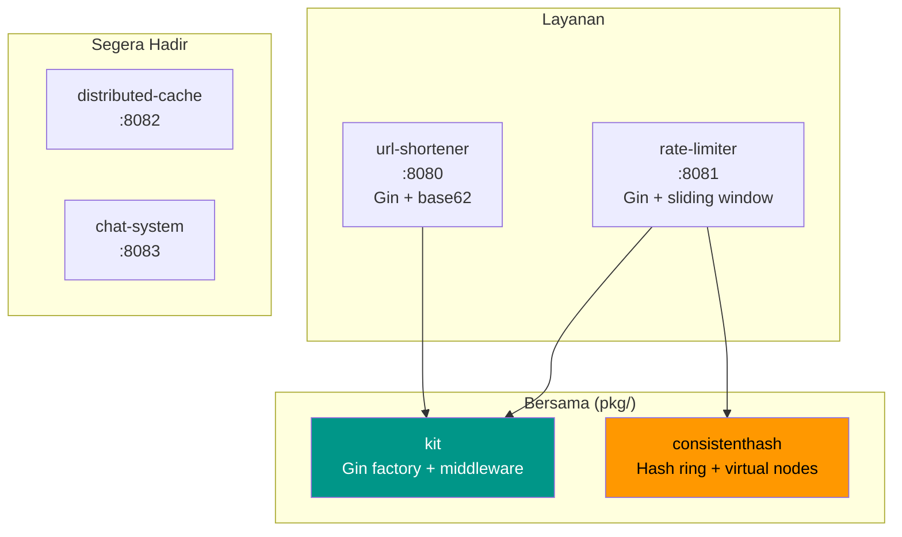
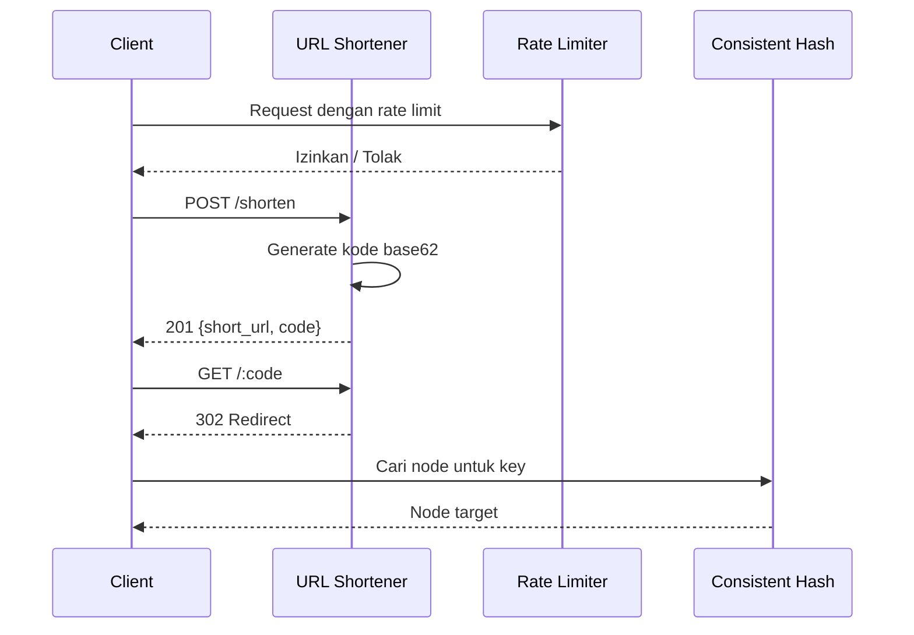

# faisalaffan-design-system

[English](README.md)

## 01_LOGO

<p align="center">
  
</p>

## 02_BANNER

<p align="center">
  
</p>

---

Go monorepo berisi implementasi latihan system design. Setiap folder adalah service standalone dengan entrypoint sendiri.

## Arsitektur





## Struktur

```
├── url-shortener/       # Layanan URL shortener (:8080)
│   ├── handler/         # Gin HTTP handler
│   ├── service/         # Logika bisnis
│   ├── storage/         # Interface storage + implementasi in-memory
│   └── shortcode/       # Generator kode acak base62
├── rate-limiter/        # Layanan rate limiter (:8081)
│   ├── algorithm/       # Token bucket, sliding window, fixed window
│   └── storage/         # Interface counter store + implementasi in-memory
├── distributed-cache/   # Distributed cache (:8082) — segera
├── chat-system/         # Sistem chat (:8083) — segera
└── pkg/                 # Komponen bersama
    ├── kit/             # Gin factory, config, response helper, middleware
    └── consistenthash/  # Consistent hashing dengan virtual nodes
```

## Menjalankan

```bash
go run ./url-shortener     # :8080
go run ./rate-limiter      # :8081

go test ./...              # Jalankan semua tes
go build ./...             # Build semua
go vet ./...               # Vet semua
```

## Dependensi

```bash
docker compose up -d       # Redis + Postgres (untuk problem mendatang)
```

## Keputusan Teknis

| Keputusan | Alasan |
|-----------|--------|
| **Gin Gonic** | Framework HTTP Go tercepat. Ekosistem middleware kuat. Produktif tanpa korbankan performa. |
| **Interface-first storage** | Setiap layanan mendefinisikan interface `Storage`. Default in-memory, bisa ditukar ke Redis/Postgres tanpa ubah handler. |
| **Single `go.mod`** | Repo portfolio solo. Versi dependency bersama. Multi-module berlebihan untuk skala ini. |
| **Base62 random shortcode** | 7 karakter dari [a-zA-Z0-9] = ~3.5 triliun kombinasi. Acak + retry lebih simpel dari hash URL, hindari race condition URL sama. |
| **Sliding window rate limiting** | Algoritma default. Lebih presisi dari fixed window (tidak ada burst di batas window). Profil memori lebih baik dari token bucket untuk high-cardinality keys. |
| **Virtual nodes (150 replika)** | Consistent hashing dengan 150 virtual node per physical node. `crc32` untuk kecepatan — cukup uniform untuk use case non-kripto. |
| **Graceful shutdown** | Setiap layanan tangani SIGINT/SIGTERM dengan timeout 5 detik. Pola production walau di kode latihan. |
