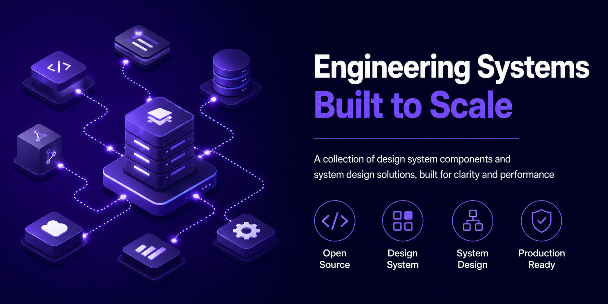
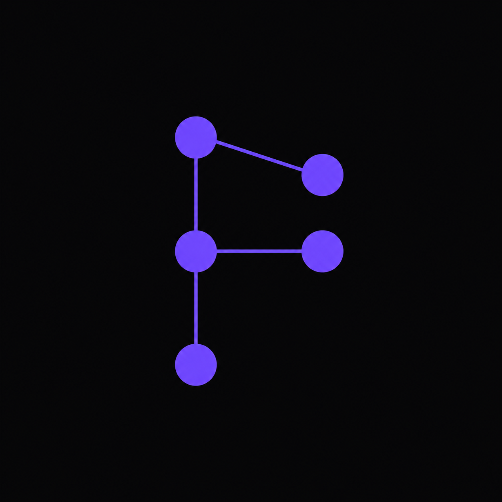

# faisalaffan-design-system

<p align="center">
  <a href="README.md">🇬🇧 English</a>
</p>

<p align="center">
  
</p>

<p align="center">
  
</p>

---

Go monorepo mengimplementasikan semua 12 problem system design dari "System Design Interview" (2nd Ed) karya Alex Xu, didukung teori dari "Designing Data-Intensive Applications" karya Kleppmann.

**196 tes | 88 package | 22 layanan | 2 paket bersama**

## Layanan

| # | Layanan | Port | Pola Utama | Batch |
|---|---------|------|-----------|-------|
| 1 | **url-shortener** | 8080 | Base62 + collision retry | 1 |
| 2 | **rate-limiter** | 8081 | Sliding window + token bucket | 1 |
| 3 | **chat-system** | 8082 | WebSocket rooms + broadcast | 3 |
| 4 | **notification-system** | 8083 | Pub/sub + multi-channel | 3 |
| 5 | **unique-id-generator** | 8084 | Snowflake 64-bit | 2 |
| 6 | **key-value-store** | 8085 | Consistent hashing sharding | 2 |
| 7 | **search-autocomplete** | 8086 | Trie + top-K frekuensi | 2 |
| 8 | **news-feed** | 8087 | Fan-out on write | 4 |
| 9 | **web-crawler** | 8088 | BFS + politeness + dedup | 4 |
| 10 | **youtube** | 8089 | Metadata + search + transcode | 5 |
| 11 | **google-drive** | 8090 | File + folder + versioning | 5 |

### Q-Commerce

| # | Layanan | Port | Pola Utama |
|---|---------|------|-----------|
| 12 | **inventory-service** | 8100 | Redis Lua atomic reservation, dual-store, TTL reaper |
| 13 | **geo-service** | 8101 | H3 hexagon indexing, haversine tie-breaking |
| 14 | **flash-sale** | 8102 | Stock buckets, waiting room, HMAC attestation |
| 15 | **checkout-service** | 8103 | Saga orchestration, outbox, idempotency |
| 16 | **promo-engine** | 8104 | AST rule tree, Redis Lua counters, fraud detection |
| 17 | **dispatch-service** | 8105 | Batch collector, greedy matcher, driver state machine |
| 18 | **eta-service** | 8106 | Concurrent estimation, Kalman, sticky ETA cache |
| 19 | **search-service** | 8107 | Multi-match ranking, trie autocomplete, composite score |
| 20 | **tracking-service** | 8108 | WebSocket ingestion, Kalman filter, SSE push |
| 21 | **pricing-service** | 8109 | Surge detection, price lock, elasticity tracker |

## Menjalankan

```bash
go run ./services/url-shortener          # :8080
go run ./services/rate-limiter           # :8081
go run ./services/chat-system            # :8082
go run ./services/notification-system    # :8083
go run ./services/unique-id-generator    # :8084
go run ./services/key-value-store        # :8085
go run ./services/search-autocomplete    # :8086
go run ./services/news-feed              # :8087
go run ./services/web-crawler            # :8088
go run ./services/youtube                # :8089
go run ./services/google-drive           # :8090
go run ./services/inventory-service      # :8100
go run ./services/geo-service            # :8101
go run ./services/flash-sale             # :8102
go run ./services/checkout-service       # :8103
go run ./services/promo-engine           # :8104
go run ./services/dispatch-service       # :8105
go run ./services/eta-service            # :8106
go run ./services/search-service         # :8107
go run ./services/tracking-service       # :8108
go run ./services/pricing-service        # :8109

go test ./...                   # 196 tes di 88 package
go build ./...                  # Build semua
go vet ./...                    # Vet semua
```

## Dependensi

```bash
docker compose up -d       # Redis + Postgres (untuk persistensi mendatang)
```

## Keputusan Teknis

| Keputusan | Alasan |
|-----------|--------|
| **Gin Gonic** | Framework HTTP Go tercepat. Ekosistem middleware kuat. Produktif tanpa korbankan performa. |
| **Interface-first storage** | Setiap layanan mendefinisikan interface `Storage`. Default in-memory, bisa ditukar ke Redis/Postgres tanpa ubah handler. |
| **Single `go.mod`** | Repo portfolio solo. Versi dependency bersama. Multi-module berlebihan untuk skala ini. |
| **Base62 random shortcode** | 7 karakter dari [a-zA-Z0-9] = ~3.5 triliun kombinasi. Acak + retry lebih simpel dari hash URL. |
| **Sliding window rate limiting** | Lebih presisi dari fixed window. Profil memori lebih baik dari token bucket untuk high-cardinality keys. |
| **Virtual nodes (150 replika)** | Consistent hashing dengan 150 virtual node. `crc32` untuk kecepatan — cukup uniform. |
| **Snowflake 64-bit ID** | Timestamp(41) + Worker(10) + Sequence(12) = 4096 ID/ms/worker, ~69 tahun masa pakai. Tanpa koordinasi. |
| **Trie-based autocomplete** | Pencarian prefix O(k). Top-K berdasarkan frekuensi + tiebreak leksikografis. Concurrent-safe untuk read. |
| **Fan-out on write** | Push post baru ke timeline semua follower saat write. Tradeoff write amplification untuk instant timeline reads. |
| **BFS crawler dengan politeness** | URL frontier berbasis channel. Delay per domain. Ekstraksi link HTML via `golang.org/x/net/html`. |
| **WebSocket rooms** | Room event loop berbasis goroutine (channel join/leave/broadcast). Riwayat pesan ring buffer (100 msg cap). |
| **Notifikasi multi-channel** | Interface Sender: in-app (tersimpan), email, push (simulasi). Pub/sub mendekopel publisher dari delivery. |
| **Transcoding simulasi** | Pemrosesan video async berbasis goroutine. State machine: uploading → processing → ready. |
| **File versioning** | Riwayat versi immutable per file. Setiap update menambah versi baru. Konten lama dipertahankan untuk rollback. |
| **Graceful shutdown** | Setiap layanan menangani SIGINT/SIGTERM dengan timeout 5 detik. Pola production di kode latihan. |
