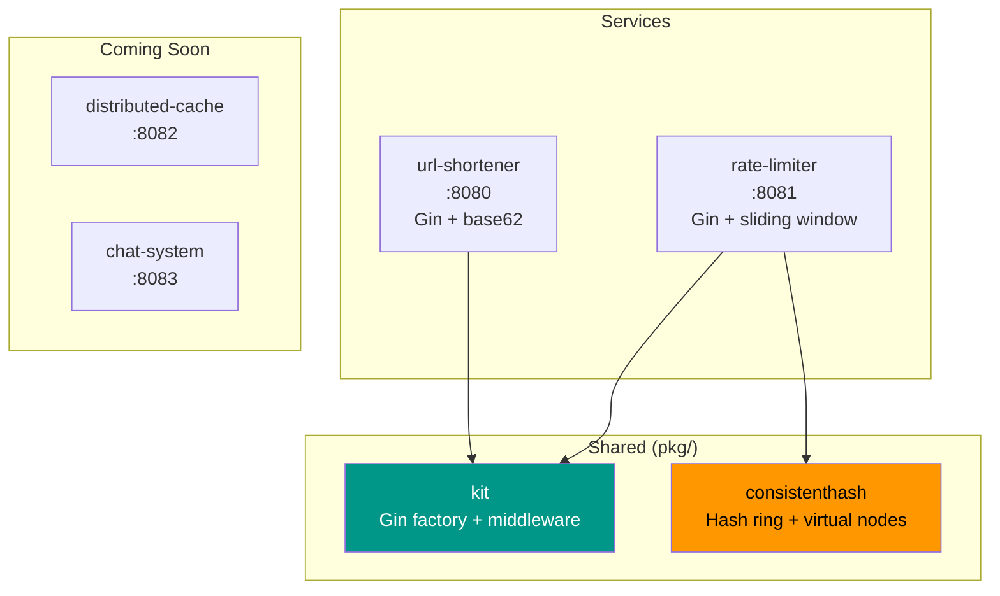
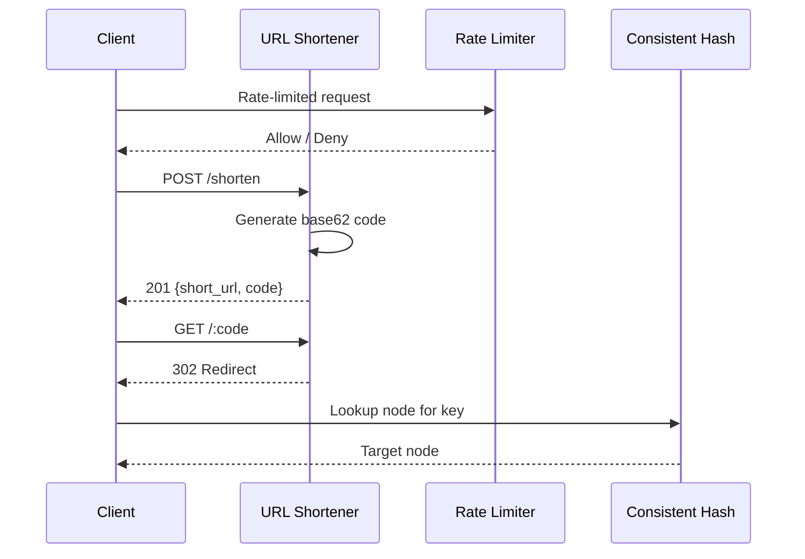

# faisalaffan-design-system

[Bahasa Indonesia](README.id.md)

Go monorepo for system design exercise implementations. Each folder is a standalone service with its own entrypoint.

## Architecture





## Structure

```
├── url-shortener/       # URL shortener service (:8080)
│   ├── handler/         # Gin HTTP handlers
│   ├── service/         # Business logic
│   ├── storage/         # Storage interface + in-memory impl
│   └── shortcode/       # Base62 random code generator
├── rate-limiter/        # Rate limiter service (:8081)
│   ├── algorithm/       # Token bucket, sliding window, fixed window
│   └── storage/         # Counter store interface + in-memory impl
├── distributed-cache/   # Distributed cache (:8082) — soon
├── chat-system/         # Chat system (:8083) — soon
└── pkg/                 # Shared components
    ├── kit/             # Gin factory, config, response helpers, middleware
    └── consistenthash/  # Consistent hashing with virtual nodes
```

## Running

```bash
go run ./url-shortener     # :8080
go run ./rate-limiter      # :8081

go test ./...              # Run all tests
go build ./...             # Build all
go vet ./...               # Vet all
```

## Dependencies

```bash
docker compose up -d       # Redis + Postgres (for future problems)
```

## Design Decisions

| Decision | Rationale |
|----------|-----------|
| **Gin Gonic** | Fastest Go HTTP framework. Middleware ecosystem. Productive without sacrificing performance. |
| **Interface-first storage** | Every service defines a `Storage` interface. In-memory default, swappable to Redis/Postgres with zero handler changes. |
| **Single `go.mod`** | Solo portfolio repo. Shared dependency versions. Multi-module overkill for this scale. |
| **Base62 random shortcode** | 7 chars from [a-zA-Z0-9] = ~3.5 trillion combinations. Random + retry simpler than URL hashing, avoids same-URL race conditions. |
| **Sliding window rate limiting** | Default algorithm. More precise than fixed window (no edge-of-window burst). Better memory profile than token bucket for high-cardinality keys. |
| **Virtual nodes (150 replicas)** | Consistent hashing with 150 virtual nodes per physical node. `crc32` for speed — sufficient uniformity for non-crypto use case. |
| **Graceful shutdown** | Each service handles SIGINT/SIGTERM with 5s timeout. Production pattern even in exercise code. |
