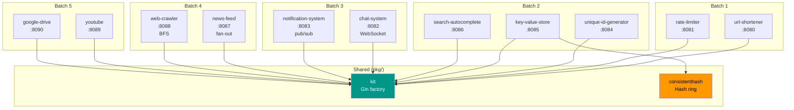

# faisalaffan-design-system

<p align="center">
  <a href="README.id.md">🇮🇩 Bahasa Indonesia</a>
</p>

<p align="center">
  
</p>

<p align="center">
  
</p>

---

Go monorepo implementing all 12 system design problems from Alex Xu's "System Design Interview" (2nd Ed), backed by theory from Kleppmann's "Designing Data-Intensive Applications".

**100 tests | 44 packages | 12 services | 2 shared packages**

## Architecture



## Services

| # | Service | Port | Core Pattern | Batch |
|---|---------|------|-------------|-------|
| 1 | **url-shortener** | 8080 | Base62 + collision retry | 1 |
| 2 | **rate-limiter** | 8081 | Sliding window + token bucket | 1 |
| 3 | **chat-system** | 8082 | WebSocket rooms + broadcast | 3 |
| 4 | **notification-system** | 8083 | Pub/sub + multi-channel | 3 |
| 5 | **unique-id-generator** | 8084 | Snowflake 64-bit | 2 |
| 6 | **key-value-store** | 8085 | Consistent hashing sharding | 2 |
| 7 | **search-autocomplete** | 8086 | Trie + top-K frequency | 2 |
| 8 | **news-feed** | 8087 | Fan-out on write | 4 |
| 9 | **web-crawler** | 8088 | BFS + politeness + dedup | 4 |
| 10 | **youtube** | 8089 | Metadata + search + transcode | 5 |
| 11 | **google-drive** | 8090 | Files + folders + versioning | 5 |

## Running

```bash
go run ./url-shortener          # :8080
go run ./rate-limiter           # :8081
go run ./chat-system            # :8082
go run ./notification-system    # :8083
go run ./unique-id-generator    # :8084
go run ./key-value-store        # :8085
go run ./search-autocomplete    # :8086
go run ./news-feed              # :8087
go run ./web-crawler            # :8088
go run ./youtube                # :8089
go run ./google-drive           # :8090

go test ./...                   # 100 tests across 44 packages
go build ./...                  # Build all
go vet ./...                    # Vet all
```

## Dependencies

```bash
docker compose up -d       # Redis + Postgres (for future persistence)
```

## Design Decisions

| Decision | Rationale |
|----------|-----------|
| **Gin Gonic** | Fastest Go HTTP framework. Middleware ecosystem. Productive without sacrificing performance. |
| **Interface-first storage** | Every service defines a `Storage` interface. In-memory default, swappable to Redis/Postgres with zero handler changes. |
| **Single `go.mod`** | Solo portfolio repo. Shared dependency versions. Multi-module overkill for this scale. |
| **Base62 random shortcode** | 7 chars from [a-zA-Z0-9] = ~3.5 trillion combinations. Random + retry simpler than URL hashing. |
| **Sliding window rate limiting** | More precise than fixed window. Better memory profile than token bucket for high-cardinality keys. |
| **Virtual nodes (150 replicas)** | Consistent hashing with 150 virtual nodes. `crc32` for speed — sufficient uniformity. |
| **Snowflake 64-bit IDs** | Timestamp(41) + Worker(10) + Sequence(12) = 4096 IDs/ms/worker, ~69 year lifetime. No coordination needed. |
| **Trie-based autocomplete** | O(k) prefix search. Top-K by frequency with lexicographic tiebreak. Concurrent-safe reads. |
| **Fan-out on write** | Push new posts to all follower timelines at write time. Trade write amplification for instant timeline reads. |
| **BFS crawler with politeness** | Channel-based URL frontier. Per-domain delay. HTML link extraction via `golang.org/x/net/html`. |
| **WebSocket rooms** | Goroutine-based room event loop (join/leave/broadcast channels). Message history ring buffer (100 msg cap). |
| **Multi-channel notification** | Sender interface: in-app (persisted), email, push (simulated). Pub/sub decouples publishers from delivery. |
| **Simulated transcoding** | Goroutine-based async video processing. State machine: uploading → processing → ready. |
| **File versioning** | Immutable version history per file. Each update appends new version. Old content retained for rollback. |
| **Graceful shutdown** | Every service handles SIGINT/SIGTERM with 5s timeout. Production pattern in exercise code. |
