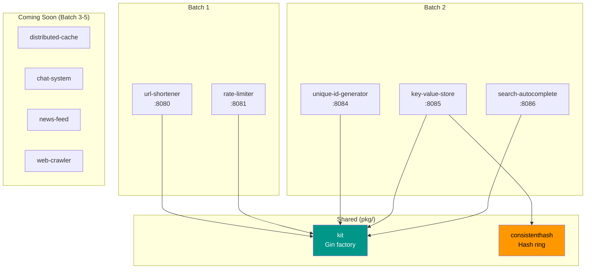
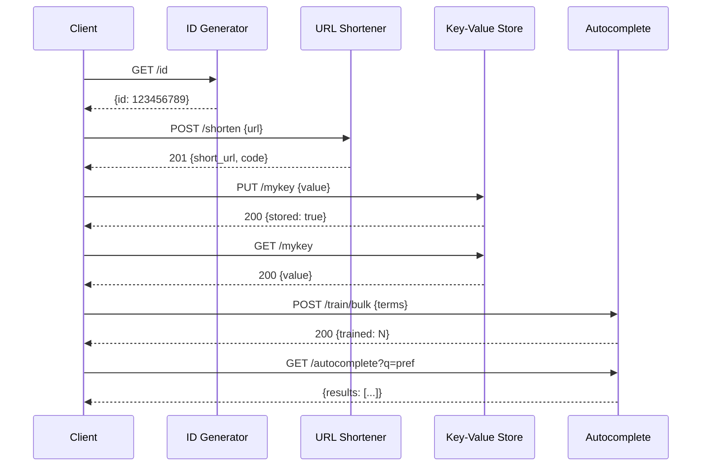

# faisalaffan-design-system

[Bahasa Indonesia](README.id.md)

## 01_LOGO

<p align="center">
  
</p>

## 02_BANNER

<p align="center">
  
</p>

---

Go monorepo for system design exercise implementations. Each folder is a standalone service with its own entrypoint.

## Architecture





## Structure

```
├── url-shortener/          # URL shortener (:8080)
│   ├── handler/            # Gin HTTP handlers
│   ├── service/            # Business logic
│   ├── storage/            # Storage interface + in-memory
│   └── shortcode/          # Base62 random code generator
├── rate-limiter/           # Rate limiter (:8081)
│   ├── algorithm/          # Token bucket, sliding window, fixed window
│   └── storage/            # Counter store interface + in-memory
├── unique-id-generator/    # Snowflake ID generator (:8084)
│   ├── snowflake/          # 64-bit ID: timestamp + worker + sequence
│   └── handler/            # GET /id
├── key-value-store/        # Distributed KV store (:8085)
│   ├── storage/            # Store interface + in-memory
│   ├── shard/              # Consistent hashing shard manager
│   └── handler/            # GET/PUT/DELETE /:key
├── search-autocomplete/    # Autocomplete service (:8086)
│   ├── trie/               # Concurrent-safe prefix tree
│   └── handler/            # GET /autocomplete, POST /train
├── distributed-cache/      # — soon
├── chat-system/            # — soon
└── pkg/                    # Shared components
    ├── kit/                # Gin factory, config, response helpers, middleware
    └── consistenthash/     # Consistent hashing with virtual nodes
```

## Running

```bash
go run ./url-shortener          # :8080
go run ./rate-limiter           # :8081
go run ./unique-id-generator    # :8084
go run ./key-value-store        # :8085
go run ./search-autocomplete    # :8086

go test ./...                   # 48 tests across 25 packages
go build ./...                  # Build all
go vet ./...                    # Vet all
```

## Dependencies

```bash
docker compose up -d       # Redis + Postgres (for future problems)
```

## Design Decisions

| Decision | Rationale |
|----------|-----------|
| **Gin Gonic** | Fastest Go HTTP framework. Middleware ecosystem. Productive without sacrificing performance. |
| **Interface-first storage** | Every service defines a `Storage` interface. In-memory default, swappable to Redis/Postgres with zero handler changes. |
| **Single `go.mod`** | Solo portfolio repo. Shared dependency versions. Multi-module overkill for this scale. |
| **Base62 random shortcode** | 7 chars from [a-zA-Z0-9] = ~3.5 trillion combinations. Random + retry simpler than URL hashing. |
| **Sliding window rate limiting** | More precise than fixed window. Better memory profile than token bucket for high-cardinality keys. |
| **Virtual nodes (150 replicas)** | Consistent hashing with 150 virtual nodes. `crc32` for speed — sufficient uniformity. |
| **Snowflake 64-bit IDs** | Timestamp(41) + Worker(10) + Sequence(12) = 4096 IDs/ms/worker, ~69 year lifetime. No coordination needed. |
| **Trie-based autocomplete** | O(k) prefix search where k = input length. Top-K by frequency with lexicographic tiebreak. Concurrent-safe reads. |
| **Graceful shutdown** | Every service handles SIGINT/SIGTERM with 5s timeout. Production pattern in exercise code. |
