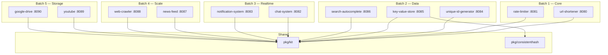

# Architecture

## High-Level Design

## Shared Packages

### pkg/kit
Gin factory, config loader, JSON response helpers, AppError types, and middleware (recovery, logging, rate-limit bridge).

### pkg/consistenthash
Hash ring with 150 virtual nodes per physical node. `crc32` hashing. Used by key-value-store for shard-to-node mapping.

## Design Philosophy

- **Interface-first**: every service defines a `Storage` interface. In-memory default, swappable to Redis/Postgres.
- **Single module**: one `go.mod` at root. All services share dependency versions.
- **Graceful shutdown**: every service handles SIGINT/SIGTERM with 5s timeout.
- **Gin Gonic**: consistent HTTP framework across all services.
