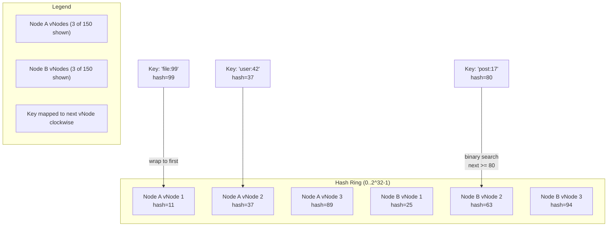

# pkg/consistenthash -- Hash Ring

Consistent hashing ring with 150 virtual nodes per physical node, `crc32` key hashing, and O(log N) node lookup via binary search. Used by the key-value store for distributed shard placement.

## Architecture



The ring is a sorted slice of integer hash values. Each physical node is replicated `replicas` times with a `strconv.Itoa(i) + node` key to produce a uniform distribution around the ring. Key lookup walks clockwise to the nearest vNode via binary search, wrapping to index 0 when the target exceeds the maximum hash.

## API

```go
func New(replicas int) *HashRing
func (h *HashRing) Add(node string)
func (h *HashRing) Remove(node string)
func (h *HashRing) Get(key string) string
```

### Constructor

Default replica count is 150 when zero or negative is passed.

```go
ring := consistenthash.New(150)
ring.Add("node-a")
ring.Add("node-b")
ring.Add("node-c")

node := ring.Get("user:42") // Returns one of node-a, node-b, node-c
```

### Add

Inserts `replicas` virtual nodes into the sorted key ring.

```go
func (h *HashRing) Add(node string) {
    for i := 0; i < h.replicas; i++ {
        hash := int(crc32.ChecksumIEEE([]byte(strconv.Itoa(i) + node)))
        h.keys = append(h.keys, hash)
        h.hashMap[hash] = node
    }
    sort.Ints(h.keys)
}
```

### Remove

Deletes all virtual nodes belonging to the given physical node and rebuilds the sorted key slice.

```go
func (h *HashRing) Remove(node string) {
    for i := 0; i < h.replicas; i++ {
        hash := int(crc32.ChecksumIEEE([]byte(strconv.Itoa(i) + node)))
        delete(h.hashMap, hash)
    }
    var newKeys []int
    for _, k := range h.keys {
        if _, ok := h.hashMap[k]; ok {
            newKeys = append(newKeys, k)
        }
    }
    h.keys = newKeys
    sort.Ints(h.keys)
}
```

### Get

Binary search for the next vNode >= key hash. Returns the corresponding physical node.

```go
func (h *HashRing) Get(key string) string {
    if len(h.keys) == 0 {
        panic("hash ring is empty")
    }
    hash := int(crc32.ChecksumIEEE([]byte(key)))
    idx := sort.Search(len(h.keys), func(i int) bool {
        return h.keys[i] >= hash
    })
    if idx == len(h.keys) {
        idx = 0 // wrap around
    }
    return h.hashMap[h.keys[idx]]
}
```

## Technical Decisions

- **150 virtual nodes**: Balances distribution uniformity against memory footprint. Each vNode occupies ~24 bytes (int key + map entry), so 150 vNodes x 10 nodes = ~36 KB. Increasing to 300 yields diminishing returns for the key-value store use case.
- **crc32 over md5/sha1**: A non-cryptographic hash is sufficient for distribution. crc32 is hardware-accelerated on modern CPUs and produces a full 32-bit range.
- **Binary search over red-black tree**: The key slice is append-only during Add and sorted once. Binary search on a sorted slice (`sort.Search`) is O(log N) and cache-friendly. A red-black tree would add complexity with no measurable gain at this replica count.
- **Panic on empty ring**: Explicitness over silent zero-value. A Get on an empty ring is always a programming error and should fail loudly.
- **Remove rebuilds the key slice**: Rather than delete from the middle of a slice (O(N) shift), we iterate once and re-slice. This keeps the code simple and correctness obvious.
