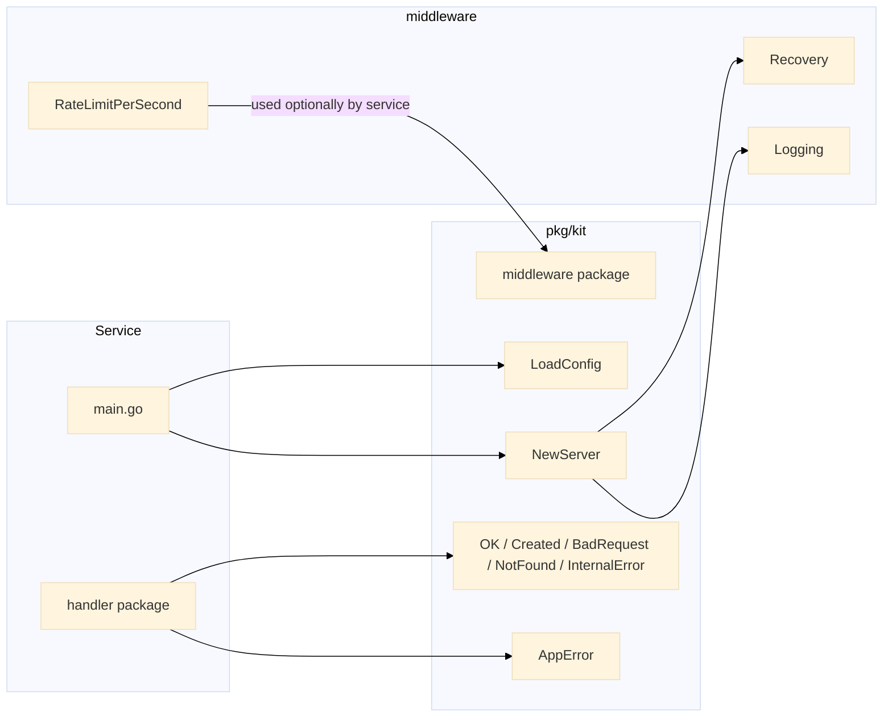

# pkg/kit -- Gin Server Factory

Gin-based HTTP server factory, configuration loader, JSON response helpers, typed errors, and built-in middleware -- shared by every service in the monorepo.

## Architecture



## Components

### Config Loader

`LoadConfig()` reads `PORT` and `ENV` environment variables with sane defaults. Used by every service `main.go`.

```go
type Config struct {
    Port string
    Env  string
}

func LoadConfig() Config {
    port := os.Getenv("PORT")
    if port == "" {
        port = "8080"
    }
    env := os.Getenv("ENV")
    if env == "" {
        env = "development"
    }
    return Config{Port: port, Env: env}
}
```

### Server Factory

`NewServer` creates a Gin engine pre-configured with recovery and logging middleware, debug/release/test mode based on `Config.Env`, and a `/health` endpoint.

```go
func NewServer(cfg Config) *gin.Engine {
    gin.SetMode(ginMode(cfg.Env))
    g := gin.New()
    g.Use(middleware.Recovery(), middleware.Logging())
    g.GET("/health", func(c *gin.Context) {
        OK(c, gin.H{"status": "ok"})
    })
    return g
}
```

### Response Helpers

| Function | HTTP Status | Description |
|---|---|---|
| `OK` | 200 | Standard success payload |
| `Created` | 201 | Resource created |
| `BadRequest` | 400 | Validation / bad input |
| `NotFound` | 404 | Resource not found |
| `InternalError` | 500 | Server-side failure |

All responses share a consistent JSON envelope:

```go
type Response struct {
    Data  interface{} `json:"data,omitempty"`
    Error string      `json:"error,omitempty"`
    Meta  interface{} `json:"meta,omitempty"`
}
```

### AppError

Unifies error handling across service and handler layers with an error code, human-readable message, and optional wrapped cause.

```go
type AppError struct {
    Code    int
    Message string
    Err     error
}

func (e *AppError) Error() string {
    if e.Err != nil {
        return fmt.Sprintf("[%d] %s: %v", e.Code, e.Message, e.Err)
    }
    return fmt.Sprintf("[%d] %s", e.Code, e.Message)
}

func (e *AppError) Unwrap() error { return e.Err }
```

### Middleware

#### Recovery

Catches panics, logs the stack trace via `debug.Stack()`, and responds with 500 instead of crashing the process.

```go
func Recovery() gin.HandlerFunc {
    return func(c *gin.Context) {
        defer func() {
            if err := recover(); err != nil {
                log.Printf("panic recovered: %v\n%s", err, debug.Stack())
                c.AbortWithStatusJSON(http.StatusInternalServerError, gin.H{
                    "error": "internal server error",
                })
            }
        }()
        c.Next()
    }
}
```

#### Logging

Logs every request with method, path, status code, and duration.

```go
func Logging() gin.HandlerFunc {
    return func(c *gin.Context) {
        start := time.Now()
        c.Next()
        log.Printf("%s %s %d %s",
            c.Request.Method,
            c.Request.URL.Path,
            c.Writer.Status(),
            time.Since(start).Round(time.Millisecond),
        )
    }
}
```

#### RateLimit Bridge

Attaches a rate-limiter algorithm to any route. Used by the rate-limiter service and available as a general-purpose guard.

```go
func RateLimitPerSecond(algo algorithm.Algorithm, limit int) gin.HandlerFunc {
    return func(c *gin.Context) {
        key := c.ClientIP()
        if !algo.Allow(key, limit, time.Second) {
            c.AbortWithStatusJSON(http.StatusTooManyRequests, gin.H{
                "error": "rate limit exceeded",
            })
            return
        }
        c.Next()
    }
}
```

## Endpoints

| Method | Path | Description |
|---|---|---|
| GET | `/health` | Health check, returns `{"data": {"status": "ok"}}` |

## Technical Decisions

- **Gin over net/http**: Consistent framework choice across all 12 services. Built-in binding, validation, and middleware chaining.
- **gin.New() over gin.Default()**: Explicit middleware registration avoids surprise inclusion of `gin.Logger()` and `gin.Recovery()` with different output formats.
- **Logging over structured logger**: `log.Printf` keeps the dependency surface minimal. Services that need structured output can add a logger later without changing the middleware interface.
- **Response envelope**: A single `Response` struct with `Data`, `Error`, and optional `Meta` makes client-side parsing uniform. No competing conventions between services.
- **AppError pattern**: Wraps the cause with `fmt.Errorf` for stack-free error chains. `Unwrap()` enables `errors.Is` / `errors.As` at caller sites.
