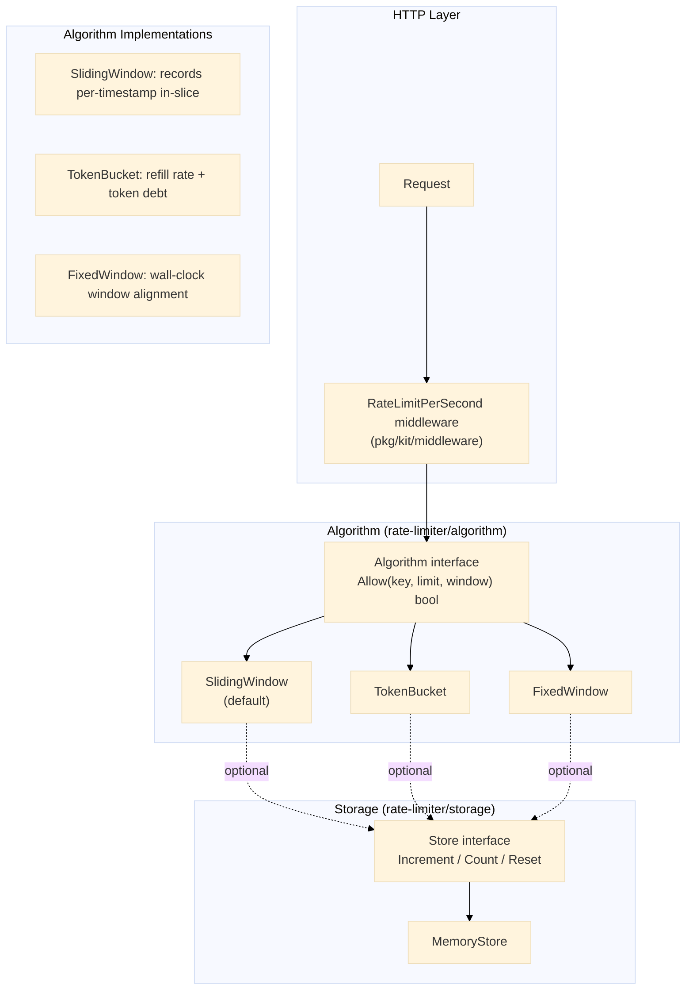

# Rate Limiter

Pluggable algorithm interface with three implementations (sliding window, token bucket, fixed window) and an optional storage interface backed by an in-memory store. Exposed as a Gin middleware via `pkg/kit/middleware`.

## Architecture



## Algorithm Interface

```go
type Algorithm interface {
    Allow(key string, limit int, window time.Duration) bool
}
```

All algorithms track state per-key (typically the client IP). `Allow` returns `true` if the request is within the limit and `false` if rate-limited.

### Sliding Window (default)

Tracks a slice of nanosecond timestamps per key. Old entries outside the window are pruned on each call. Provides the most accurate window boundaries.

```go
func (sw *SlidingWindow) Allow(key string, limit int, window time.Duration) bool {
    now := time.Now().UnixNano()
    cutoff := now - window.Nanoseconds()

    w, ok := sw.windows[key]
    if !ok {
        sw.windows[key] = &slidingEntry{timestamps: []int64{now}}
        return true
    }

    var valid []int64
    for _, ts := range w.timestamps {
        if ts > cutoff {
            valid = append(valid, ts)
        }
    }
    if len(valid) < limit {
        valid = append(valid, now)
        w.timestamps = valid
        return true
    }
    w.timestamps = valid
    return false
}
```

### Token Bucket

Each key has a token pool that refills continuously at `rate = limit / window.Seconds()`. Bursts up to `limit` are allowed.

```go
func (tb *TokenBucket) Allow(key string, limit int, window time.Duration) bool {
    b, ok := tb.buckets[key]
    if !ok {
        b = &bucket{tokens: float64(limit) - 1, lastRefill: time.Now()}
        tb.buckets[key] = b
        return true
    }
    rate := float64(limit) / window.Seconds()
    elapsed := time.Since(b.lastRefill).Seconds()
    b.tokens += elapsed * rate
    if b.tokens > float64(limit) {
        b.tokens = float64(limit)
    }
    b.lastRefill = time.Now()
    if b.tokens >= 1 {
        b.tokens--
        return true
    }
    return false
}
```

### Fixed Window

Aligns windows to wall-clock boundaries (e.g., 0:00--1:00, 1:00--2:00). Simpler but allows double traffic at boundaries.

```go
func (fw *FixedWindow) Allow(key string, limit int, window time.Duration) bool {
    now := time.Now().UnixNano()
    windowNano := window.Nanoseconds()
    currentWindow := now / windowNano * windowNano

    w, ok := fw.windows[key]
    if !ok || w.window != currentWindow {
        fw.windows[key] = &fixedEntry{count: 1, window: currentWindow}
        return true
    }
    if w.count < limit {
        w.count++
        return true
    }
    return false
}
```

## Storage Interface

Optional persistence layer for external rate-limit state (e.g., Redis).

```go
type Store interface {
    Increment(key string, window time.Duration) (int, error)
    Count(key string, window time.Duration) (int, error)
    Reset(key string) error
}
```

The default `MemoryStore` uses TTL-based expiration per entry.

## Gin Middleware

Bridged through `pkg/kit/middleware` as `RateLimitPerSecond`:

```go
srv.GET("/limited", kitmw.RateLimitPerSecond(algo, 5), func(c *gin.Context) {
    kit.OK(c, gin.H{"message": "within rate limit"})
})
```

Key extracted from `c.ClientIP()`. Returns 429 Too Many Requests when exceeded.

## Endpoints

| Method | Path | Description |
|---|---|---|
| `GET` | `/limited` | Rate-limited route (default: 5 req/s) |
| `GET` | `/unlimited` | No rate limit applied |
| `POST` | `/admin/reset` | Reset rate limit for a specific IP |

## Technical Decisions

- **Sliding window as default**: Best accuracy for rate limiting. Fixed window has boundary bias; token bucket allows short bursts. Sliding window provides the most predictable behavior for most use cases.
- **Nanosecond precision**: `time.Now().UnixNano()` avoids collision artifacts that millisecond precision can cause under high concurrency within a single second.
- **Per-key maps with mutexes**: In-process maps keep the implementation self-contained with zero external dependencies. Contention is negligible for typical per-IP granularity (one goroutine per request).
- **Algorithm interface as the seam**: New algorithms (e.g., sliding window counter from Redis) can be added by implementing `Allow(key, limit, window)`. No middleware or handler code changes.
- **Storage interface for production use**: The algorithm state is ephemeral. Production deployments swap `MemoryStore` for Redis using the `Store` interface, making rate limits survive restarts and scale across instances.
