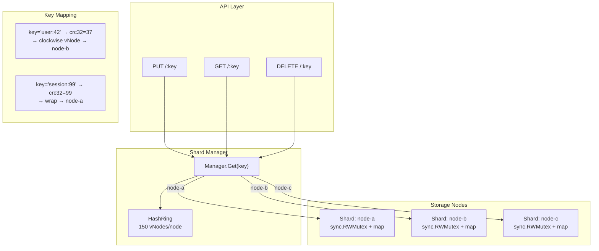

# Key-Value Store

Consistent-hashing-backed distributed key-value store. The `shard.Manager` uses `pkg/consistenthash` to map keys to nodes, with an in-memory store per shard.

## Architecture



The shard manager receives every key operation, hashes the key via `crc32`, locates the responsible vNode on the hash ring via binary search, and delegates to the corresponding shard's in-memory store.

## Endpoints

| Method | Path | Description |
|---|---|---|
| `GET` | `/:key` | Retrieve value for a key |
| `PUT` | `/:key` | Store a value (raw request body) |
| `DELETE` | `/:key` | Delete a key |

### PUT /my-key

```http
PUT /my-key HTTP/1.1
Content-Type: text/plain

hello world
```

```json
{"data": {"key": "my-key", "stored": true}}
```

### GET /my-key

```json
{"data": {"key": "my-key", "value": "hello world"}}
```

### DELETE /my-key

```json
{"data": {"key": "my-key", "deleted": true}}
```

## Shard Manager

```go
type Manager struct {
    ring   *consistenthash.HashRing
    shards map[string]storage.Store
}

func NewManager(nodes []string) *Manager {
    ring := consistenthash.New(150)
    shards := make(map[string]storage.Store)
    for _, n := range nodes {
        ring.Add(n)
        shards[n] = storage.NewMemoryStore()
    }
    return &Manager{ring: ring, shards: shards}
}
```

### Key Routing

```go
func (m *Manager) getShard(key string) storage.Store {
    node := m.ring.Get(key) // consistent hash lookup
    return m.shards[node]
}
```

Every `Get`, `Put`, and `Delete` call resolves the key to a shard through `getShard`. Adding or removing a node only remaps keys proportional to the node's share of the ring (K/N keys for N nodes) -- the minimal re-mapping property of consistent hashing.

### Node Configuration

Nodes are configured via the `KV_NODES` environment variable as a comma-separated list:

```bash
KV_NODES=node-a,node-b,node-c go run ./services/key-value-store
```

When the variable is empty, a single `default` node is used.

## Storage Interface

```go
type Store interface {
    Get(ctx context.Context, key string) (string, error)
    Put(ctx context.Context, key string, value string) error
    Delete(ctx context.Context, key string) error
}
```

The default `MemoryStore` uses `sync.RWMutex` with a `map[string]string`. Reads acquire a read lock (concurrent), writes acquire a write lock (exclusive).

## Technical Decisions

- **Consistent hashing over modulo N**: Modulo N requires rehashing every key when a node is added or removed. Consistent hashing only moves K/N keys. This is critical for production where node membership changes regularly (rolling deploys, autoscaling).
- **150 vNodes per node**: Matches the `pkg/consistenthash` default. 150 provides uniform distribution across the ring while keeping the sorted key slice small (~150 * 10 = 1,500 entries) for fast binary search.
- **Raw body PUT**: The request body is stored as-is without JSON parsing. This makes the store agnostic to data format -- it can hold JSON, plain text, serialized protobuf, or any byte string.
- **No TTL / expiration**: The initial implementation is a plain key-value map. TTL can be added at the storage layer without changing the shard manager or handler.
- **Shard-local memory stores**: Each shard is an isolated `sync.RWMutex`-guarded map. There is no cross-shard communication, replication, or consensus. Production deployments would replace `MemoryStore` with a persistent storage engine (RocksDB, SQLite) or a replicated store (Redis Cluster, etcd).
