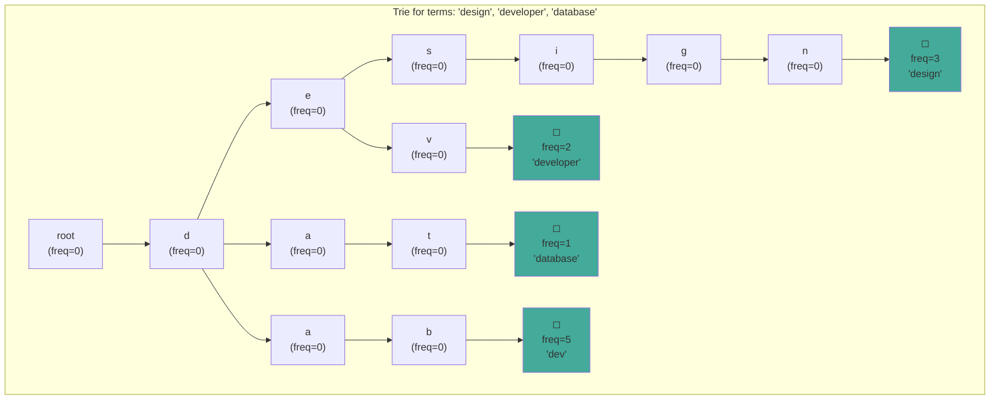
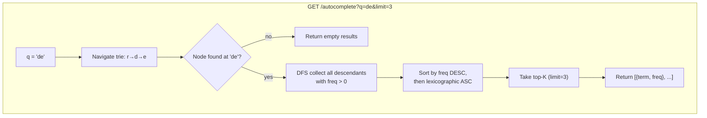

# Search Autocomplete

Prefix-tree (Trie) with per-node frequency counters, top-K result ranking by frequency, and lexicographic tiebreaking. Exposes `POST /train` for learning terms and `GET /autocomplete?q=...` for prefix search.

## Architecture

### Trie Structure



Each edge is a character in the alphabet. Terminal nodes (filled squares above) carry a frequency counter incremented via `Insert` or `Increment`. The prefix tree compresses shared prefixes so `"design"` and `"developer"` share the `"d"`, `"e"` path.

### Search Flow



## Endpoints

| Method | Path | Description |
|---|---|---|
| `GET` | `/autocomplete` | Search for prefix suggestions |
| `POST` | `/train` | Increment a single term's frequency |
| `POST` | `/train/bulk` | Increment multiple terms at once |

### GET /autocomplete?q=de&limit=3

```http
GET /autocomplete?q=de&limit=3
```

```json
{
  "data": {
    "query": "de",
    "results": [
      {"term": "developer", "freq": 5},
      {"term": "design", "freq": 3}
    ]
  }
}
```

### POST /train

```json
// Request
{"term": "golang"}
// Response
{"data": {"trained": "golang"}}
```

### POST /train/bulk

```json
// Request
{"terms": ["golang", "gin", "goroutine"]}
// Response
{"data": {"trained": 3}}
```

## Trie Implementation

```go
type node struct {
    children map[rune]*node
    freq     int
}

type Trie struct {
    mu   sync.RWMutex
    root *node
}

func New() *Trie {
    return &Trie{root: &node{children: make(map[rune]*node)}}
}

func (t *Trie) Insert(term string, freq int) {
    cur := t.root
    for _, ch := range term {
        if cur.children[ch] == nil {
            cur.children[ch] = &node{children: make(map[rune]*node)}
        }
        cur = cur.children[ch]
    }
    cur.freq += freq
}

func (t *Trie) Search(prefix string, limit int) []Result {
    cur := t.root
    for _, ch := range prefix {
        if cur.children[ch] == nil {
            return nil
        }
        cur = cur.children[ch]
    }

    var results []Result
    collect(cur, prefix, &results)

    sort.Slice(results, func(i, j int) bool {
        if results[i].Freq == results[j].Freq {
            return results[i].Term < results[j].Term
        }
        return results[i].Freq > results[j].Freq
    })

    if limit > 0 && len(results) > limit {
        results = results[:limit]
    }
    return results
}
```

The handler also provides a bulk train endpoint for batch ingestion:

```go
type bulkTrainRequest struct {
    Terms []string `json:"terms" binding:"required"`
}

func (h *AutocompleteHandler) TrainBulk(c *gin.Context) {
    var req bulkTrainRequest
    if err := c.ShouldBindJSON(&req); err != nil {
        kit.BadRequest(c, "terms array is required")
        return
    }
    for _, term := range req.Terms {
        h.trie.Increment(term)
    }
    kit.OK(c, gin.H{"trained": len(req.Terms)})
}
```

## Technical Decisions

- **Trie over inverted index**: A Trie is the canonical data structure for prefix autocomplete. Lookup time is O(len(prefix) + number of descendant nodes) regardless of dictionary size. An inverted index would require a separate prefix query layer.
- **Per-node map over array of 26**: `map[rune]*node` supports arbitrary Unicode characters (Chinese, Arabic, emoji). A fixed-size array would limit the alphabet to ASCII. The memory overhead of a map is acceptable at this scale.
- **Top-K by frequency, lexicographic tiebreak**: The two-stage sort produces deterministic results. Without the lexicographic fallback, results with equal frequency would be in non-deterministic map iteration order.
- **DFS collection over precomputed suggestions**: Precomputing the top-K per prefix would speed up lookups at the cost of memory and update complexity. The current approach keeps the data structure simple and correct. Production systems at scale can add a cache layer in front of the Trie.
- **RWMutex for concurrent access**: The Trie uses a read-write mutex. `Search` acquires a read lock (concurrent readers), while `Insert` / `Increment` acquire a write lock (exclusive). This maximizes throughput under read-heavy autocomplete workloads.
- **Seed terms in main.go**: The service pre-populates common terms (`"design"`, `"developer"`, `"database"`, `"distributed"`, `"docker"`, `"deploy"`) so the autocomplete endpoint returns useful results immediately without training.
