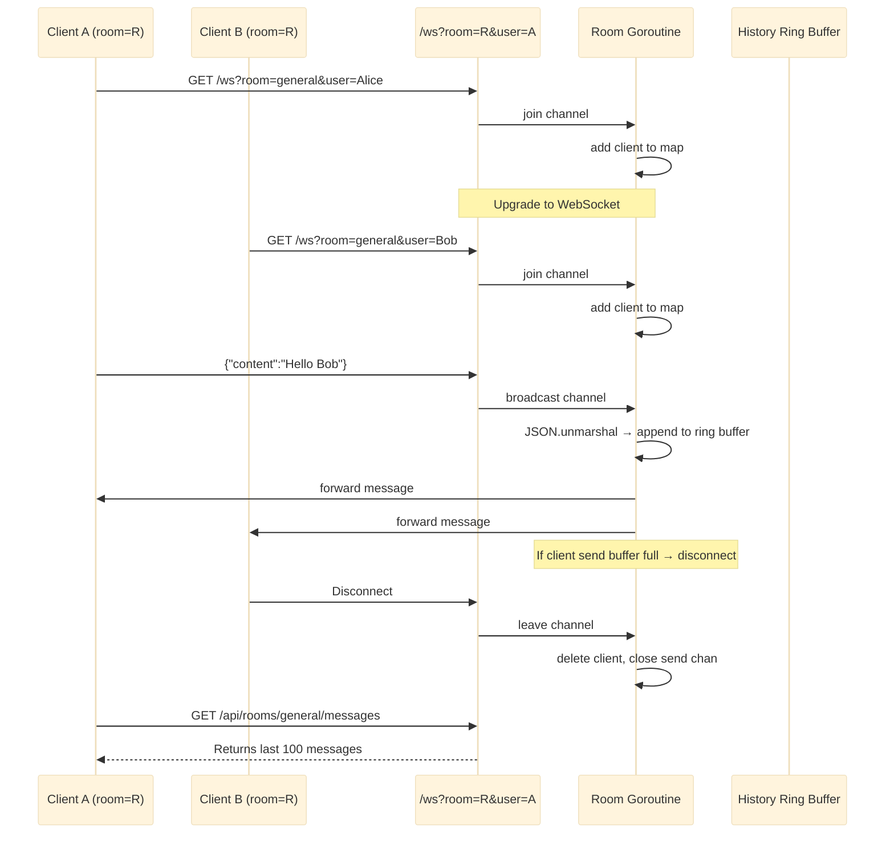

# Chat System

WebSocket-based real-time chat with room management, goroutine event loop, and message history using a ring buffer.

Port **8082** | Package `chat-system/`

---

## Architecture



### Room Event Loop

The `Room.run()` goroutine serialises all state mutations through three channels, eliminating concurrent-write issues without fine-grained locking in the hot path.

```go
func (r *Room) run() {
    for {
        select {
        case client := <-r.join:
            r.mu.Lock()
            r.clients[client] = true
            r.mu.Unlock()

        case client := <-r.leave:
            r.mu.Lock()
            delete(r.clients, client)
            close(client.Send)
            r.mu.Unlock()

        case msg := <-r.broadcast:
            var m Message
            if err := json.Unmarshal(msg, &m); err != nil {
                continue
            }
            r.mu.Lock()
            r.history = append(r.history, m)
            if len(r.history) > r.maxHistory {
                r.history = r.history[len(r.history)-r.maxHistory:]
            }
            for c := range r.clients {
                select {
                case c.Send <- msg:
                default:
                    delete(r.clients, c)
                    close(c.Send)
                }
            }
            r.mu.Unlock()
        }
    }
}
```

---

## API Endpoints

| Method | Path | Description |
|--------|------|-------------|
| `GET` | `/ws?room=R&user=U` | Upgrade to WebSocket in room R as user U |
| `GET` | `/api/rooms` | List all rooms and their client counts |
| `GET` | `/api/rooms/:room/messages` | Get message history for a room |

### WebSocket Message Format

```json
{
    "user": "Alice",
    "room": "general",
    "content": "Hello Bob",
    "timestamp": 1719912345678
}
```

---

## Technical Decisions

### Goroutine-Based Event Loop

Each room runs a dedicated goroutine with three channels (`join`, `leave`, `broadcast`). This actor-model pattern provides:

- **Serialised access**: all room state mutations go through the select loop, so no mutex is needed in the broadcast path (though a `sync.RWMutex` guards `history` reads from the REST endpoint).
- **Non-blocking send**: the `select` + `default` pattern on `c.Send` drops slow clients instead of blocking the broadcast loop.

### Ring Buffer History

The history slice acts as a ring buffer capped at 100 messages. When the limit is reached, the oldest messages are trimmed:

```go
r.history = append(r.history, m)
if len(r.history) > r.maxHistory {
    r.history = r.history[len(r.history)-r.maxHistory:]
}
```

### Room Manager

A `Manager` struct provides `GetOrCreate(name)` for lazy room creation. A default `"general"` room is pre-created at startup.

---

## Key Files

| File | Purpose |
|------|---------|
| `room/room.go` | Room struct, event loop, Client type |
| `room/manager.go` | Room lifecycle management |
| `ws/handler.go` | WebSocket upgrade and read/write pump |
| `handler/handler.go` | HTTP handlers (WS upgrade, REST endpoints) |
