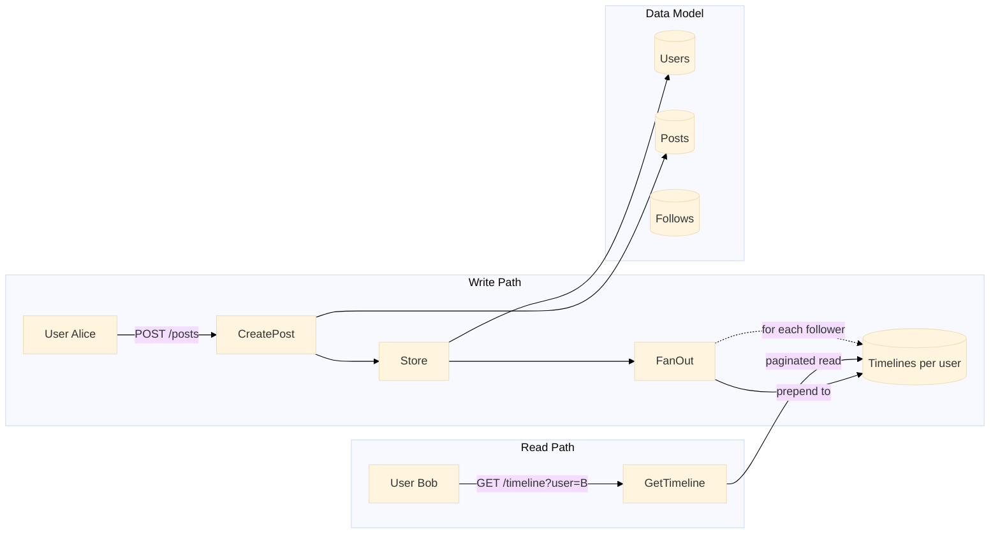

# News Feed

Fan-out on write timeline system. When a user creates a post, it is immediately pushed into the timelines of all their followers.

Port **8087** | Package `news-feed/`

---

## Architecture



### Fan-Out on Write

When a user creates a post, the system iterates over all users, checks who follows the poster, and prepends the post to each follower's timeline. The poster's own timeline also receives the post.

```go
func (s *MemoryStore) CreatePost(userID, content string) *Post {
    s.mu.Lock()
    defer s.mu.Unlock()

    s.postSeq++
    p := &Post{
        ID:        userID + "_" + time.Now().Format("20060102150405"),
        UserID:    userID,
        Content:   content,
        CreatedAt: time.Now().UnixMilli(),
    }

    s.posts[userID] = append(s.posts[userID], p)

    // Fan-out: push to follower timelines
    for followerID := range s.follows {
        if s.follows[followerID][userID] {
            s.timeline[followerID] = append([]*Post{p}, s.timeline[followerID]...)
        }
    }
    // Also add to own timeline
    s.timeline[userID] = append([]*Post{p}, s.timeline[userID]...)

    return p
}
```

---

## API Endpoints

| Method | Path | Description |
|--------|------|-------------|
| `POST` | `/users` | Create a user (body: `{"id": "alice"}`) |
| `POST` | `/posts` | Create a post (body: `{"user_id": "...", "content": "..."}`) |
| `POST` | `/follow` | Follow a user (body: `{"follower_id": "...", "followee_id": "..."}`) |
| `GET` | `/timeline?user=X&offset=0&limit=20` | Get paginated timeline for a user |
| `GET` | `/users/:id/posts` | Get all posts by a specific user |

### POST /follow

```json
{
    "follower_id": "bob",
    "followee_id": "alice"
}
```

### GET /timeline?user=bob

```json
{
    "timeline": [
        {"id": "alice_20250101120000_hello", "user_id": "alice", "content": "Hello!", "created_at": 1719912345678},
        {"id": "bob_20250101115900_gm",      "user_id": "bob",   "content": "GM",     "created_at": 1719912340678}
    ]
}
```

---

## Technical Decisions

### Fan-Out on Write vs. on Read

| Approach | Trade-off |
|----------|-----------|
| **Fan-out on write** (chosen) | Fast reads, slow writes. Post is written once, then copied to N follower timelines at write time. Suitable for systems with high read-to-write ratio. |
| Fan-out on read | Slow reads, fast writes. Post is fetched and merged from followed users at read time. Better for users with very large followings (celebrities). |

This implementation uses fan-out on write. A hybrid approach (fan-out to regular users on write, pull for celebrities on read) would be the next step for production scale.

### Data Model

```
users:      map[string]*User              # userID → User
posts:      map[string][]*Post             # userID → posts (author's own)
follows:    map[string]map[string]bool     # followerID → set of followeeIDs
timeline:   map[string][]*Post             # userID → timeline (pre-computed feed)
```

### Pagination

Timeline reads support `offset` and `limit` query parameters for cursor-free offset-based pagination:

```go
func (s *MemoryStore) GetTimeline(userID string, offset, limit int) []*Post {
    tl := s.timeline[userID]
    if offset >= len(tl) {
        return []*Post{}
    }
    end := offset + limit
    if end > len(tl) {
        end = len(tl)
    }
    result := make([]*Post, end-offset)
    copy(result, tl[offset:end])
    return result
}
```

### Consistency

All mutations are serialised via `sync.RWMutex`. Timeline reads use `RLock` for concurrent reads. Write locks ensure no timeline is partially updated when a post fans out.

---

## Key Files

| File | Purpose |
|------|---------|
| `store/store.go` | In-memory data model, fan-out logic, paginated reads |
| `handler/handler.go` | HTTP handlers for users, posts, follow, timeline |
