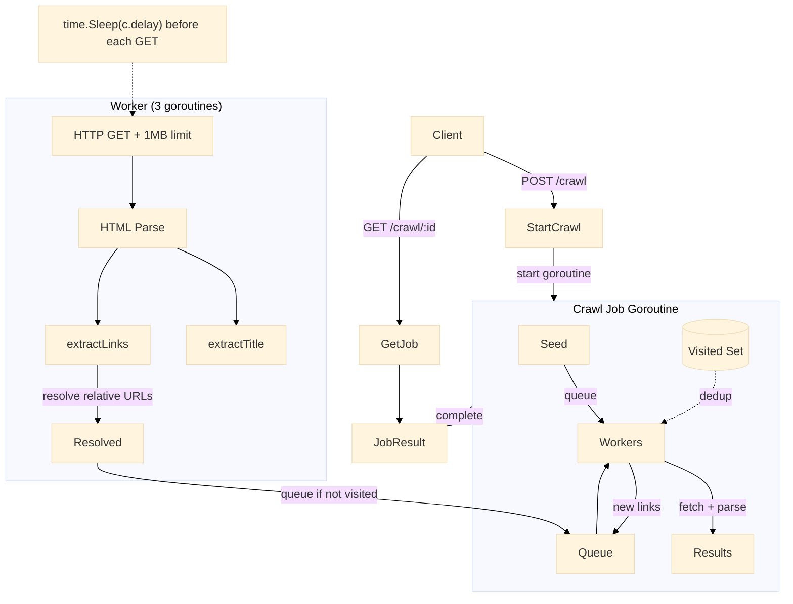

# Web Crawler

BFS-based web crawler using goroutine workers for concurrent page fetching. Implements politeness delay, URL deduplication, and HTML link extraction via `golang.org/x/net/html`.

Port **8088** | Package `web-crawler/`

---

## Architecture



### Crawl Loop

The crawler uses a BFS approach: a buffered channel serves as the URL frontier, visited URLs are tracked in a thread-safe set, and multiple worker goroutines consume from the frontier in parallel.

```go
func (c *Crawler) run(id string) {
    job := c.jobs[id]
    job.Status = "running"

    visited := newVisited()
    queue := make(chan string, job.MaxPages*2)
    results := make(chan *PageResult, job.MaxPages)
    var wg sync.WaitGroup

    queue <- job.SeedURL
    visited.tryVisit(job.SeedURL)

    workers := 3
    for i := 0; i < workers; i++ {
        wg.Add(1)
        go func() {
            defer wg.Done()
            for rawURL := range queue {
                result := c.fetch(rawURL)
                results <- result

                if result.StatusCode == 200 {
                    for _, link := range result.Links {
                        if visited.tryVisit(link) && visited.len() <= job.MaxPages {
                            select {
                            case queue <- link:
                            default:
                            }
                        }
                    }
                }
            }
        }()
    }

    time.Sleep(2 * time.Second)
    close(queue)
    wg.Wait()
    close(results)

    for r := range results {
        job.Pages = append(job.Pages, r)
    }
    job.Status = "completed"
}
```

### URL Fetch with Politeness

```go
func (c *Crawler) fetch(rawURL string) *PageResult {
    result := &PageResult{URL: rawURL}

    // Politeness delay before each request
    time.Sleep(c.delay)

    resp, err := c.client.Get(rawURL)
    if err != nil {
        result.Error = err.Error()
        return result
    }
    defer resp.Body.Close()

    result.StatusCode = resp.StatusCode
    if resp.StatusCode != 200 {
        return result
    }

    // 1MB response body limit
    body, _ := io.ReadAll(io.LimitReader(resp.Body, 1<<20))
    result.Title = extractTitle(string(body))
    result.Links = extractLinks(parsed, string(body))
    return result
}
```

### HTML Link Extraction

```go
func extractLinks(base *url.URL, htmlStr string) []string {
    doc, _ := html.Parse(strings.NewReader(htmlStr))
    links := make(map[string]bool)

    var f func(*html.Node)
    f = func(n *html.Node) {
        if n.Type == html.ElementNode && n.Data == "a" {
            for _, attr := range n.Attr {
                if attr.Key == "href" {
                    ref, _ := url.Parse(attr.Val)
                    resolved := base.ResolveReference(ref)
                    if resolved.Scheme == "http" || resolved.Scheme == "https" {
                        resolved.Fragment = ""
                        links[resolved.String()] = true
                    }
                }
            }
        }
        for c := n.FirstChild; c != nil; c = c.NextSibling {
            f(c)
        }
    }
    f(doc)

    result := make([]string, 0, len(links))
    for link := range links {
        result = append(result, link)
    }
    return result
}
```

---

## API Endpoints

| Method | Path | Description |
|--------|------|-------------|
| `POST` | `/crawl` | Start a new crawl job (body: `url`, `max_pages`) |
| `GET` | `/crawl/:id` | Get crawl job result with all crawled pages |

### POST /crawl

```json
{
    "url": "https://example.com",
    "max_pages": 10
}
```

Response:

```json
{
    "job_id": "crawl_1",
    "status": "started"
}
```

### GET /crawl/:id

```json
{
    "job": {
        "id": "crawl_1",
        "status": "completed",
        "seed_url": "https://example.com",
        "max_pages": 10,
        "pages": [
            {
                "url": "https://example.com",
                "status_code": 200,
                "title": "Example Domain",
                "links": ["https://www.iana.org/domains/example"],
                "crawled_at": 1719912345678
            }
        ],
        "started_at": 1719912345000,
        "ended_at": 1719912346000
    }
}
```

---

## Technical Decisions

### BFS via Channel Frontier

The URL frontier is a buffered Go channel acting as a BFS queue. Worker goroutines consume from it and enqueue newly discovered links, respecting the `maxPages` cap.

### Politeness Delay

A configurable `time.Sleep(c.delay)` before each HTTP GET prevents overwhelming target servers. Default is 1 second, configurable via the `CRAWL_DELAY_MS` environment variable.

### URL Deduplication

A `visitedURLs` struct wraps a `map[string]struct{}` with a mutex. `tryVisit()` atomically checks and marks a URL, returning `false` if already visited -- this prevents both duplicate fetches and infinite loops.

### Worker Pool

Three goroutines consume from the frontier channel concurrently. The `sync.WaitGroup` ensures all workers finish before the job is marked complete. After a 2-second drain period, the queue is closed to signal workers to stop.

### Response Body Limit

`io.LimitReader(resp.Body, 1<<20)` caps each response at 1 MB to prevent unbounded memory usage on large pages.

---

## Key Files

| File | Purpose |
|------|---------|
| `crawler/crawler.go` | Crawler engine: BFS loop, HTTP fetch, HTML parsing |
| `handler/handler.go` | HTTP handlers for starting and querying crawl jobs |
