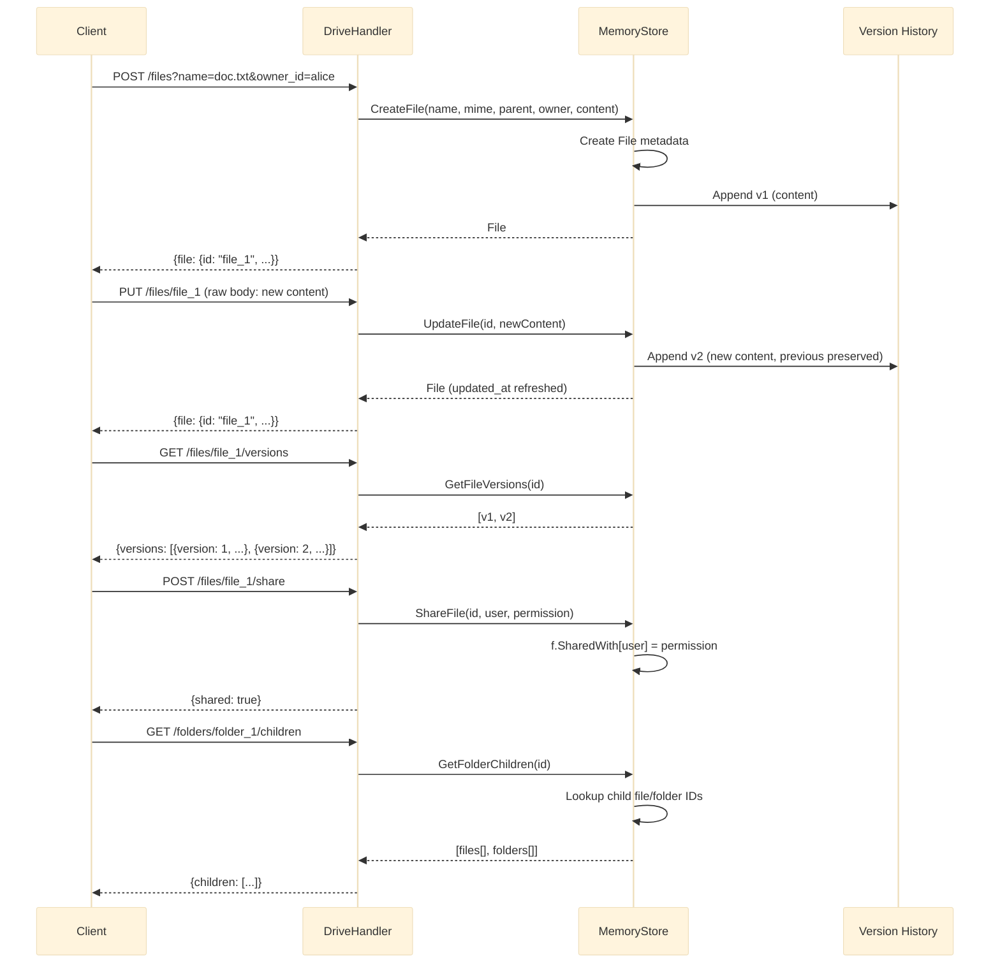

# Google Drive

File and folder hierarchy with immutable version history and user-level sharing permissions.

Port **8090** | Package `google-drive/`

---

## Architecture



### Immutable Version History

Each file update appends a new version instead of overwriting. The full history is preserved and queryable:

```go
type FileVersion struct {
    Version   int    `json:"version"`
    Content   []byte `json:"content"`
    Size      int64  `json:"size"`
    CreatedAt int64  `json:"created_at"`
}
```

```go
func (s *MemoryStore) UpdateFile(id string, content []byte) (*File, error) {
    f, ok := s.files[id]
    if !ok {
        return nil, fmt.Errorf("file not found")
    }

    versions := s.fileData[id]
    newVersion := len(versions) + 1
    s.fileData[id] = append(versions, &FileVersion{
        Version:   newVersion,
        Content:   content,
        Size:      int64(len(content)),
        CreatedAt: time.Now().UnixMilli(),
    })

    f.Size = int64(len(content))
    f.UpdatedAt = time.Now().UnixMilli()
    return f, nil
}
```

### Folder Hierarchy

Files and folders form a tree via `parentID`. A `folderChildren` map tracks child membership for efficient listing:

```go
type Folder struct {
    ID        string `json:"id"`
    Name      string `json:"name"`
    ParentID  string `json:"parent_id"`
    OwnerID   string `json:"owner_id"`
    CreatedAt int64  `json:"created_at"`
}
```

```go
func (s *MemoryStore) GetFolderChildren(folderID string) []interface{} {
    var children []interface{}
    for _, childID := range s.folderChildren[folderID] {
        if f, ok := s.files[childID]; ok {
            children = append(children, f)
        } else if f, ok := s.folders[childID]; ok {
            children = append(children, f)
        }
    }
    return children
}
```

### Sharing Permissions

```go
func (s *MemoryStore) ShareFile(fileID, userID, permission string) error {
    f, ok := s.files[fileID]
    if !ok {
        return fmt.Errorf("file not found")
    }
    f.SharedWith[userID] = permission
    return nil
}
```

---

## API Endpoints

| Method | Path | Description |
|--------|------|-------------|
| `POST` | `/files?name=N&owner_id=O&parent_id=P` | Create a new file (body: raw content or multipart) |
| `GET` | `/files/:id` | Get file metadata and content size |
| `GET` | `/files/:id/download` | Download raw file content |
| `PUT` | `/files/:id` | Update file content (appends a new version) |
| `DELETE` | `/files/:id` | Delete file and all versions |
| `GET` | `/files/:id/versions` | List all versions of a file |
| `POST` | `/files/:id/share` | Share file with a user (body: user_id, permission) |
| `POST` | `/folders` | Create a folder (body: name, owner_id, parent_id) |
| `GET` | `/folders/:id/children` | List files and sub-folders in a folder |

### POST /files/:id/share

```json
{
    "user_id": "bob",
    "permission": "read"
}
```

Permission values: `"read"` or `"write"`.

### POST /folders

```json
{
    "name": "Documents",
    "owner_id": "alice",
    "parent_id": ""
}
```

### GET /folders/:id/children

```json
{
    "children": [
        {"id": "file_1", "name": "doc.txt", "mime_type": "text/plain", ...},
        {"id": "folder_2", "name": "Photos", ...}
    ]
}
```

---

## Technical Decisions

### Immutable Version History

Every `PUT /files/:id` appends a new `FileVersion` rather than mutating the previous one. This means:

- **Full audit trail**: all previous content is recoverable.
- **Time travel**: clients can fetch any historical version.
- **Storage cost**: grows linearly with update count. Production systems would add compaction policies or retention limits.

### File and Folder Unification

The handler returns both files and folders from `GetFolderChildren`. Internally they are stored in separate maps, but the API presents a unified view -- similar to how Google Drive treats folders as a special file type.

### Permission Model

Permissions are stored as a `map[string]string` on each file (`userID -> "read"|"write"`). This is a flat access control list (ACL). Production systems layer on:

- **Inheritance**: children inherit parent folder permissions.
- **Groups**: permissions assigned to groups rather than individual users.
- **Owner-only delete**: only the file owner can delete.

### Content Storage

File content and metadata are stored separately. The `fileData` map holds the versioned content while the `files` map holds the metadata. In production, content would be stored in an object store (S3, GCS) with metadata in a relational database.

---

## Key Files

| File | Purpose |
|------|---------|
| `store/store.go` | File, Folder, FileVersion models; CRUD; version history; sharing |
| `handler/handler.go` | HTTP handlers for files, folders, versions, sharing, download |
