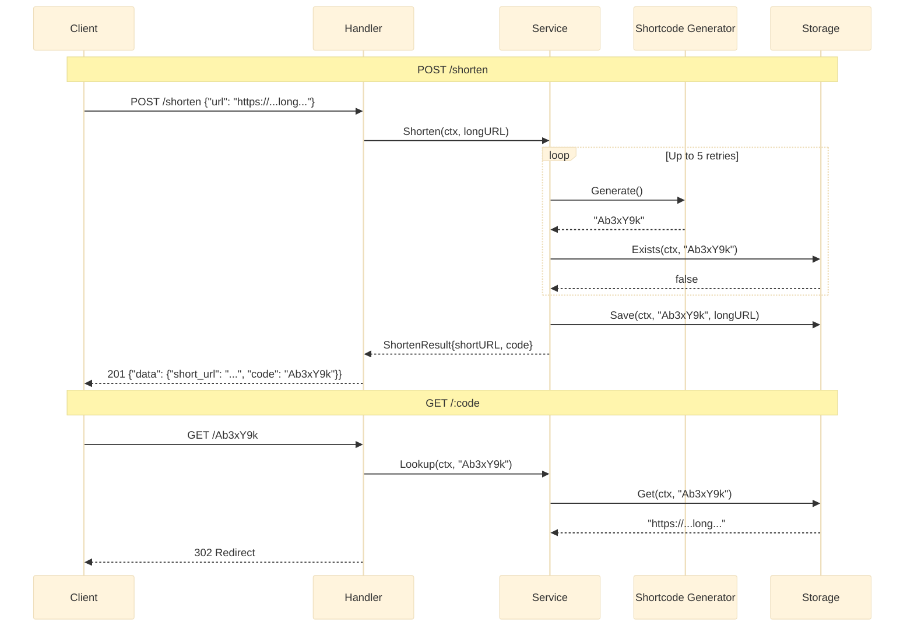

# URL Shortener

Base62 7-character random shortcode generator with collision retry (up to 5 attempts) and HTTP 302 redirect. Four-layer architecture: Handler, Service, Storage, Shortcode.

## Architecture



## Endpoints

| Method | Path | Description |
|---|---|---|
| `POST` | `/shorten` | Create a short URL from a long URL |
| `GET` | `/:code` | Redirect to the original long URL |

### POST /shorten

```json
// Request
{"url": "https://example.com/very/long/url"}

// Response 201
{"data": {"short_url": "http://localhost:8080/Ab3xY9k", "code": "Ab3xY9k"}}
```

### GET /:code

Responds with HTTP 302 (Found) and `Location` header set to the original URL. Returns 404 if the shortcode does not exist.

## Layers

### Handler

Validates the JSON body, extracts the `code` path param, and delegates to the service. Uses `kit.BadRequest`, `kit.Created`, `kit.NotFound` for consistent JSON responses.

### Service -- Shorten & Lookup

```go
type ShortenService struct {
    store   storage.Storage
    baseURL string
}

func (s *ShortenService) Shorten(ctx context.Context, longURL string) (*ShortenResult, error) {
    for attempts := 0; attempts < 5; attempts++ {
        code, err := shortcode.Generate()
        if err != nil {
            return nil, fmt.Errorf("generate shortcode: %w", err)
        }
        exists, err := s.store.Exists(ctx, code)
        if err != nil {
            return nil, fmt.Errorf("check exists: %w", err)
        }
        if exists {
            log.Printf("collision: %s, retrying", code)
            continue
        }
        if err := s.store.Save(ctx, code, longURL); err != nil {
            return nil, fmt.Errorf("save: %w", err)
        }
        return &ShortenResult{
            ShortURL: s.baseURL + "/" + code,
            Code:     code,
        }, nil
    }
    return nil, fmt.Errorf("failed to generate unique code after 5 attempts")
}
```

### Shortcode Generator

Cryptographically random 7-character string from a 62-character alphabet (a-z, A-Z, 0-9). Uses `crypto/rand` for secure randomness.

```go
const alphabet = "abcdefghijklmnopqrstuvwxyzABCDEFGHIJKLMNOPQRSTUVWXYZ0123456789"
const codeLength = 7

func Generate() (string, error) {
    code := make([]byte, codeLength)
    for i := range code {
        n, err := rand.Int(rand.Reader, big.NewInt(int64(len(alphabet))))
        if err != nil {
            return "", err
        }
        code[i] = alphabet[n.Int64()]
    }
    return string(code), nil
}
```

### Storage Interface

```go
type Storage interface {
    Save(ctx context.Context, code string, url string) error
    Get(ctx context.Context, code string) (string, error)
    Exists(ctx context.Context, code string) (bool, error)
}
```

The default implementation is `storage.MemoryStore` -- a thread-safe in-memory map guarded by `sync.RWMutex`.

## Technical Decisions

- **7-character base62** = 62^7 = ~3.5 trillion combinations, which makes collision probability negligible at any realistic scale. Collision retry is implemented as a safety net, not an expected code path.
- **302 (Found) over 301 (Moved Permanently)**: 302 gives the service owner flexibility to change the target URL or deprecate redirects. Browsers cache 301 responses aggressively, making updates invisible to users.
- **crypto/rand over math/rand**: Shortcodes should not be predictable. Using `crypto/rand` prevents enumeration attacks where an attacker iterates sequential shortcodes.
- **Up to 5 collision retries**: After 5 consecutive collisions (probability: (1/3.5T)^5 = effectively zero), the service returns an error rather than looping forever. This is a correctness guardrail, not a performance concern.
- **Four-layer separation**: Handler owns HTTP concerns (JSON parsing, status codes), Service owns business logic (retry, URL assembly), Storage owns persistence, Shortcode owns generation. Each layer is independently testable and swappable.

## Source Code

[View on GitHub](https://github.com/faisalaffan/faisalaffan-design-system/blob/dev/services/url-shortener/main.go)
