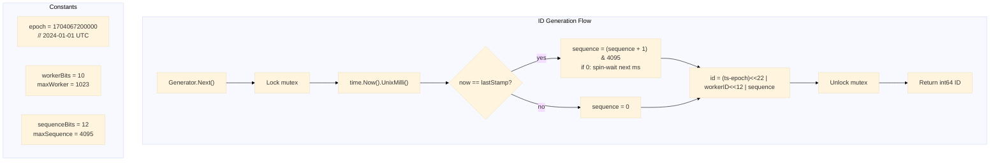

# Unique ID Generator

Snowflake-style 64-bit unique ID generator with 41-bit timestamp (epoch 2024-01-01), 10-bit worker ID, and 12-bit sequence number. Produces up to 4,096 IDs per millisecond per worker.

## Architecture

### ID Bit Layout

```
 0                   1                   2                   3
 0 1 2 3 4 5 6 7 8 9 0 1 2 3 4 5 6 7 8 9 0 1 2 3 4 5 6 7 8 9 0 1
├───────────────────────────────────────────────┬────────────┬──────┤
│                  Timestamp                      │  WorkerID  │ Seq  │
│                  41 bits                        │  10 bits   │12bit │
│              ~69 years                          │ 0 - 1023   │0-4095│
└───────────────────────────────────────────────┴────────────┴──────┘
```

- **Bit 63** (not shown): Unused (sign bit, always 0).
- **Bits 22--62 (41 bits)**: Milliseconds since epoch 2024-01-01T00:00:00Z. Supports ~69 years until 2093.
- **Bits 12--21 (10 bits)**: Worker node ID (0--1023).
- **Bits 0--11 (12 bits)**: Sequence number per millisecond (0--4095).



## Implementation

```go
const (
    epoch         = 1704067200000 // 2024-01-01T00:00:00Z in ms
    workerBits    = 10
    sequenceBits  = 12
    maxWorker     = 1<<workerBits - 1  // 1023
    maxSequence   = 1<<sequenceBits - 1 // 4095

    timestampShift = workerBits + sequenceBits // 22
    workerShift    = sequenceBits              // 12
)

type Generator struct {
    mu        sync.Mutex
    workerID  int64
    sequence  int64
    lastStamp int64
}

func New(workerID int64) (*Generator, error) {
    if workerID < 0 || workerID > maxWorker {
        return nil, fmt.Errorf("worker ID must be between 0 and %d", maxWorker)
    }
    return &Generator{workerID: workerID}, nil
}

func (g *Generator) Next() (int64, error) {
    g.mu.Lock()
    defer g.mu.Unlock()

    now := time.Now().UnixMilli()
    if now < g.lastStamp {
        return 0, fmt.Errorf("clock moved backwards, refusing to generate ID")
    }

    if now == g.lastStamp {
        g.sequence = (g.sequence + 1) & maxSequence
        if g.sequence == 0 {
            for now <= g.lastStamp {
                now = time.Now().UnixMilli()
            }
        }
    } else {
        g.sequence = 0
    }

    g.lastStamp = now

    id := (now-epoch)<<timestampShift |
        g.workerID<<workerShift |
        g.sequence

    return id, nil
}
```

## Endpoints

| Method | Path | Description |
|---|---|---|
| `GET` | `/id` | Generate a unique 64-bit ID |

### Response

```json
{"data": {"id": 7277771434402209792}}
```

Worker ID is configured via the `WORKER_ID` environment variable (default: 0).

## API

```go
func New(workerID int64) (*Generator, error)
func (g *Generator) Next() (int64, error)
```

## Technical Decisions

- **41-bit timestamp / 10-bit worker / 12-bit sequence**: Standard Snowflake layout. 41 bits at millisecond granularity yields ~69 years of uniqueness from epoch. 10 bits (1024 workers) covers realistic cluster sizes. 12 bits (4096 IDs/ms) is sufficient for a single worker at any reasonable request rate.
- **Epoch 2024-01-01**: Custom epoch extends the usable lifetime compared to Twitter's original 2010 epoch. IDs are smaller (fewer timestamp bits consumed) and overflow happens in 2093 instead of 2081.
- **Mutex over atomic CAS**: Simplicity. CAS with a retry loop on sequence overflow is marginally faster but adds subtle correctness concerns around the monotonic clock check. A mutex guarantees linearizability of the generation path.
- **Clock drift detection**: If the system clock jumps backward, the generator returns an error instead of producing duplicate IDs. This is a fail-safe: production deployments should use NTP with `-x` (gradual slew) rather than `-g` (step), and monitor clock skew.
- **Worker ID from environment**: No coordination service (ZooKeeper / etcd) required for single-node deployments. Multi-worker deployments can use the environment variable set at deployment time (Kubernetes StatefulSet ordinal, Terraform variable, etc.).

## Source Code

[View on GitHub](https://github.com/faisalaffan/faisalaffan-design-system/blob/dev/services/unique-id-generator/main.go)
