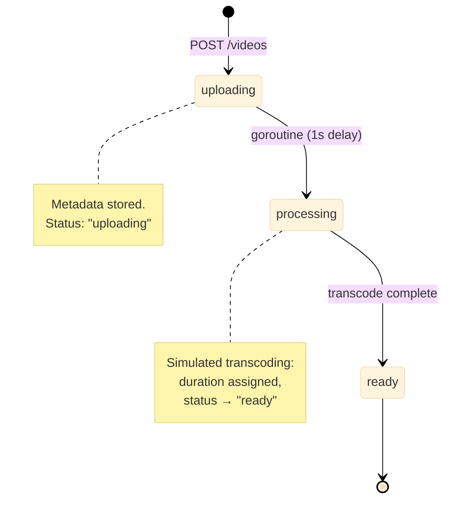

# YouTube

Video metadata management with simulated transcoding pipeline (uploading -> processing -> ready) and full-text search across titles, descriptions, and tags.

Port **8089** | Package `youtube/`

---

## Architecture



### Transcoding Simulation

When a video is created, a goroutine is spawned to simulate transcoding. After a 1-second delay, the status transitions from `"uploading"` to `"ready"` and a random duration (10-610 seconds) is assigned.

```go
type MemoryStore struct {
    mu     sync.RWMutex
    videos map[string]*Video
    seq    int64
}

func (s *MemoryStore) Create(title, description string, tags []string) *Video {
    s.mu.Lock()
    defer s.mu.Unlock()

    s.seq++
    v := &Video{
        ID:          fmt.Sprintf("vid_%d", s.seq),
        Title:       title,
        Description: description,
        Tags:        tags,
        Status:      "uploading",
        UploadedAt:  time.Now().UnixMilli(),
    }

    s.videos[v.ID] = v

    // Simulate transcoding in background
    go s.transcode(v.ID)
    return v
}

func (s *MemoryStore) transcode(id string) {
    time.Sleep(1 * time.Second)

    s.mu.Lock()
    defer s.mu.Unlock()
    if v, ok := s.videos[id]; ok {
        v.Status = "ready"
        v.Duration = rand.Intn(600) + 10 // 10-610 seconds
    }
}
```

### Full-Text Search

Search performs a linear scan through all videos with case-insensitive matching against title, description, and tags:

```go
func (s *MemoryStore) Search(query string) []*Video {
    s.mu.RLock()
    defer s.mu.RUnlock()

    q := strings.ToLower(query)
    var result []*Video
    for _, v := range s.videos {
        if strings.Contains(strings.ToLower(v.Title), q) ||
            strings.Contains(strings.ToLower(v.Description), q) ||
            containsTag(v.Tags, q) {
            result = append(result, v)
        }
    }
    sort.Slice(result, func(i, j int) bool {
        return result[i].UploadedAt > result[j].UploadedAt
    })
    return result
}

func containsTag(tags []string, q string) bool {
    for _, t := range tags {
        if strings.Contains(strings.ToLower(t), q) {
            return true
        }
    }
    return false
}
```

---

## API Endpoints

| Method | Path | Description |
|--------|------|-------------|
| `POST` | `/videos` | Upload a new video (body: title, description, tags) |
| `GET` | `/videos` | List all videos (sorted by upload date, newest first) |
| `GET` | `/videos/:id` | Get video details (also increments view count) |
| `GET` | `/search?q=X` | Search videos by title, description, or tags |

### POST /videos

```json
{
    "title": "Introduction to Go Channels",
    "description": "A deep dive into Go's concurrency primitives",
    "tags": ["golang", "concurrency", "channels"]
}
```

Response:

```json
{
    "video": {
        "id": "vid_1",
        "title": "Introduction to Go Channels",
        "status": "uploading",
        "uploaded_at": 1719912345678
    }
}
```

### GET /videos/:id

```json
{
    "video": {
        "id": "vid_1",
        "title": "Introduction to Go Channels",
        "description": "A deep dive into Go's concurrency primitives",
        "tags": ["golang", "concurrency", "channels"],
        "status": "ready",
        "duration_secs": 342,
        "view_count": 7,
        "uploaded_at": 1719912345678
    }
}
```

### GET /search?q=channels

```json
{
    "videos": [
        {"id": "vid_1", "title": "Introduction to Go Channels", ...}
    ]
}
```

---

## Technical Decisions

### Video State Machine

```
uploading → processing → ready
```

Each video starts as `"uploading"`, transitions through `"processing"` (simulated by the goroutine), and reaches `"ready"`. In production, the processing step would involve actual transcoding (FFmpeg), thumbnail generation, and CDN distribution.

### Background Transcoding

A goroutine per video simulates async transcoding. In production:
- A job queue (RabbitMQ, Redis) replaces goroutines for durability.
- Transcoding workers run on separate infrastructure.
- Webhook callbacks or polling notify the client when processing completes.

### Search Implementation

The current search is an in-memory linear scan. This is sufficient for the demo but would be replaced by:
- **Postgres full-text search** (`tsvector`/`tsquery`) for moderate scale.
- **Elasticsearch/Meilisearch** for production-scale search with relevance ranking, typo tolerance, and faceted search.

### View Counting

Each `GET /videos/:id` call increments the view counter. This is intentionally naive -- production systems use a separate counter service or batched writes to avoid write amplification on every read.

---

## Key Files

| File | Purpose |
|------|---------|
| `store/store.go` | Video model, CRUD, simulated transcoding, search |
| `handler/handler.go` | HTTP handlers for upload, list, get, search |

## Source Code

[View on GitHub](https://github.com/faisalaffan/faisalaffan-design-system/blob/dev/services/youtube/main.go)
