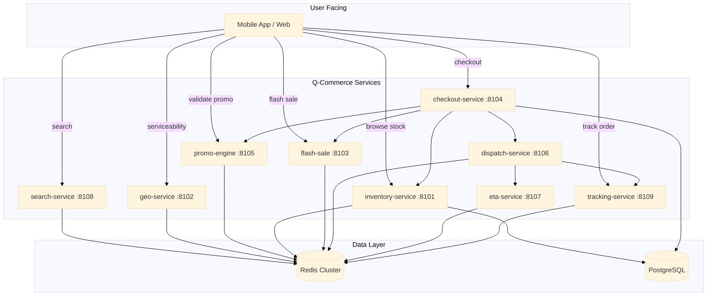

# Q-Commerce

Q-commerce (quick commerce) services power instant delivery platforms: 15-minute delivery windows, real-time inventory visibility, dynamic dispatching, and flash sale handling. This chapter covers 10 microservices that collectively form a production-grade quick commerce backend.

## Service Overview

| # | Service | Port | Core Pattern |
|---|---------|------|-------------|
| 1 | inventory-service | 8101 | Redis Lua atomic reservation + dual-store (Redis + Postgres) |
| 2 | geo-service | 8102 | H3 hexagon resolution + 5-tier fallback |
| 3 | flash-sale | 8103 | Redis Lua bucketed stock + sorted set waiting room |
| 4 | checkout-service | 8104 | Saga orchestration + transactional outbox |
| 5 | promo-engine | 8105 | AST composable conditions + Redis Lua multi-counter |
| 6 | dispatch-service | 8106 | Batch collector + greedy driver-order matching |
| 7 | eta-service | 8107 | Concurrent 3-goroutine ETA + Gaussian noise model |
| 8 | search-service | 8108 | Multi-match query builder + composite ranking |
| 9 | tracking-service | 8109 | Kalman filter location + WebSocket ingestion + SSE fan-out |

## Architecture



### Flow Description

1. **Discovery**: User searches for products (`search-service`) and checks delivery availability (`geo-service`).
2. **Browse**: User browses inventory and promotional offers. Stock is checked in `inventory-service`; promos are validated in `promo-engine`.
3. **Checkout**: `checkout-service` orchestrates a 5-step saga: reserve inventory, create order, charge payment, confirm order, publish events.
4. **Flash Sale**: High-concurrency checkout for limited-time deals runs through `flash-sale`, bypassing the normal checkout saga for performance.
5. **Dispatch**: Once an order is confirmed, `dispatch-service` matches a driver, computes ETA via `eta-service`, and starts live tracking via `tracking-service`.
6. **Tracking**: Drivers push GPS updates through `tracking-service` WebSocket; customers consume SSE events for live tracking.

## Common Patterns

- **Dual-store**: `inventory-service` uses Redis for operational reads/writes and Postgres as the system of record. Other services follow similar patterns.
- **Redis Lua scripts**: Atomic operations in `inventory-service`, `flash-sale`, and `promo-engine` use Lua scripts to avoid race conditions.
- **Saga orchestration**: `checkout-service` implements the saga pattern with compensation actions for each step.
- **Graceful degradation**: All services have fallback tiers when primary data sources are unavailable.

## Quick Start

```bash
# Start inventory service (requires Redis + Postgres)
go run ./services/qcommerce/inventory-service

# Start geo service
go run ./services/qcommerce/geo-service

# Run all q-commerce tests
go test ./services/qcommerce/...
```
