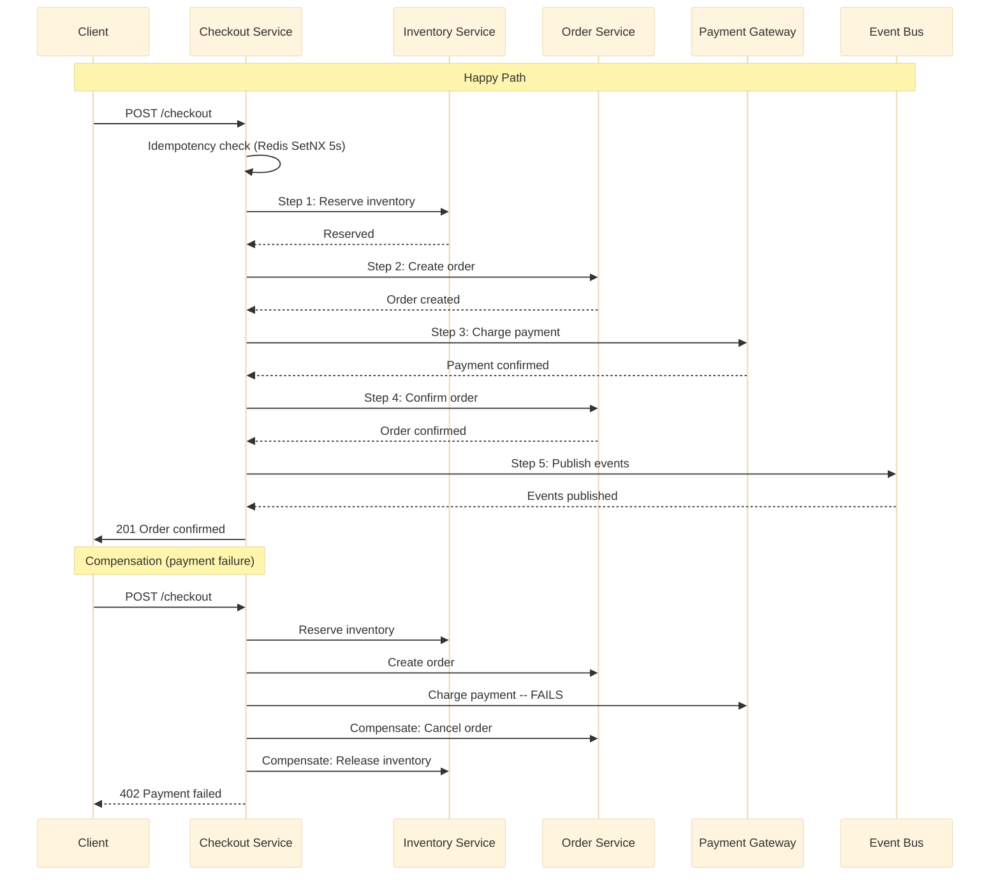

# Checkout Service

Saga orchestration engine for the q-commerce checkout flow. Coordinates 5 distributed steps with compensatory actions on failure. Uses Redis idempotency keys, a transactional outbox pattern, and HMAC webhook verification with timing-safe comparison.

Port **8104** | Package `checkout-service/`

## Architecture



### Saga Steps

| Step | Action | Compensation |
|------|--------|-------------|
| 1 | Reserve inventory (`inventory-service`) | Release inventory |
| 2 | Create order (`order-service`) | Cancel order |
| 3 | Charge payment (`payment-gateway`) | Refund payment |
| 4 | Confirm order (`order-service`) | — (terminal) |
| 5 | Publish events (event bus) | — (terminal) |

## Idempotency

Every checkout request carries an idempotency key (`Idempotency-Key` header). The service checks Redis `SetNX` with a 5-second lock before processing. After completion, the result is cached in Redis for 24 hours.

```go
func (s *Service) checkout(ctx context.Context, req *CheckoutRequest, idempotencyKey string) (*CheckoutResult, error) {
    // Check idempotency cache
    if result, err := s.idempotencyCache.Get(ctx, idempotencyKey); err == nil {
        return result, nil
    }

    // Acquire lock (5s TTL prevents concurrent duplicate processing)
    acquired, err := s.rdb.SetNX(ctx, "lock:"+idempotencyKey, "1", 5*time.Second).Result()
    if err != nil || !acquired {
        return nil, ErrConcurrentCheckout
    }
    defer s.rdb.Del(ctx, "lock:"+idempotencyKey)

    // Execute saga
    result, err := s.executeSaga(ctx, req)
    if err != nil {
        return nil, err
    }

    // Cache result for 24h
    s.idempotencyCache.Set(ctx, idempotencyKey, result, 24*time.Hour)
    return result, nil
}
```

## Transactional Outbox

Events are first written to an outbox table in the same database transaction as the order creation, then published asynchronously by a separate publisher goroutine. This ensures exactly-once event delivery semantics.

```go
func (s *Service) publishEvent(ctx context.Context, event Event) error {
    // Write to outbox in the same transaction
    _, err := s.db.Exec(ctx,
        "INSERT INTO outbox (event_type, payload, created_at) VALUES ($1, $2, NOW())",
        event.Type, event.Payload,
    )
    if err != nil {
        return fmt.Errorf("outbox write: %w", err)
    }
    // The publisher goroutine picks up unread outbox rows
    // and publishes them to the event bus
    return nil
}
```

## Webhook Verification

Payment gateway webhooks are verified using HMAC-SHA256 with a timing-safe comparison to prevent timing side-channel attacks.

```go
func (s *Service) verifyWebhook(signature string, body []byte) bool {
    mac := hmac.New(sha256.New, []byte(s.webhookSecret))
    mac.Write(body)
    expected := hex.EncodeToString(mac.Sum(nil))
    return hmac.Equal([]byte(signature), []byte(expected))
}
```

## API Endpoints

| Method | Path | Description |
|--------|------|-------------|
| `POST` | `/checkout` | Initiate a checkout (idempotent) |
| `POST` | `/webhook/payment` | Payment gateway webhook receiver |
| `GET` | `/orders/:id` | Get order status |

### POST /checkout

```json
// Request
Headers: {"Idempotency-Key": "req_abc123"}
Body: {"user_id": "usr_42", "hub_id": "hub_1", "items": [{"sku": "sku_101", "qty": 2}]}

// Response 201 (success)
{"data": {"order_id": "ord_xyz", "status": "confirmed", "total": 15.99}}

// Response 402 (payment failed)
{"error": {"code": "PAYMENT_FAILED", "message": "Card declined"}}
```

### POST /webhook/payment

```json
// Request
Headers: {"X-Signature": "sha256=abc123def"}
Body: {"event": "payment.succeeded", "order_id": "ord_xyz", "amount": 15.99}

// Response 200
{"status": "received"}
```

## Key Algorithms

### Saga Executor

```go
type SagaStep struct {
    name        string
    execute     func(context.Context) error
    compensate  func(context.Context) error
}

func (s *Service) executeSaga(ctx context.Context, req *CheckoutRequest) (*CheckoutResult, error) {
    steps := []SagaStep{
        {name: "reserve_inventory", execute: s.reserveInventory, compensate: s.releaseInventory},
        {name: "create_order",      execute: s.createOrder,      compensate: s.cancelOrder},
        {name: "charge_payment",    execute: s.chargePayment,    compensate: s.refundPayment},
        {name: "confirm_order",     execute: s.confirmOrder},
        {name: "publish_events",    execute: s.publishEvents},
    }

    executed := make([]int, 0, len(steps))

    for i, step := range steps {
        if err := step.execute(ctx); err != nil {
            // Compensate in reverse order
            for j := len(executed) - 1; j >= 0; j-- {
                steps[executed[j]].compensate(ctx)
            }
            return nil, fmt.Errorf("step %s failed: %w", step.name, err)
        }
        executed = append(executed, i)
    }

    return &CheckoutResult{OrderID: req.OrderID, Status: "confirmed"}, nil
}
```

## Technical Decisions

- **Saga orchestration over choreography**: The checkout service coordinates all steps centrally, making the flow explicit in a single code path. Choreography (each service reacting to events) is more decoupled but harder to reason about, test, and debug.
- **Redis SetNX idempotency lock (5s)**: Prevents duplicate checkout processing when clients retry the same request. The short TTL ensures locks are not held indefinitely if the processing goroutine crashes. The 24-hour result cache allows immediate response to retries without re-execution.
- **Transactional outbox**: Guarantees at-least-once event delivery without two-phase commit. Events and order state are written atomically to Postgres. A background publisher reads unprocessed outbox rows, publishes to the event bus, and marks them as processed.
- **HMAC webhook with timing-safe compare**: Prevents webhook forgery and timing side-channel attacks. `hmac.Equal` runs in constant time regardless of how many bytes match, unlike a naive `==` comparison that short-circuits on the first mismatch.
- **Compensation in reverse order**: Each step's compensator reverses its action. If step 3 fails, step 2 and step 1 compensators run in reverse order (2 then 1), leaving the system in a clean state. Compensation is best-effort and may require manual intervention for partial failures.

## Source Code

[View on GitHub](https://github.com/faisalaffan/faisalaffan-design-system/blob/dev/services/checkout-service/main.go)
