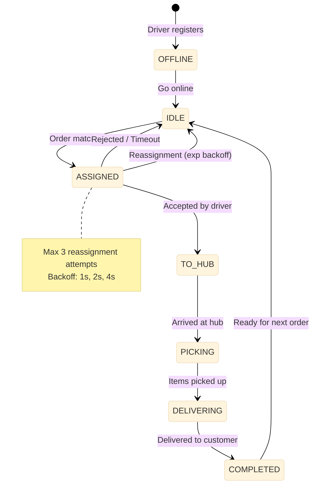

# Dispatch Service

Batch-based driver-order matching engine. Collects open orders into a batch window, then runs a greedy scoring algorithm to assign drivers. Maintains a 7-state driver state machine with reassignment on rejection, exponential backoff, and an anti-starvation heuristic.

Port **8106** | Package `dispatch-service/`

## Architecture



### Driver State Machine

| State | Meaning | Transitions To |
|-------|---------|----------------|
| OFFLINE | Not available for dispatch | IDLE |
| IDLE | Available — waiting for assignment | ASSIGNED |
| ASSIGNED | Order assigned — waiting for driver to accept | TO_HUB, IDLE |
| TO_HUB | En route to hub | PICKING |
| PICKING | Picking up items at hub | DELIVERING |
| DELIVERING | En route to customer | COMPLETED |
| COMPLETED | Order delivered | IDLE |

## Batch Collector

Orders are not dispatched individually. Instead, they are collected into a batch window and flushed when either condition is met:

| Condition | Value | Rationale |
|-----------|-------|-----------|
| MaxWindow | 5 seconds | Maximum wait before dispatch |
| MinOrders | 3 orders | Minimum batch size for efficient routing |
| Flush trigger | Whichever comes first | Balances latency against batch efficiency |

```go
func (s *Service) batchLoop(ctx context.Context) {
    ticker := time.NewTicker(s.maxWindow)
    defer ticker.Stop()

    for {
        select {
        case <-ctx.Done():
            return
        case <-ticker.C:
            s.flushBatch(ctx)
        case order := <-s.orderChan:
            s.pendingOrders = append(s.pendingOrders, order)
            if len(s.pendingOrders) >= s.minOrders {
                s.flushBatch(ctx)
            }
        }
    }
}
```

## Greedy Driver-Order Matching

When a batch flushes, the dispatcher scores every available (driver, order) pair and assigns the highest-scoring matches greedily.

### Scoring Formula

```
score = w1 * distance_score + w2 * eta_score + w3 * load_score + w4 * priority_score - anti_starvation_penalty
```

| Factor | Weight | Description |
|--------|--------|-------------|
| Distance | 0.25 | Normalised haversine distance from driver to hub |
| ETA | 0.25 | Remaining time to reach hub (shorter = better) |
| Load | 0.20 | Driver's current delivery load (lower = better) |
| Priority | 0.30 | Order priority (flash sale, VIP, normal) |
| Anti-starvation | Penalty | Drivers who haven't received orders recently get a score boost |

### Reassignment with Exponential Backoff

If a driver rejects an order or times out, the dispatcher reassigns up to 3 times with exponential backoff:

| Attempt | Backoff | Total Time |
|---------|---------|------------|
| 1 | 1s | 1s |
| 2 | 2s | 3s |
| 3 | 4s | 7s |

After 3 failed attempts, the order is placed back in the pool for the next batch cycle.

## API Endpoints

| Method | Path | Description |
|--------|------|-------------|
| `POST` | `/dispatch/order` | Submit an order for dispatch |
| `POST` | `/dispatch/driver/location` | Update driver GPS location |
| `POST` | `/dispatch/driver/accept` | Driver accepts an assignment |
| `POST` | `/dispatch/driver/reject` | Driver rejects an assignment |

### POST /dispatch/order

```json
// Request
{"order_id": "ord_xyz", "hub_id": "hub_1", "priority": "normal"}

// Response 200
{"data": {"dispatch_id": "dsp_abc", "status": "pending", "estimated_match_seconds": 5}}
```

### POST /dispatch/driver/accept

```json
// Request
{"driver_id": "drv_42", "dispatch_id": "dsp_abc"}

// Response 200
{"data": {"status": "accepted", "hub_id": "hub_1", "order_id": "ord_xyz"}}
```

## Key Algorithms

### Greedy Matcher

```go
func (s *Service) matchBatch(ctx context.Context, orders []Order, drivers []Driver) []Assignment {
    type scoredPair struct {
        driverID string
        orderID  string
        score    float64
    }

    var pairs []scoredPair
    for _, d := range drivers {
        for _, o := range orders {
            score := s.scorePair(ctx, d, o)
            pairs = append(pairs, scoredPair{d.ID, o.ID, score})
        }
    }

    // Sort by score descending
    sort.Slice(pairs, func(i, j int) bool {
        return pairs[i].score > pairs[j].score
    })

    assignedDrivers := make(map[string]bool)
    assignedOrders := make(map[string]bool)
    var result []Assignment

    for _, p := range pairs {
        if !assignedDrivers[p.driverID] && !assignedOrders[p.orderID] {
            result = append(result, Assignment{
                DriverID: p.driverID,
                OrderID:  p.orderID,
                Score:    p.score,
            })
            assignedDrivers[p.driverID] = true
            assignedOrders[p.orderID] = true
        }
    }

    return result
}
```

### Anti-Starvation Score Boost

```go
func (s *Service) antiStarvationBoost(driverID string) float64 {
    lastAssignment, err := s.rdb.Get(context.Background(), "last_assign:"+driverID).Result()
    if err != nil {
        return 0.5 // Never assigned — give high boost
    }
    elapsed := time.Since(parseTime(lastAssignment))
    if elapsed > 5*time.Minute {
        return 0.3 // Waiting >5 minutes
    }
    if elapsed > 2*time.Minute {
        return 0.1 // Waiting >2 minutes
    }
    return 0
}
```

## Technical Decisions

- **Batch dispatch (5s / 3 orders)**: Optimises route efficiency by matching multiple orders at once. Waiting 5 seconds for a batch is acceptable for q-commerce where the total delivery is under 15 minutes. The 3-order minimum prevents a single order from being dispatched without routing optimisation.
- **Greedy matcher over Hungarian algorithm**: The Hungarian algorithm guarantees optimal assignment but runs in O(n^3). Greedy with score sorting runs in O(n log n) and produces near-optimal results in practice. Given that q-commerce batches are small (3-10 orders per hub per 5s window), the simplicity wins.
- **7-state driver machine**: Each state transition corresponds to a meaningful business event (accepted, arrived, picked up, delivered). This granularity enables precise tracking of driver performance metrics — average time from acceptance to arrival, picking time per item, etc.
- **Exponential backoff (1s, 2s, 4s) with max 3 attempts**: Prevents rapid reassignment cycles that flood drivers with notifications. After 3 rejections, the order waits for the next batch cycle, giving the system time to find a better-suited driver.
- **Anti-starvation heuristic**: Drivers who have been idle for more than 2 minutes get a score boost, and more than 5 minutes get a significant boost. This ensures all drivers get orders consistently, improving driver retention and platform fairness.
