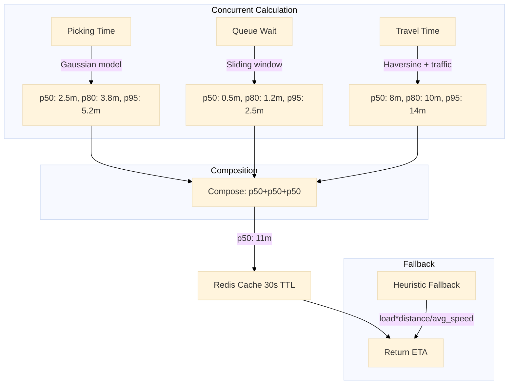

# ETA Service

Concurrent multi-component ETA calculator. Spawns three goroutines — picking time, queue wait, and travel time — each with a 5-second timeout. Combines results into p50/p80/p95 estimates using a sticky Redis cache with a 30-second TTL.

Port **8107** | Package `eta-service/`

## Architecture



### Concurrent Model

```go
func (s *Service) CalculateETA(ctx context.Context, req *ETARequest) (*ETAResult, error) {
    ctx, cancel := context.WithTimeout(ctx, 5*time.Second)
    defer cancel()

    type componentResult struct {
        name string
        comp *Component
        err  error
    }

    resultChan := make(chan componentResult, 3)

    go func() {
        comp, err := s.calculatePicking(ctx, req)
        resultChan <- componentResult{"picking", comp, err}
    }()
    go func() {
        comp, err := s.calculateQueueWait(ctx, req)
        resultChan <- componentResult{"queue", comp, err}
    }()
    go func() {
        comp, err := s.calculateTravel(ctx, req)
        resultChan <- componentResult{"travel", comp, err}
    }()

    components := make(map[string]*Component)
    for i := 0; i < 3; i++ {
        r := <-resultChan
        if r.err != nil {
            log.Printf("component %s failed: %v", r.name, r.err)
            continue
        }
        components[r.name] = r.comp
    }

    return s.composeETA(components), nil
}
```

## Component Models

### Picking Time — Gaussian with Load Multiplier

Picking time follows a roughly normal distribution per item, scaled by the hub's current load factor.

```go
func (s *Service) calculatePicking(ctx context.Context, req *ETARequest) (*Component, error) {
    loadFactor := s.getHubLoadFactor(ctx, req.HubID)
    items := len(req.Items)

    // Base: ~2 minutes for first item, ~30s per additional item
    basePerItem := 30.0 // seconds
    firstItem := 120.0  // seconds
    baseMean := (firstItem + float64(items-1)*basePerItem) * loadFactor

    // Gaussian noise: stddev = 20% of mean
    noise := rand.NormFloat64() * baseMean * 0.2
    mean := baseMean + noise

    return &Component{
        P50: time.Duration(mean) * time.Second,
        P80: time.Duration(mean*1.3) * time.Second,
        P95: time.Duration(mean*1.8) * time.Second,
    }, nil
}
```

### Travel Time — Haversine with Traffic Sliding Window

Travel time uses haversine distance divided by an estimated speed that accounts for traffic conditions via a sliding window of recent trip speeds.

```go
func (s *Service) calculateTravel(ctx context.Context, req *ETARequest) (*Component, error) {
    dist := haversine(req.HubLat, req.HubLng, req.DestLat, req.DestLng)

    // Sliding window of recent speeds for this area
    avgSpeed, err := s.getAverageSpeed(ctx, req.DestArea)
    if err != nil {
        avgSpeed = 8.0 // Default: 8 km/h (urban scooter)
    }

    travelMinutes := (dist / avgSpeed) * 60.0
    return &Component{
        P50: time.Duration(travelMinutes) * time.Minute,
        P80: time.Duration(travelMinutes*1.25) * time.Minute,
        P95: time.Duration(travelMinutes*1.5) * time.Minute,
    }, nil
}
```

### Queue Wait — Sliding Window Estimator

Queue wait estimates how long the order will sit before a driver picks it up, based on a sliding window of recent wait times.

```go
func (s *Service) calculateQueueWait(ctx context.Context, req *ETARequest) (*Component, error) {
    key := fmt.Sprintf("queue_wait:%s", req.HubID)

    // Retrieve recent wait times from sliding window (last 30 minutes)
    waits, err := s.rdb.LRange(ctx, key, 0, 99).Result()
    if err != nil || len(waits) == 0 {
        return &Component{P50: 0, P80: 0, P95: 0}, nil // No wait data
    }

    var values []float64
    for _, w := range waits {
        v, _ := strconv.ParseFloat(w, 64)
        values = append(values, v)
    }
    sort.Float64s(values)

    return &Component{
        P50: time.Duration(percentile(values, 0.5)) * time.Second,
        P80: time.Duration(percentile(values, 0.8)) * time.Second,
        P95: time.Duration(percentile(values, 0.95)) * time.Second,
    }, nil
}
```

## Sticky ETA Cache

Each calculated ETA is cached in Redis with a 30-second TTL. Subsequent requests for the same order within the TTL window receive the cached value — "sticky" behaviour that prevents ETA jitter during the delivery.

```go
func (s *Service) GetETA(ctx context.Context, orderID string) (*ETAResult, error) {
    cached, err := s.rdb.Get(ctx, "eta:"+orderID).Result()
    if err == nil {
        var result ETAResult
        json.Unmarshal([]byte(cached), &result)
        return &result, nil
    }
    return nil, ErrETANotFound
}
```

## API Endpoints

| Method | Path | Description |
|--------|------|-------------|
| `POST` | `/eta/calculate` | Request a fresh ETA calculation |
| `GET` | `/eta/:order_id` | Get the most recent cached ETA for an order |

### POST /eta/calculate

```json
// Request
{"hub_id": "hub_1", "hub_lat": -6.2000, "hub_lng": 106.8167, "dest_lat": -6.2088, "dest_lng": 106.8456, "items": [{"sku": "sku_101", "qty": 2}], "dest_area": "central_jakarta"}

// Response 200
{"data": {"total": {"p50": "11m0s", "p80": "14m30s", "p95": "19m0s"}, "components": {"picking": {"p50": "2m30s", "p80": "3m48s", "p95": "5m12s"}, "queue": {"p50": "30s", "p80": "1m12s", "p95": "2m30s"}, "travel": {"p50": "8m0s", "p80": "10m0s", "p95": "14m0s"}}}}
```

### GET /eta/:order_id

```json
// Response 200
{"data": {"order_id": "ord_xyz", "total": {"p50": "11m0s", "p80": "14m30s", "p95": "19m0s"}, "cached_at": "2026-06-22T10:30:00Z"}}
```

## Key Algorithms

### ETA Composition

```go
func (s *Service) composeETA(components map[string]*Component) *ETAResult {
    total := &Component{}
    for _, comp := range components {
        total.P50 += comp.P50
        total.P80 += comp.P80
        total.P95 += comp.P95
    }
    return &ETAResult{Total: total, Components: components}
}
```

### Fallback Heuristic

When no component data is available (e.g., queue wait has no history), the heuristic uses:

```go
func (s *Service) heuristicETA(req *ETARequest) *Component {
    dist := haversine(req.HubLat, req.HubLng, req.DestLat, req.DestLng)
    // Default: 2m picking + 30s queue + distance at 10 km/h
    totalMin := 2.5 + (dist/10.0)*60.0
    return &Component{
        P50: time.Duration(totalMin) * time.Minute,
        P80: time.Duration(totalMin*1.3) * time.Minute,
        P95: time.Duration(totalMin*1.7) * time.Minute,
    }
}
```

## Technical Decisions

- **3 concurrent goroutines with 5s timeout**: Each component (picking, queue, travel) is independent and can be calculated in parallel. The 5-second timeout bounds the total calculation time. If a component fails or times out, the service returns a partial result with available components — the caller decides whether to accept a degraded ETA or use the fallback heuristic.
- **Gaussian noise picking model**: Picking times follow a normal distribution in practice (most picks cluster around the mean with occasional outliers). Adding Gaussian noise (±20% stddev) makes the ETA realistic — not every order of the same size gets the same estimate.
- **Haversine with traffic sliding window**: Simple spherical distance for the base estimate, adjusted by a sliding window of recent trip speeds in the same area. The sliding window captures current traffic conditions without a third-party traffic API dependency.
- **p50/p80/p95 composition**: Each component returns three percentiles. The total ETA is a simple sum of corresponding percentiles per component. Providing multiple percentiles lets the frontend choose: show p50 as the primary ETA, p80 as the "latest" estimate, and p95 for internal capacity planning.
- **Sticky ETA cache (30s TTL)**: Prevents the ETA from fluctuating on every request. Once calculated, the ETA is cached for 30 seconds and served to all consumers (customer app, dispatch system, tracking page). The 30-second window is short enough to reflect meaningful changes (driver assignment, traffic) but long enough to prevent visual jitter.
- **Fallback heuristic**: When all component data is unavailable, the heuristic returns a distance-based estimate at a default speed of 10 km/h. This is an approximation but keeps the service functional during data source degradation.
