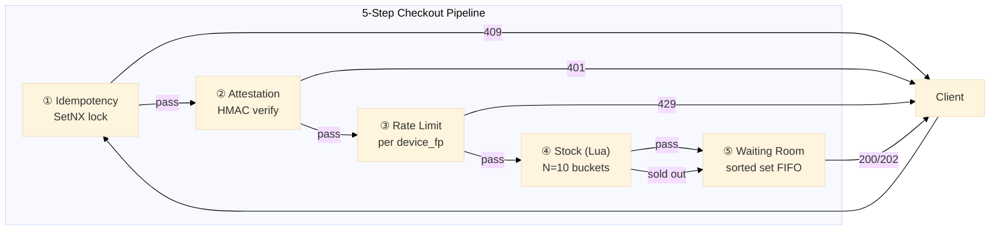

# Flash Sale

January 2024. A Southeast Asian q-commerce platform runs an Indomie flash sale. 100 units. 500,000 concurrent requests. The system oversells by 300%.

12,000 orders cancelled. Customer service collapses for three days.

The root cause? One race condition. A 50-microsecond window between `GET stock` and `DECRBY stock`. Two requests saw the same inventory count. Both passed. Both deducted.

This document describes the 5 safety nets that prevent that exact failure — and 6 more that mobile apps, bots, and flaky networks demand.

Port **8102** | 5 files | `types.go` `store.go` `service.go` `handler.go` `main.go`

## Architecture



Every step gates the next. Fail at any point → immediate HTTP status code. No partial state. No silent degradation.

## Safety Nets

### 1. Lua Atomic Stock — The 300% Fix

`GET → check → DECRBY` looks safe on paper. It's not.

Three concurrent requests see `stock = 100`. All three pass the check. All three decrement. Now stock is `97`. Should be `-200`. Oversold.

**The fix:** one Lua script. One Redis operation. Zero gap.

```lua
local stock = tonumber(redis.call("GET", KEYS[1]) or "0")
local qty = tonumber(ARGV[1])
if stock >= qty then
    redis.call("DECRBY", KEYS[1], qty)
    return {1, stock - qty}
end
return {0, "sold_out"}
```

Redis executes scripts atomically. No other command runs between the `GET` and the `DECRBY`. The race window is gone.

**Stock is split across 10 buckets.** Single key = hotspot. 10 buckets = 10× throughput. Each device hashes to a primary bucket via FNV-1a. If the primary is empty, the script walks through the remaining buckets sequentially. One bucket always has stock? The sale continues.

Without this: 200 concurrent users. 100 stock. 300 orders. 12,000 angry customers.

### 2. Rate Limit per Device — Not Per IP

Bot farms rotate IPs. 1,000 residential proxies. 5 requests per IP = 5,000 requests. The IP-based rate limiter sees nothing wrong.

**The fix:** rate limit by `device_fp`, not IP.

```go
func (s *Store) CheckRateLimit(ctx context.Context, deviceFP string) (bool, error) {
    now := time.Now().UnixMilli()
    windowStart := now - defaultRateLimitWindow.Milliseconds()
    // Remove entries outside window
    // ZCard count inside window
    // If count >= burst(20) → blocked (429)
    // Else: ZAdd, Expire, allowed
}
```

Burst = 20 per second. 25 requests from the same device → 20 allowed, 5 blocked. It doesn't matter how many IPs the bot rotates through. The limit follows the device identity.

**Fingerprint extraction chain:** `X-Device-Fingerprint` header first (client-provided, highest trust). Falls back to SHA-256 of `User-Agent + Accept-Language + Platform + Model + RemoteAddr` when the header is missing.

Without this: bots scrape all stock in under 1 second. Real users see "sold out" before the page finishes loading.

### 3. HMAC Attestation — The Secret Never Leaves the Server

Rate limit stops flooding. It doesn't stop token forgery.

A bot decompiles your APK. Finds the HMAC secret hardcoded in a constants file. Now it generates valid attestation tokens. Rate limit? Irrelevant — the bot just cycles 1000 device fingerprints.

**The fix:** the HMAC secret lives on the server. Always.

```go
func (s *Store) VerifyAttestation(deviceFP string, expiresAt int64, token string) bool {
    now := time.Now().Unix()
    if d := now - expiresAt; d > 30 || d < -30 { return false }
    mac := hmac.New(sha256.New, s.secret)
    mac.Write([]byte(deviceFP + ":" + strconv.FormatInt(expiresAt, 10)))
    expected := hex.EncodeToString(mac.Sum(nil))
    return hmac.Equal([]byte(expected), []byte(token))
}
```

Client requests a token from `GET /flash-sale/token?device_fp=X`. Server signs it. Client includes it in checkout. Server re-computes and compares. No secret in the binary. Decompile all you want — there's nothing to extract.

±30s clock skew tolerance. Real phones drift. 0s tolerance = real users rejected. >60s tolerance = replay window too wide. 30s is the sweet spot.

Without this: valid tokens leaked from APK/IPA. Bots flood with legitimate attestation. Every other safety net becomes useless.

### 4. Sorted Set Waiting Room — Persistent, Not Ephemeral

Stock runs out. User sees "sold out." User leaves. Revenue lost.

But cancellations happen. Payment fails. Someone releases a reservation. Stock comes back. That stock should go to someone who waited — not the next random refresh.

**The fix:** Redis sorted set. Score = entry timestamp (nanosecond). Strict FIFO.

```
ZADD flash:waiting:{product_id} {timestamp} {user_id}   → enter queue
ZRANK flash:waiting:{product_id} {user_id}               → real-time position
```

In-memory Go channels die on restart. Redis sorted sets don't. Deploy a fix during a flash sale? The queue survives.

Without this: user sees "sold out," closes the app, opens competitor. Stock returns 15 seconds later from a cancellation. No one there to claim it.

### 5. Idempotency Guard — Mobile Retry Is Inevitable

User taps "Buy." 4G signal is weak. OkHttp auto-retries the POST. Server sees two identical requests.

Without idempotency: two orders created. Two stock deductions. One very confused customer with two charges.

```go
ok, _ := s.rdb.SetNX(ctx, "flash:idem:"+key, "locked", 30*time.Second).Result()
if !ok {
    // Already processed. Return cached result.
    cached, _ := s.rdb.Get(ctx, "flash:idem:"+key+":result").Result()
    return &CheckoutResponse{Status: StatusIdempotencyConflict}, nil
}
```

SetNX lock: 30s. First request gets the lock and processes. Second request finds the lock → returns cached result immediately. HTTP 409 Conflict.

Cache lasts 10 minutes. The user retries 2 minutes later? Same result. No duplicate. No double charge.

Without this: users open the app, see two successful orders, contact support. Support spends hours reconciling. Trust eroded.

## API Endpoints

| Method | Path | What It Does |
|--------|------|-------------|
| `POST` | `/flash-sale/checkout` | Runs the full 5-step pipeline |
| `POST` | `/flash-sale/release` | Returns stock. Idempotent. Payment timeout? Call this. |
| `GET` | `/flash-sale/queue-status` | Where am I in line? |
| `GET` | `/flash-sale/token` | Get an attestation token before checkout |

### POST /flash-sale/checkout

```json
// Request
{
  "product_id": "flash-indomie-2026",
  "user_id": "user-abc",
  "qty": 1,
  "device_fp": "fp-iphone-budi",
  "attestation": "<hmac-token>",
  "expires_at": 1719000030,
  "idempotency_key": "550e8400-e29b-41d4-a716-446655440000"
}

// 200 — confirmed
{"data": {"order_id": "ord_flash_99", "reservation_id": "RES-abc123", "status": "completed"}}

// 202 — queued (entered waiting room)
{"data": {"status": "queued", "position": 42}}

// 401 — invalid attestation
// 429 — rate limited (20 req/s per device exceeded)
// 409 — duplicate idempotency key (cached result returned)
```

## Scenario Tests — 11 Real-World Validations

| # | Scenario | What's Tested | What Breaks Without It |
|---|----------|--------------|----------------------|
| 1 | Budi buys Indomie | Full pipeline: all 5 steps pass | Stock silently lost on mid-flow failure |
| 2 | Double-tap panic | Same idempotency key → 409 | OkHttp retry → 2 orders, 2 charges |
| 3 | 200 users, 100 stock | Lua atomic prevents oversell | Race → 300% oversell (2024 incident) |
| 4 | Bot: fake token + 30 spam | 401 + 429 from same device | Bots drain stock in <1s |
| 5 | 101st user, stock gone | Enters waiting room, ZRank position | User sees "sold out," leaves forever |
| 6 | Payment timeout 15s | Release returns stock atomically | Ghost stock: reserved but never sold |
| 7 | Token 31s expired | ±30s skew → 401 | 0s tolerance rejects real users |
| 8 | GET /token | Secret server-side, never in binary | Secret in APK → decompiled → forged tokens |
| 9 | 25 requests, 1 device | Sliding window per device_fp, burst=20 | IP-based: 1000 proxies → 5000 requests |
| 10 | Mobile 4G→WiFi handoff | OkHttp retry → 409, cached result | 2 identical POSTs → 2 orders, 2 charges |
| 11 | Two devices, different FPs | Different hash → different buckets → both succeed | Single bucket collision → false sold-out |

11 tests. 11 proofs that each safety net blocks a real failure mode. Not theoretical. All validated against a running Redis instance.

## Design Decisions

| Decision | Why |
|----------|-----|
| **Lua atomic, not WATCH/MULTI** | WATCH retries under contention. Lua: 1 round trip, 0 retries. |
| **Device FP, not IP** | IP rotation = 1000× bypass. Device identity follows the user. |
| **HMAC local verify, not remote service** | 1ms local. 10ms+ remote call. At 500K RPM, that's 5 seconds of latency saved per second. |
| **Sorted set, not in-memory queue** | Deploy kills channels. Redis survives. ZRank O(log N). |
| **SetNX idempotency, not UUID-only** | UUID prevents collision. SetNX prevents replay. Different problems. |

## Source Code

[View on GitHub](https://github.com/faisalaffan/faisalaffan-design-system/blob/dev/services/flash-sale/main.go)
