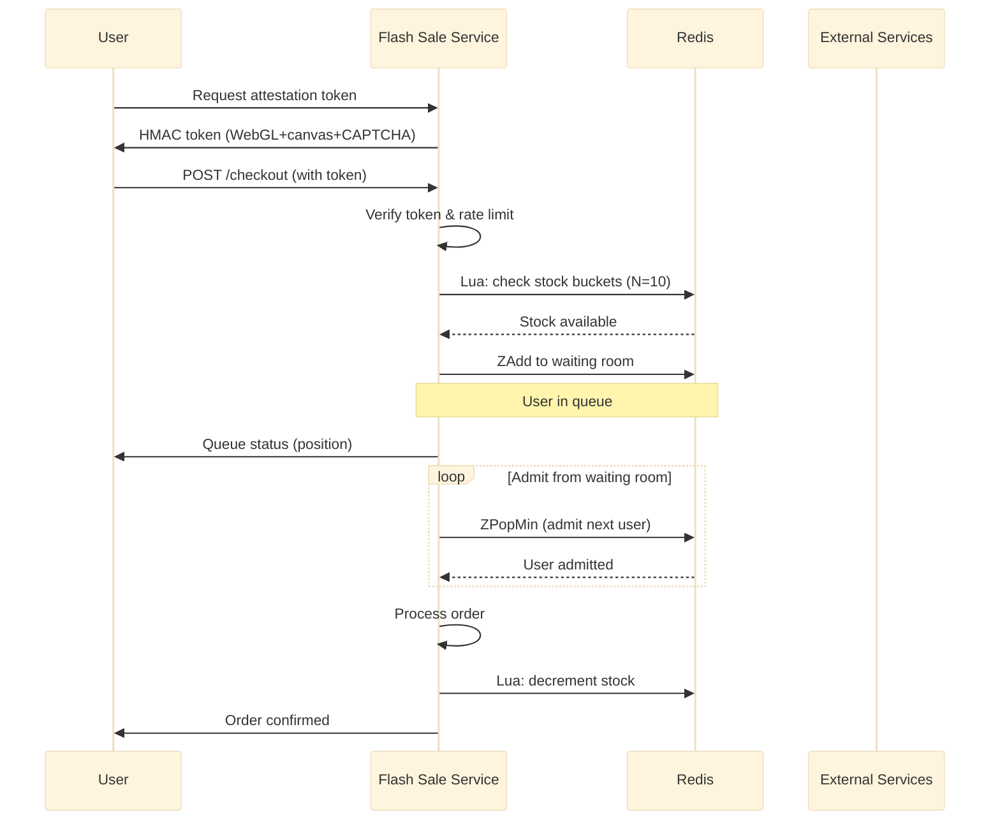

# Flash Sale

High-throughput flash sale checkout engine using Redis Lua bucketed stock, a sorted set waiting room, HMAC-SHA256 attestation tokens, and sliding window rate limiting per device fingerprint.

Port **8103** | Package `flash-sale/`

## Architecture



### Stock Buckets

Flash sale stock is distributed across `N=10` Redis buckets per SKU to reduce contention. Each bucket is an independent Redis key.

| Concept | Detail |
|---------|--------|
| Buckets | 10 per SKU (`flash:sku_101:bucket:0` — `flash:sku_101:bucket:9`) |
| Primary bucket | `hash(device_fingerprint) % 10` |
| Overflow | Sequential fallback to `(primary + 1) % N` |
| Atomic check | Lua script checks all buckets starting from primary |

```go
func (s *Service) selectBucket(sku, fingerprint string) int {
    h := fnv.New32a()
    h.Write([]byte(sku + ":" + fingerprint))
    return int(h.Sum32()) % s.bucketCount
}
```

### Waiting Room

When stock is available but demand exceeds throughput, users enter a sorted set waiting room. The score is their entry timestamp. A background goroutine admits users via `ZPopMin`.

```redis
ZADD flash:sale:123:queue <timestamp> <user_id>
ZPOPMIN flash:sale:123:queue <batch_size>
```

## Rate Limiting

Sliding window rate limiter keyed by device fingerprint. Each device gets 3 checkout attempts per 10-second window.

```go
func (s *Service) isRateLimited(ctx context.Context, fingerprint string) bool {
    key := fmt.Sprintf("rl:flash:%s", fingerprint)
    now := time.Now().Unix()

    // Remove entries outside window
    s.rdb.ZRemRangeByScore(ctx, key, "0", strconv.FormatInt(now-10, 10))

    // Count entries in window
    count, _ := s.rdb.ZCard(ctx, key).Result()
    if count >= 3 {
        return true
    }

    // Add current attempt
    s.rdb.ZAdd(ctx, key, redis.Z{Score: float64(now), Member: strconv.FormatInt(now, 10)})
    s.rdb.Expire(ctx, key, 10*time.Second)
    return false
}
```

## Attestation Tokens

Before checkout, the client requests an HMAC-SHA256 attestation token. The token embeds WebGL fingerprint, canvas fingerprint, and a CAPTCHA result. The service verifies the token on each checkout request.

```go
func (s *Service) generateToken(ctx context.Context, fingerprint string) (string, error) {
    payload := map[string]interface{}{
        "fp":  fingerprint,
        "exp": time.Now().Add(30 * time.Second).Unix(),
        "nonce": randSeq(16),
    }
    payloadBytes, _ := json.Marshal(payload)
    mac := hmac.New(sha256.New, []byte(s.secretKey))
    mac.Write(payloadBytes)
    sig := hex.EncodeToString(mac.Sum(nil))
    return base64.RawURLEncoding.EncodeToString(payloadBytes) + "." + sig, nil
}
```

## API Endpoints

| Method | Path | Description |
|--------|------|-------------|
| `POST` | `/checkout` | Submit a flash sale checkout request |
| `GET` | `/queue-status` | Get current position in the waiting room |
| `POST` | `/admin/sales` | Create or configure a flash sale event |

### POST /checkout

```json
// Request
{"sale_id": "sale_42", "sku": "sku_101", "qty": 1, "attestation": "eyJmcCI6Inh5eiJ9.abc123def"}

// Response 200 (admitted)
{"data": {"order_id": "ord_flash_99", "status": "confirmed"}}

// Response 202 (queued)
{"data": {"status": "queued", "position": 42, "estimated_wait_seconds": 12}}
```

### GET /queue-status?user_id=usr_42&sale_id=sale_42

```json
// Response 200
{"data": {"position": 15, "total_in_queue": 200, "estimated_wait_seconds": 8}}
```

## Key Algorithms

### Bucketed Stock Reservation (Lua)

```lua
-- KEYS[N] = bucket keys for one SKU
-- ARGV[1] = primary index
-- ARGV[2] = qty
local n = #KEYS
local start = tonumber(ARGV[1]) + 1
for i = 0, n - 1 do
    local idx = ((start + i - 1) % n) + 1
    local stock = tonumber(redis.call("GET", KEYS[idx]) or "0")
    if stock >= tonumber(ARGV[2]) then
        redis.call("DECRBY", KEYS[idx], ARGV[2])
        return { KEYS[idx], stock - tonumber(ARGV[2]) }
    end
end
return redis.error_reply("SOLD_OUT")
```

## Technical Decisions

- **10 stock buckets per SKU**: Reduces Redis key contention by an order of magnitude. With a single key, every concurrent checkout serialises on one Lua script. With 10 buckets, 10 concurrent checkouts can proceed in parallel as long as they hash to different buckets.
- **Fingerprint-based bucket assignment**: Ensures the same device always hits the same bucket, making retries predictable. Sequential fallback on overflow prevents deterministic rejection.
- **Sorted set waiting room**: Redis sorted sets provide O(log N) insertion and O(log N) removal. `ZPopMin` admits the earliest-waiting users efficiently. The room acts as a shock absorber between client demand and processing capacity.
- **Sliding window rate limiting per device**: 3 attempts per 10 seconds prevents automated bots from flooding the system while allowing legitimate retries on transient failures.
- **HMAC-SHA256 attestation**: Client-generated attestations with WebGL, canvas, and CAPTCHA challenges make automated abuse harder. The 30-second token expiry limits the replay window. The server secret key prevents forgery.
- **Background admit goroutine**: Polls the waiting room sorted set and admits users in FIFO order. The admit rate is configurable per sale based on processing capacity, preventing resource exhaustion.
