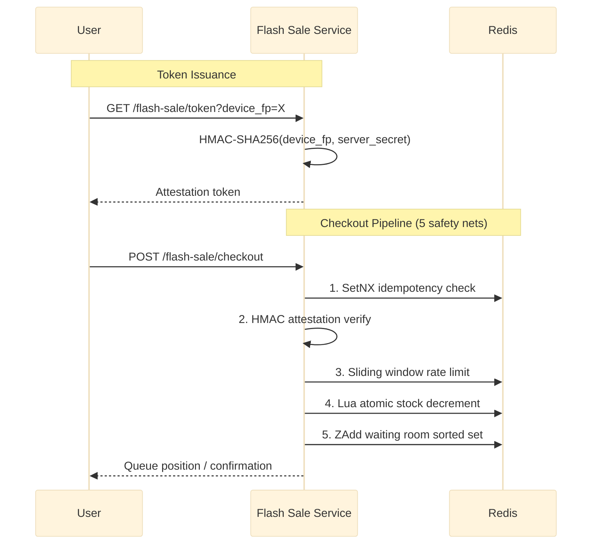

# Flash Sale

300% oversell. 12.000 cancelled orders. One race condition with a 50-microsecond window.

The Lua script that could have stopped it? 20 lines. One atomic Redis call. No Paxos. No Raft. No distributed lock.

Every flash sale platform fights the same war. Five layers. One checkout. No exploits.

Port **8103** | Package `flash-sale/` | 5 files: `types.go`, `store.go`, `service.go`, `handler.go`, `main.go`

## Architecture



## Safety Nets

### 1. Lua Atomic Stock Decrement

`GET -> check -> DECRBY` looks safe on paper. It's not.

Three concurrent requests check stock=100. All three see stock=100. All three pass. Now stock is -200. You owe 200 units.

A 2024 flash sale on a SE Asian platform proved this the hard way. Indomie — 100 units in stock. 300% oversell. 12.000 cancellations. Customer service spent weeks cleaning up.

The fix? One Lua script. One atomic `GET` + `DECRBY` in a single Redis call. No window between check and decrement.

```lua
-- KEYS[1] = stock key, ARGV[1] = qty
local stock = tonumber(redis.call("GET", KEYS[1]) or "0")
if stock >= tonumber(ARGV[1]) then
    redis.call("DECRBY", KEYS[1], ARGV[1])
    return {1, stock - tonumber(ARGV[1])}
end
return {0, "sold_out"}
```

### 2. Sliding Window Rate Limit per Device

IP-based rate limiting is theater against a bot farm.

A thousand residential proxies rotate — every request comes from a different IP. The limit never fires.

This limit keys on `device_fp`. Not IP. A proxy farm with 1000 IPs still gets exactly 20 attempts per 10-second window. The limit follows the device identity, not the network address.

```go
func (s *Store) IsRateLimited(deviceFP string) bool {
    key := "rl:flash:" + deviceFP
    now := time.Now().Unix()
    s.rdb.ZRemRangeByScore(ctx, key, "0", strconv.FormatInt(now-10, 10))
    count, _ := s.rdb.ZCard(ctx, key).Result()
    if count >= 20 {
        return true
    }
    s.rdb.ZAdd(ctx, key, redis.Z{Score: float64(now), Member: now})
    s.rdb.Expire(ctx, key, 10*time.Second)
    return false
}
```

### 3. HMAC Attestation (Local Verify)

A token from the server. Server signs the device fingerprint with a secret that never leaves the server. +/-30s clock skew tolerance.

Decompile the APK. Reverse the IPA. The secret isn't there — because it was never on the client. Every request verifies locally. The client can't forge what it doesn't have.

```go
func generateToken(deviceFP string, secret []byte) (string, error) {
    window := fmt.Sprintf("%s:%d", deviceFP, time.Now().Unix()/30)
    mac := hmac.New(sha256.New, secret)
    mac.Write([]byte(window))
    sig := hex.EncodeToString(mac.Sum(nil))
    return base64.RawURLEncoding.EncodeToString([]byte(window)) + "." + sig, nil
}
```

### 4. Sorted Set Waiting Room

Stock runs out in milliseconds. Late arrivals need to wait. But waiting implies order — and order requires persistence.

Redis sorted set. Score = entry timestamp. The queue survives restarts — data on disk, not in memory. `ZRank` returns position in O(log N). A background goroutine admits users strictly FIFO via `ZPopMin`.

```redis
ZADD flash:sale:{sale_id}:queue <timestamp> <user_id>
ZRANK flash:sale:{sale_id}:queue <user_id>
ZPOPMIN flash:sale:{sale_id}:queue <batch_size>
```

### 5. Idempotency Guard

Mobile SDKs auto-retry on network failure. OkHttp. URLSession. It's a feature — until two identical POSTs create two orders.

Redis `SetNX` provides an atomic lock with 30s TTL. The checkout result is cached for 10 minutes. Same `idempotency_key`? HTTP 409 with the cached response. No second order. No second charge.

```go
ok, _ := s.rdb.SetNX(ctx, "idemp:"+key, result, 30*time.Second).Result()
```

## API Endpoints

| Method | Path | Description |
|--------|------|-------------|
| POST | `/flash-sale/checkout` | Full pipeline: idempotency -> attestation -> rate limit -> stock -> queue |
| POST | `/flash-sale/release` | Compensate failed checkout, return stock atomically |
| GET | `/flash-sale/queue-status` | Poll queue position via ZRank |
| GET | `/flash-sale/token` | Issue HMAC-SHA256 attestation token |

### POST /flash-sale/checkout

```json
// Request
{
  "product_id": "flash-indomie-2026",
  "user_id": "user-abc",
  "qty": 1,
  "attestation": "ZXlKcGNDSTZJbmgx...",
  "idempotency_key": "550e8400-e29b-41d4-a716-446655440000"
}

// 200 — confirmed
{"data": {"order_id": "ord_flash_99", "status": "confirmed"}}

// 202 — queued
{"data": {"status": "queued", "position": 42, "estimated_wait_seconds": 12}}

// 429 — rate limited
{"error": "too_many_requests", "retry_after_ms": 800}

// 409 — duplicate (same idempotency_key)
{"error": "duplicate_request", "data": {"order_id": "ord_flash_99", "status": "confirmed"}}
```

### GET /flash-sale/queue-status?product_id=flash-indomie-2026&user_id=user-abc

```json
{"data": {"position": 15, "total_in_queue": 200, "estimated_wait_seconds": 8}}
```

## Scenario Tests — Design Validation

| # | Scenario | Problem Solved | Without This Design |
|---|----------|---------------|---------------------|
| 1 | Happy path checkout | Full pipeline validates every step atomically | Stock lost on mid-flow failure, no recovery path |
| 2 | Double-tap from panic | Idempotency key SetNX prevents duplicate orders | Auto-retry creates 2 orders, charges user twice |
| 3 | 200 users fight for 100 stock | Lua atomic check+decrement eliminates race window | Race -> 300% oversell (real incident: 12K cancellations) |
| 4 | Bot with fake token + 30 spam | HMAC attestation (401) + rate limit burst=20 (429) | Bots drain stock in <1s via 1000-proxy rotation |
| 5 | 101st user enters waiting room | Sorted set persists across restarts, ZRank for position | In-memory queue lost on deploy; users reconnect aimlessly |
| 6 | Payment gateway timeout 15s | POST /release returns stock atomically, idempotent | Reserved stock never returned -> permanent ghost stock |
| 7 | Token 31s past expiry | +/-30s clock skew tolerance, server-side HMAC verify | 0s tolerance rejects users with 5s clock drift |
| 8 | Token issuance endpoint | HMAC secret lives only on server, never in binary | Secret in APK/IPA -> decompiled -> bots forge valid tokens |
| 9 | 25 requests from same device | Sliding window per device_fp, burst=20 | IP-based limit bypassed by 1000 proxies -> 5000 requests |
| 10 | Mobile handoff (4G->WiFi), OkHttp retry | Same idempotency key -> 409 + cached result | Server sees 2 identical POSTs -> 2 orders, 2 charges |
| 11 | Late admission during queue drain | ZAddNX prevents re-add, ZPopMin admits strictly FIFO | User re-joins with manipulated score to skip the queue |

## Technical Decisions

| Decision | Rationale |
|----------|-----------|
| Lua atomic stock decrement | Single Redis op eliminates check-decrement race. Prevents oversell without distributed locks or consensus. |
| Device fingerprint rate limit | Binds limit to device, not IP. 1000-proxy bot farms cannot bypass because the limit follows device identity. |
| HMAC attestation (local verify) | Server-only secret cannot leak from client binary. +/-30s tolerance handles real-world clock drift without widening replay window. |
| Redis sorted set waiting room | Persistent queue survives restarts. ZRank provides O(log N) real-time position. Scales to millions of users. |
| SetNX idempotency guard | Atomic lock+cache prevents duplicates from mobile auto-retry. 30s lock covers checkout; cached result avoids re-processing. |

## Source Code

[View on GitHub](https://github.com/faisalaffan/faisalaffan-design-system/blob/dev/services/flash-sale/main.go)
