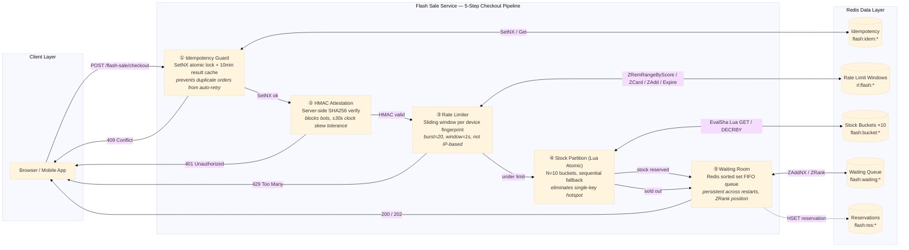

# Flash Sale

High-throughput flash sale checkout engine with Lua atomic N-bucket stock decrement, HMAC-SHA256 attestation tokens, sliding window rate limiting per device fingerprint, a Redis sorted set waiting room, SetNX idempotency guards, and a reservation lifecycle with compensating release transactions.

Port **8102** | Package `flash-sale/` | 5 files: `types.go`, `store.go`, `service.go`, `handler.go`, `main.go`

## Architecture



The pipeline is strictly sequential: each step gates the next. A failure at any step returns a specific HTTP status code (401, 429, 409) with a structured error response. The Redis backing store is loaded with 3 Lua scripts at startup via `ScriptLoad`, which returns SHA hashes used for `EvalSha` calls.

## Stock Partitioning

### Problem

A single Redis key `flash:total:{product_id}` is a hotspot under flash sale load. When 200 concurrent users attempt checkout, all 200 hit the same key. This creates contention on the Redis server and serialises what could otherwise be parallel operations. A single-key design also means one Lua script must check and decrement the entire inventory in one atomic operation — correct, but it creates a coordination bottleneck.

### Solution: N-Bucket Striping

Distribute the total stock across N independent Redis keys (buckets). Each device is deterministically hashed to a primary bucket. The Lua script first tries the primary bucket; if it is depleted, it falls back to the remaining N-1 buckets in sequence.

```
Total stock S → distribute across N buckets
Bucket i gets base = S / N, plus 1 if i < (S % N)  (even distribution)
Device FP → FNV-1a hash → primary bucket index
Lua: try primary, then (primary+1) % N, ..., (primary+N-1) % N
```

### Data Structures

| Key Pattern | Type | Purpose |
|-------------|------|---------|
| `flash:total:{product_id}` | String (integer) | Global remaining stock counter |
| `flash:bucket:{product_id}:{0..N-1}` | String (integer) | Per-bucket stock counter |

### Bucket Initialisation

```go
func (s *Store) InitProduct(ctx context.Context, productID string, totalStock, bucketCount int) error {
    pipe := s.rdb.Pipeline()
    pipe.Set(ctx, keyTotal+productID, totalStock, 0)
    base := totalStock / bucketCount
    rem := totalStock % bucketCount
    for i := 0; i < bucketCount; i++ {
        q := base
        if i < rem {
            q++
        }
        pipe.Set(ctx, keyBucket+productID+":"+strconv.Itoa(i), q, 0)
    }
    _, err := pipe.Exec(ctx)
    return err
}
```

For `totalStock = 100` and `bucketCount = 10`, each bucket gets 10. For `totalStock = 103`, the first 3 buckets get 11 and the remaining 7 get 10.

### Lua Bucket Decrement (Atomic)

```lua
-- KEYS[1]   = flash:total:{pid}
-- KEYS[2..] = flash:bucket:{pid}:{0..N-1}
-- ARGV[1]   = quantity
-- ARGV[2]   = N (bucket count)
-- ARGV[3]   = start index (primary bucket)
--
-- Returns: {idx, remaining} on success
--          {-2, total} if global stock insufficient
--          {-3, total} if all buckets depleted (fragmentation)

local total = tonumber(redis.call("GET", KEYS[1]) or "0")
if total < tonumber(ARGV[1]) then return {-2, total} end

local N = tonumber(ARGV[2])
local start = tonumber(ARGV[3])

for i = 0, N - 1 do
    local idx = (start + i) % N
    local v = tonumber(redis.call("GET", KEYS[2 + idx]) or "0")
    if v >= tonumber(ARGV[1]) then
        redis.call("DECRBY", KEYS[2 + idx], ARGV[1])
        redis.call("DECRBY", KEYS[1], ARGV[1])
        return {idx, total - tonumber(ARGV[1])}
    end
end

return {-3, total}
```

The primary bucket is derived from the device fingerprint:

```go
func hashFP(fp string) int {
    h := fnv.New32a()
    h.Write([]byte(fp))
    return int(h.Sum32())
}

// In ReserveStock:
primary := hashFP(deviceFP) % numBuckets
```

### Edge Cases

**Redis failover NOSCRIPT.** The Lua scripts are loaded at startup via `ScriptLoad`, and all subsequent calls use `EvalSha`. If a Redis failover promotes a replica that has never seen the script, `EvalSha` returns a NOSCRIPT error. Mitigation: retry with `Eval` (fallback to inline script) or reload scripts on connection reconnect. Currently the code returns the error to the caller, which fails the checkout.

**Stock fragmentation.** Bucket 0 may be empty while bucket 5 still has stock. The sequential fallback handles this by iterating through all N buckets starting from the primary. Return code `-3` signals total fragmentation (every bucket is below the requested quantity even though the global total might suggest otherwise — a rare edge case when all buckets have partial stock but no single bucket has enough for the requested qty).

**Operation timeout.** Redis pipeline commands or individual ops can time out under extreme load. The `ReserveStock` function propagates the error; the service layer returns an internal error response.

## Waiting Room

### Problem

A flash sale can generate 50,000 checkout requests in under one second. The downstream services (payment gateway, inventory, order management) cannot handle this concurrency. Naive approaches like in-memory queues are lost on deploy; simple "sold out" responses lose revenue when cancellations free up stock.

### Solution: Redis Sorted Set FIFO Queue

Users who fail to reserve stock (all buckets depleted) are placed into a Redis sorted set keyed by product. Their entry timestamp (Unix nanosecond) is the score, ensuring strict FIFO ordering. The sorted set persists across service restarts, survives Redis failover, and provides O(log N) position queries via ZRank.

### Data Structures

| Key Pattern | Type | Purpose |
|-------------|------|---------|
| `flash:waiting:{product_id}` | Sorted Set | FIFO queue of waiting users |
| Score | UnixNano | Entry timestamp (strict ordering) |
| Member | User ID | Unique user identifier |

### Algorithms

**Enqueue.** When stock is exhausted, the user joins the waiting room. `ZAddNX` prevents a user from re-adding themselves with a different score (score manipulation attack):

```go
func (s *Store) JoinWaitingRoom(ctx context.Context, productID, userID string) (int, error) {
    key := keyWaiting + productID
    s.rdb.ZAddNX(ctx, key, redis.Z{Score: float64(time.Now().UnixNano()), Member: userID})
    pos, err := s.rdb.ZRank(ctx, key, userID).Result()
    if err != nil {
        return 0, err
    }
    return int(pos), nil
}
```

**Position query.** Returns 0-indexed position. The service layer converts to 1-indexed for the user:

```go
func (s *Store) QueuePosition(ctx context.Context, productID, userID string) (int, error) {
    pos, err := s.rdb.ZRank(ctx, keyWaiting+productID, userID).Result()
    if err == redis.Nil {
        return -1, nil  // user not in queue
    }
    return int(pos), err
}
```

**AdmitNext.** When stock becomes available (e.g., a reservation is released), the next user in FIFO order is admitted:

```redis
ZPOPMIN flash:waiting:{product_id} 1
```

The current implementation does not include an automatic admission goroutine — admission happens reactively when stock is released, or a separate background worker polls the queue.

### Edge Cases

**Token expiry.** Waiting room entries have a 10-minute TTL (`waitingRoomTTL`). Users who remain queued beyond this period are evicted. The client should poll `queue-status` and re-join if position returns -1.

**Admission rate mismatch.** If stock is released faster than users can be admitted (e.g., 50 stock released but 5000 users in queue), the admission rate is limited by the release rate. A background goroutine with configurable batch size and interval can smooth this.

**Stale entry cleanup.** `ZAddNX` prevents duplicates, but there is no active cleanup of users who have left the browser tab. The TTL-based expiry handles this passively.

## Rate Limiter

### Problem

IP-based rate limits are ineffective against bot operations that rotate through thousands of residential proxies. Each request comes from a different IP, so the per-IP limit is never exceeded. Attackers can blast 10,000 checkout attempts in seconds.

### Solution: Sliding Window per Device Fingerprint

Bind the rate limit to the device fingerprint (`device_fp`), not the network address. Each device gets 20 checkout attempts per 1-second sliding window. Proxy rotation is irrelevant — the limit follows the device identity, not the IP.

### Data Structure

| Key Pattern | Type | Purpose |
|-------------|------|---------|
| `rl:flash:{device_fp}` | Sorted Set | Sliding window of request timestamps |
| Score | UnixMilli | Request timestamp in milliseconds |
| Member | Random suffix | Unique per request (prevents ZAdd dedup) |
| TTL | 10 seconds | Auto-cleanup when window becomes idle |

### Algorithm (Lua Atomic)

```lua
-- KEYS[1] = rl:flash:{device_fp}
-- ARGV[1] = windowStart (now - window)
-- ARGV[2] = now
-- ARGV[3] = burst limit
-- ARGV[4] = unique member suffix

redis.call("ZREMRANGEBYSCORE", KEYS[1], 0, tonumber(ARGV[1]))
if redis.call("ZCARD", KEYS[1]) >= tonumber(ARGV[3]) then return 0 end
redis.call("ZADD", KEYS[1], ARGV[2], ARGV[4])
redis.call("EXPIRE", KEYS[1], 10)
return 1
```

Steps:
1. Remove all entries older than the window boundary (ZRemRangeByScore).
2. Check remaining count against burst limit (ZCard).
3. If under limit, add the current request and set TTL.
4. Return 0 (blocked) or 1 (allowed).

### Go Implementation

```go
func (s *Store) CheckRateLimit(ctx context.Context, deviceFP string) (bool, error) {
    now := time.Now().UnixMilli()
    windowStart := now - defaultRateLimitWindow.Milliseconds()
    suffix := strconv.FormatInt(time.Now().UnixNano(), 36)
    res, err := s.rdb.EvalSha(ctx, s.rlSHA, []string{keyRL + deviceFP}, windowStart, now, defaultRateLimitBurst, suffix).Result()
    if err != nil {
        return false, err
    }
    return res.(int64) == 1, nil
}
```

### Fingerprint Extraction Chain

The device fingerprint is submitted by the client in the checkout request body (`device_fp` field), not extracted from HTTP headers. This design choice means:

1. **Server-side fallback unavailable** — the fingerprint must come from the client. If the client omits it, the request is rejected with a 400 validation error (Gin's `binding:"required"`).
2. **Client-generated fingerprint** — typically derived from hardware identifiers, canvas fingerprint, or a UUID stored in local storage. The server treats it as an opaque string.
3. **Rate limit bypass via fingerprint rotation** — a sophisticated attacker could rotate the device fingerprint on each request. Mitigation: the application should additionally enforce rate limits per session token or user ID at a higher layer.

### Fail-Open Policy

The rate limiter is **fail-closed**: if the Lua script returns an error (Redis down, timeout, NOSCRIPT), the service treats it as rate limited:

```go
allowed, err := s.store.CheckRateLimit(ctx, req.DeviceFP)
if err != nil || !allowed {
    resp := &CheckoutResponse{Status: StatusRateLimited}
    // ...
}
```

This is deliberate: for flash sales, accidentally allowing a bot attack (fail-open when Redis is down) is worse than temporarily blocking legitimate users during a Redis hiccup.

## HMAC Attestation

### Problem

Bots and scripted attackers can bypass the rate limiter by rotating device fingerprints. They can also attempt to reverse-engineer the checkout API and send crafted requests directly. Without a cryptographic attestation mechanism, there is no way to distinguish a request from a legitimate client vs. an automated script.

### Solution: Server-Side HMAC Signing

The server issues short-lived HMAC-SHA256 tokens bound to a specific device fingerprint. The signing secret lives only on the server — it is never embedded in the client binary, never transmitted over the wire, and never logged. Decompiling the APK or IPA yields nothing.

### Token Format

```
Token = HMAC-SHA256(secret, deviceFP + ":" + expiresAt)

Where:
  secret    = 32+ random bytes, configured via HMAC_SECRET env var
  deviceFP  = opaque client-provided device identifier
  expiresAt = Unix timestamp, 30 seconds from issuance
```

### Token Issuance

```go
func (s *Store) GenerateToken(deviceFP string) (string, int64) {
    expiresAt := time.Now().Unix() + 30
    mac := hmac.New(sha256.New, s.secret)
    mac.Write([]byte(deviceFP + ":" + strconv.FormatInt(expiresAt, 10)))
    return hex.EncodeToString(mac.Sum(nil)), expiresAt
}
```

The token is hex-encoded (not base64). The `expires_at` is returned alongside the token so the client can include it in the checkout request.

### Verification

```go
func (s *Store) VerifyAttestation(deviceFP string, expiresAt int64, token string) bool {
    now := time.Now().Unix()
    // Clock skew tolerance: ±30 seconds
    if d := now - expiresAt; d > 30 || d < -30 {
        return false
    }
    // Constant-time HMAC comparison (prevents timing attacks)
    mac := hmac.New(sha256.New, s.secret)
    mac.Write([]byte(deviceFP + ":" + strconv.FormatInt(expiresAt, 10)))
    expected := hex.EncodeToString(mac.Sum(nil))
    return hmac.Equal([]byte(expected), []byte(token))
}
```

**Verification checks:**
1. **Clock skew guard.** Rejects tokens with expiry more than 30 seconds in the past or future. This tolerates real-world NTP drift between client and server without widening the replay window.
2. **HMAC recomputation.** Recomputes the expected HMAC from the server secret and compares with `hmac.Equal` (constant-time, immune to timing side-channel attacks).

### Threat Model

| Attack | Mitigation |
|--------|-----------|
| Token forgery | HMAC secret never leaves the server |
| Replay attack | 30-second expiry window, ±30s skew tolerance |
| Client decompilation | Secret not in binary — APK/IPA reverse engineering yields no secret |
| Network sniffing | Token is over HTTPS; expiry limits usefulness of captured tokens |
| Clock manipulation | Server-side time, not client time |

## Idempotency Guard

### Problem

Mobile SDKs (OkHttp, URLSession) automatically retry requests on network failure. When a user's 4G connection drops during checkout and retries on WiFi, the server receives two identical POST requests. Without idempotency, this creates duplicate orders and double charges.

### Solution: SetNX Atomic Lock + Cached Result

Every checkout request requires an `idempotency_key`. The server uses Redis `SetNX` as an atomic lock:

1. First request: `SetNX` succeeds (returns true). The pipeline executes normally. The result is cached for 10 minutes.
2. Duplicate request: `SetNX` fails (returns false). The server returns HTTP 409 Conflict with the cached result from the first request.

```go
func (s *Store) CheckIdempotency(ctx context.Context, key string) (bool, string, error) {
    ok, err := s.rdb.SetNX(ctx, keyIdem+key, "locked", 30*time.Second).Result()
    if err != nil {
        return false, "", err
    }
    if !ok {
        result, _ := s.rdb.Get(ctx, keyIdem+key+":result").Result()
        return true, result, nil  // conflict: return cached result
    }
    return false, "", nil  // no conflict: proceed
}

func (s *Store) CacheIdempotencyResult(ctx context.Context, key, result string) {
    s.rdb.Set(ctx, keyIdem+key+":result", result, 10*time.Minute)
}
```

### Key Design

| Aspect | Value | Rationale |
|--------|-------|-----------|
| Lock TTL | 30 seconds | Covers the full checkout pipeline including external calls |
| Result cache TTL | 10 minutes | Long enough for mobile retry window (typically 3-30s), short enough to not leak stale data |
| Key prefix | `flash:idem:` | Namespace isolation |
| Lock value | `"locked"` | Opaque sentinel; actual result stored in separate key |

The cached result includes the full checkout response (order ID, reservation ID, status). The duplicate caller receives the exact same response as the first caller, enabling reliable client-side idempotency handling.

## Reservation Lifecycle

Every successful stock reservation creates a reservation record in Redis with a structured hash. The reservation transitions through a lifecycle of states.

### States

```
                     ┌──────────┐
                     │ RESERVED │
                     └────┬─────┘
                          │
              ┌───────────┼───────────┐
              │           │           │
              ▼           ▼           ▼
        ┌──────────┐ ┌──────────┐ ┌──────────┐
        │CONFIRMED │ │ RELEASED │ │ EXPIRED  │
        └──────────┘ └──────────┘ └──────────┘
```

- **RESERVED** — Stock is held for the user. TTL: 5 minutes.
- **CONFIRMED** — Payment succeeded. Final state.
- **RELEASED** — Payment failed or user cancelled. Stock returned to bucket.
- **EXPIRED** — TTL elapsed without confirmation or release. Stock is automatically released by Redis key eviction.

### Data Structure

```go
// Key: flash:res:{reservation_id}
// Type: Hash
// Fields:
//   id          — reservation ID (RES-{random hex})
//   product_id  — product being reserved
//   user_id     — user who reserved
//   quantity    — quantity reserved
//   bucket_idx  — which bucket was decremented
//   status      — "reserved" | "released" | "confirmed"
//   created_at  — UnixMilli timestamp
//   expires_at  — created_at + 5min

func (s *Store) CreateReservation(ctx context.Context, productID, reservationID, userID, deviceFP string, qty, bucketIdx int) error {
    key := keyReservation + reservationID
    now := time.Now().UnixMilli()
    expiresAt := now + int64(reservationTTL.Seconds())*1000
    return s.rdb.HSet(ctx, key,
        "id", reservationID, "product_id", productID, "user_id", userID,
        "quantity", qty, "bucket_idx", bucketIdx, "status", "reserved",
        "created_at", now, "expires_at", expiresAt,
    ).Err()
}
```

### Release (Compensating Transaction)

When a payment fails or the user cancels, `POST /flash-sale/release` triggers the compensating transaction. The Lua release script atomically:

1. Fetches the reservation hash.
2. Checks current status (already released/confirmed = idempotent, skip).
3. Updates status to "released".
4. Increments both the bucket stock and total stock.

```lua
-- KEYS[1] = flash:res:{reservation_id}
-- ARGV[1] = released_at (UnixMilli)

local r = redis.call("HGETALL", KEYS[1])
if #r == 0 then return -1 end  -- not found

local status, qty, bidx, pid = "", 0, 0, ""
for i = 1, #r, 2 do
    if r[i] == "status" then status = r[i+1]
    elseif r[i] == "quantity" then qty = tonumber(r[i+1])
    elseif r[i] == "bucket_idx" then bidx = r[i+1]
    elseif r[i] == "product_id" then pid = r[i+1]
    end
end

if status == "released" or status == "confirmed" then return 1 end

redis.call("HSET", KEYS[1], "status", "released", "released_at", ARGV[1])
redis.call("INCRBY", "flash:bucket:" .. pid .. ":" .. bidx, qty)
redis.call("INCRBY", "flash:total:" .. pid, qty)
return 1
```

### Release Idempotency

Calling release twice on the same reservation is safe. The second call sees `status == "released"` and returns immediately. This protects against payment gateway retries that fire multiple release calls.

## API Endpoints

| Method | Path | Description | Auth |
|--------|------|-------------|------|
| `POST` | `/flash-sale/checkout` | Full 5-step checkout pipeline | HMAC token |
| `POST` | `/flash-sale/release` | Compensate failed checkout, return stock atomically | — |
| `GET` | `/flash-sale/queue-status` | Poll waiting room position via ZRank | — |
| `GET` | `/flash-sale/token` | Issue HMAC-SHA256 attestation token | — |
| `POST` | `/admin/flash-sale/init-product` | Initialize product stock with N buckets | Internal |
| `GET` | `/admin/flash-sale/stock` | Check remaining stock for a product | Internal |

### POST /flash-sale/checkout

```json
// Request
{
  "product_id": "flash-indomie-2026",
  "user_id": "user-abc",
  "device_fp": "fp-budi-iphone",
  "attestation": "a1b2c3d4e5f6...",
  "expires_at": 1750600000,
  "quantity": 1,
  "idempotency_key": "550e8400-e29b-41d4-a716-446655440000"
}

// 200 — confirmed
{"data": {"order_id": "ord_flash_99", "reservation_id": "RES_a1b2c3", "status": "completed"}}

// 202 — queued (stock exhausted)
{"data": {"position": 42, "status": "queued"}}

// 401 — invalid attestation
{"data": {"status": "invalid_attestation"}}

// 429 — rate limited
{"data": {"status": "rate_limited"}}

// 409 — duplicate (same idempotency_key)
{"data": {"order_id": "ord_flash_99", "reservation_id": "RES_a1b2c3", "status": "idempotency_conflict"}}
```

### POST /flash-sale/release

```json
// Request
{"reservation_id": "RES_a1b2c3"}

// 200 — released
{"data": {"released": true}}

// 400 — not found
{"error": "not found"}
```

### GET /flash-sale/queue-status

```json
// Request
GET /flash-sale/queue-status?product_id=flash-indomie-2026&user_id=user-abc

// 200 — in queue
{"data": {"position": 15, "status": "queued", "product_id": "flash-indomie-2026", "user_id": "user-abc"}}

// 200 — not in queue / sold out
{"data": {"position": 0, "status": "sold_out", "product_id": "flash-indomie-2026", "user_id": "user-abc"}}
```

### GET /flash-sale/token

```json
// Request
GET /flash-sale/token?device_fp=fp-budi-iphone

// 200
{"data": {"token": "a1b2c3d4e5f6...", "expires_in": 30}}

// 400
{"error": "device_fp required"}
```

### POST /admin/flash-sale/init-product

```json
// Request
{"product_id": "flash-indomie-2026", "total_stock": 100, "bucket_count": 10}

// 200
{"data": {"ok": true}}
```

### GET /admin/flash-sale/stock

```json
// Request
GET /admin/flash-sale/stock?product_id=flash-indomie-2026

// 200
{"data": {"product_id": "flash-indomie-2026", "remaining": 74}}
```

## Scenario Tests — Design Validation

The test suite `flash_sale_scenario_test.go` contains 11 integration tests against a real Redis instance. Each test validates a specific safety net and documents the consequence of its absence.

| # | Scenario | Problem Solved | Without This Design |
|---|----------|---------------|---------------------|
| 1 | Happy path checkout | Full pipeline validates every step atomically | Stock lost on mid-flow failure, no recovery path |
| 2 | Double-tap from panic | Idempotency key SetNX prevents duplicate orders | Auto-retry creates 2 orders, charges user twice |
| 3 | 200 users fight for 100 stock | Lua atomic check+decrement eliminates race window | Race condition allows 300% oversell (real incident: 12K cancellations) |
| 4 | Bot with fake token + 30 spam | HMAC attestation (401) + rate limit burst=20 (429) | Bots drain stock in <1s via 1000-proxy rotation, no defence |
| 5 | 101st user enters waiting room | Sorted set persists across restarts, ZRank for position | In-memory queue lost on deploy; users get "sold out" while stock may return |
| 6 | Payment gateway timeout 15s | POST /release returns stock atomically, idempotent | Reserved stock never returned — permanent ghost stock, revenue loss |
| 7 | Token 31s past expiry | ±30s clock skew tolerance, server-side HMAC verify | 0s tolerance rejects users with 5s clock drift; infinite tolerance enables replay |
| 8 | Token issuance endpoint | HMAC secret lives only on server, never in binary | Secret embedded in APK/IPA — decompiled → bots forge valid tokens |
| 9 | 25 requests from same device | Sliding window per device_fp, burst=20 | IP-based limit: 1000 proxies → 5000 effective requests, complete bypass |
| 10 | Mobile handoff (4G→WiFi), OkHttp retry | Same idempotency key → 409 + cached result | Server sees identical POSTs → 2 orders, 2 charges |
| 11 | Two devices, different buckets | Bucket fallback prevents false sold-out when primary is empty | Single-key hotspot + fragmentation → false negatives |

## Design Decisions

| # | Decision | Rationale |
|---|----------|-----------|
| 1 | **Lua atomic N-bucket stock decrement** | Single Redis operation eliminates the GET → check → DECRBY race window that caused a 300% oversell incident in 2024. N=10 buckets distribute contention across multiple keys. Sequential fallback handles individual bucket depletion without global locks or consensus protocols. |
| 2 | **Device fingerprint rate limit (not IP)** | Binds the rate limit to device identity, not network address. Bot farms with 1000 residential proxies cannot bypass because each proxy changes IP but not device fingerprint. Burst=20 per 1s window gives legitimate users headroom while limiting automated abuse. Fail-closed on Redis error (safer to block than to allow). |
| 3 | **HMAC attestation (local verify)** | Server-only secret cannot leak from client binary — decompiling the APK yields nothing. The ±30s clock skew tolerance (±1 NTP sync interval) handles real-world clock drift without widening the replay window. Constant-time `hmac.Equal` prevents timing side-channel attacks. |
| 4 | **Redis sorted set waiting room** | Persistent queue survives service restarts and Redis failover. ZRank provides O(log N) real-time position queries. ZAddNX prevents score manipulation (a user re-adding with an artificially low timestamp). 10-minute TTL bounds memory usage. |
| 5 | **SetNX idempotency guard with cached result** | Atomic lock+cache prevents duplicate orders from mobile auto-retry. 30-second lock covers the full checkout pipeline including external calls. 10-minute result cache on a separate key ensures returning the exact same response without re-executing the pipeline. |
| 6 | **Reservation lifecycle with compensating release** | Each successful stock reserve creates a structured hash (product, quantity, bucket index, status, timestamps). The Lua release script atomically returns stock to the correct bucket — no orphaned inventory. Release is idempotent: calling it twice on the same reservation is safe. |
| 7 | **FNV-1a hash for bucket assignment** | Fast (hardware-accelerated on modern CPUs), deterministic, and produces uniform distributions. The hash deterministically maps the same device fingerprint to the same primary bucket, preserving locality for users who retry. A cryptographic hash (SHA256) would be overkill — this is distribution, not security. |

## Source Code

[View on GitHub](https://github.com/faisalaffan/faisalaffan-design-system/blob/dev/services/flash-sale/main.go)
