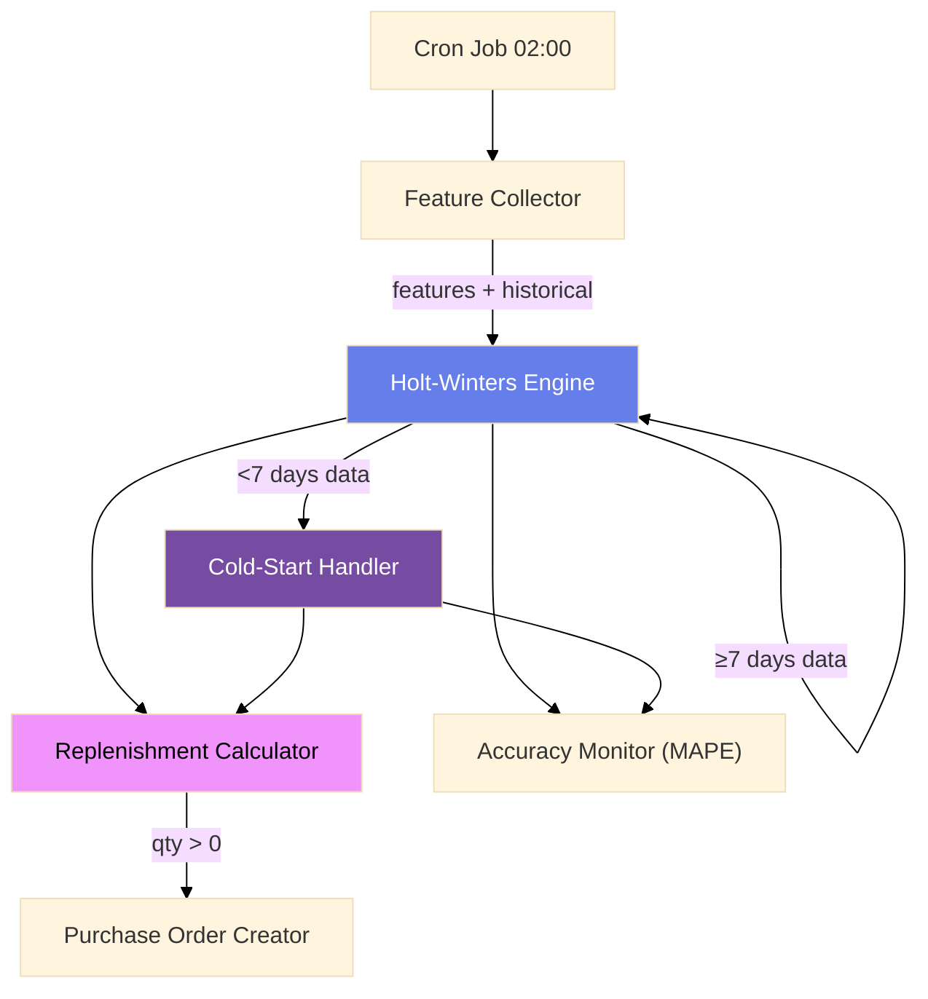

# Demand Forecasting & Replenishment

Holt-Winters triple exponential smoothing engine with Bayesian cold-start handler, replenishment calculator (reorder point + safety stock + FEFO), external feature collector, and MAPE accuracy monitor. Designed for q-commerce where demand is highly seasonal with multiplicative amplitude.

## Architecture



## Components

### 1. Holt-Winters Engine

Multiplicative triple exponential smoothing capturing level, trend, and seasonality.

| Parameter | Default | Description |
|-----------|---------|-------------|
| Alpha | 0.3 | Level smoothing factor |
| Beta | 0.1 | Trend smoothing factor |
| Gamma | 0.2 | Seasonality smoothing factor |
| SeasonLength | 7 | Daily pattern (7 = weekly) |

**Formulas:**

```
L_t = α · (Y_t / S_{t-s}) + (1-α) · (L_{t-1} + T_{t-1})   // Level
T_t = β · (L_t - L_{t-1}) + (1-β) · T_{t-1}                // Trend
S_t = γ · (Y_t / L_t) + (1-γ) · S_{t-s}                    // Seasonal
F_{t+k} = (L_t + k · T_t) · S_{t+k-s}                      // Forecast
```

**Initialization:** Level = mean of first season. Trend = mean of period-to-period changes. Seasonalities = each point / level.

```go
engine := NewHoltWintersEngine()
forecast := engine.Forecast(historical90Days, HoltWintersParams{
    Alpha: 0.3, Beta: 0.1, Gamma: 0.2, SeasonLength: 7,
}, 7) // 7-day forecast
// => [12.3, 15.1, 18.7, 14.2, 11.8, 22.4, 25.0]
```

### 2. Cold-Start Handler (Bayesian Shrinkage)

For new SKUs or hubs with < 7 days of data. Shrinks volatile sample mean toward stable category average.

```
forecast = weight · sku_mean + (1 - weight) · category_mean
weight = n / (n + prior_strength)
```

**Prior strength tuning:**
- Base: 5.0
- Category variance > 100 → 3.0 (weaker prior)
- Category variance < 10 → 10.0 (stronger prior)

**Confidence scoring:** `min(0.3 + n · 0.1, 0.9)` — ranges from 0.3 (1 point) to 0.9 (6+ points).

| Data Points | Method | Confidence |
|-------------|--------|------------|
| 0 | Category average | 0.3 |
| 1–6 | Bayesian shrinkage | 0.4–0.9 |
| ≥7 | Holt-Winters | 0.9+ |

**Example:** SKU "Es Krim Matcha Premium" launched 3 days ago with promo, averaging 200 units/day. Category average is 50/day. With prior=5: weight = 3/(3+5) = 0.375. Forecast = 0.375×200 + 0.625×50 = **106 units/day** — much more realistic than raw 200.

### 3. Replenishment Calculator

```
reorder_point = forecast_daily × lead_time_days + safety_stock
safety_stock = z × sigma × √(lead_time_days)
order_qty = max(0, reorder_point - on_hand - incoming + min_order_qty)
```

**Z-scores by service level:**

| Service Level | Z |
|---------------|---|
| 99% | 2.33 |
| 97.5% | 1.96 |
| 95% (default) | 1.65 |
| 90% | 1.28 |

**Days of cover priority:**
- < 1.0 day → `high`
- 1.0–5.0 days → `normal`
- > 5.0 days → `low`

**FEFO (First Expired First Out):** Inventory batches sorted by `ExpiryDate` ascending. Critical for fresh goods (1–3 day shelf life). Without it, waste rate increases 3–5x.

### 4. Feature Collector

Three concurrent goroutines gather external regressors:

| Source | Data | Failure Handling |
|--------|------|-----------------|
| Weather API | Temperature, humidity, precipitation, rain flag | Warn log, zero values |
| Holiday Calendar | IsPublicHoliday, IsWeekend, RamadhanMode | Cached lookup |
| Promo Schedule | HasPromo, PromoDiscountPct | Warn log, zero values |

**Season detection:** Nov–Mar = rainy, Apr–Oct = dry, otherwise = transition.

**Ramadhan detection:** March 20 – April 18 (2026). Simplified annual range.

### 5. Accuracy Monitor (MAPE)

```
APE = |forecast - actual| / actual × 100
```

- Rolling 30-day daily MAPE per SKU-hub
- Weekly MAPE = mean of last 7 days
- Monthly MAPE = mean of last 30 days
- Warning threshold: 30%
- Critical threshold: 50%
- Zero actual demand skipped (lost sale vs no demand — deliberately conservative)

**Degraded SKU reporting:** All SKUs with weekly MAPE > 30% returned with severity tag.

## Edge Cases

| Edge Case | Solution |
|-----------|----------|
| **Stockout → lost data** | Impute from 48h post-stockout window mean. Prevents under-ordering feedback loop. |
| **Bulk order anomaly** | Z-score outlier detection before feeding to model |
| **Promo cannibalization** | SKU A promo may reduce SKU B demand. Cross-SKU awareness needed. |
| **New hub stabilization** | 2–3 week cold-start window. Re-tune after 14 days. |
| **Weather API failure** | Climatology average fallback. Don't block pipeline. |
| **Zero category data** | Global default + exponential backoff. Confidence = 0.2. |

## API

| Method | Path | Purpose |
|--------|------|---------|
| POST | `/forecast/run` | Trigger daily pipeline for hub IDs |
| GET | `/forecast/:sku/:hub_id` | Get latest forecast result |
| GET | `/forecast/accuracy/:sku/:hub_id` | Get MAPE stats |
| POST | `/admin/features` | Seed external features |

## Technical Decisions

| Decision | Rationale |
|----------|-----------|
| **Holt-Winters multiplicative** | Q-commerce demand has multiplicative seasonal amplitude. Additive would under-forecast peaks. |
| **Bayesian shrinkage over raw averages** | Prevents volatile forecasts for new SKUs with sparse/noisy data. |
| **Worker pool (20 concurrency)** | 1,000 SKU × 50 hubs = 50,000 pairs. Sequential would take hours. |
| **FEFO for fresh goods** | 1–3 day shelf life makes expiry order critical. Bubble sort sufficient for batch sizes. |
| **MAPE at weekly granularity** | Daily MAPE is noisy. Weekly smoothing provides early warning before stockouts. |
| **Stockout imputation before training** | Without imputation: stockout → forecast drops → replenishment drops → more stockouts (dangerous feedback loop). |
| **External regressors required** | Without weather, holiday, and promo data, the model is blind to demand shifts. |
| **Per-SKU parameter overrides** | Different SKUs have different demand characteristics (staples vs. luxury vs. seasonal). |
