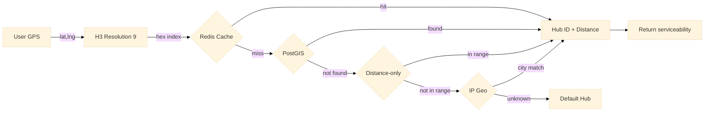

# Geo Service

H3 hexagon-based serviceability engine. Determines whether a user's location is within delivery range of a hub using hierarchical spatial indexing with a 5-tier fallback chain.

Port **8102** | Package `geo-service/`

## Architecture



### H3 Hexagon Resolution 9

H3 is Uber's hexagonal hierarchical spatial index. Resolution 9 produces hexagons of approximately 0.1 km² each, providing granularity suitable for q-commerce delivery zones.

| Resolution | Avg Hex Area | Avg Edge Length | Use Case |
|------------|-------------|-----------------|----------|
| 8 | ~0.74 km² | ~461 m | Regional zones |
| **9** | **~0.10 km²** | **~174 m** | **Q-commerce delivery (chosen)** |
| 10 | ~0.015 km² | ~67 m | Hyper-local |

```go
func (s *Service) getH3Index(lat, lng float64) (h3.Index, error) {
    ll := geo.NewLatLng(lat, lng)
    return h3.FromLatLng(ll, 9) // Resolution 9
}
```

### Redis Cache

Hub-to-hex mappings are cached in Redis with a 1-hour TTL. The key format is `h3:{hex}:hub`. On cache miss, the service falls through to PostGIS.

```go
func (s *Service) lookupHub(ctx context.Context, hex h3.Index) (*Hub, error) {
    key := fmt.Sprintf("h3:%s:hub", hex.String())

    // Redis hit
    hubID, err := s.rdb.Get(ctx, key).Result()
    if err == nil {
        return s.getHubByID(ctx, hubID)
    }

    // PostGIS fallback
    return s.lookupFromPostGIS(ctx, hex)
}
```

### Haversine Tie-Breaking

When multiple hubs serve the same hexagon, the service scores each candidate using a weighted formula:

```
score = 0.40 * distance_normalized + 0.40 * stock_availability + 0.20 * rider_availability
```

Higher score wins. Distance is computed using the haversine formula.

## 5-Tier Fallback Chain

| Tier | Data Source | Latency | Coverage |
|------|------------|---------|----------|
| 1 | Redis (H3→Hub) | <1 ms | Hot hubs |
| 2 | PostGIS (Spatial query) | 5-20 ms | All configured hubs |
| 3 | Distance-only (haversine) | <1 ms | Any hub with known location |
| 4 | IP Geo (city-level) | 50-200 ms | City-level coverage |
| 5 | Default hub | 0 ms | Fallback when all else fails |

## API Endpoints

| Method | Path | Description |
|--------|------|-------------|
| `GET` | `/serviceability?lat=&lng=` | Check delivery availability for a GPS coordinate |
| `POST` | `/admin/hubs` | Create or update a hub with its coverage hexagons |

### GET /serviceability?lat=-6.2088&lng=106.8456

```json
// Response 200
{"data": {"serviceable": true, "hub_id": "hub_central", "hub_name": "Central Jakarta Hub", "distance_km": 1.2, "eta_minutes": 18, "tier": "redis"}}
```

### POST /admin/hubs

```json
// Request
{"hub_id": "hub_central", "name": "Central Jakarta Hub", "lat": -6.2000, "lng": 106.8167, "coverage_radius_km": 3.0}

// Response 201
{"data": {"hub_id": "hub_central", "hexagons": ["894d4e4e4c7fffff", "894d4e4e483ffff"], "count": 42}}
```

## Key Algorithms

### H3→Serviceability Lookup

```go
func (s *Service) CheckServiceability(ctx context.Context, lat, lng float64) (*ServiceabilityResult, error) {
    hex, err := s.getH3Index(lat, lng)
    if err != nil {
        return nil, fmt.Errorf("h3 index: %w", err)
    }

    // Try each fallback tier
    for tier := 1; tier <= 5; tier++ {
        hub, err := s.lookupByTier(ctx, hex, tier)
        if err == nil && hub != nil {
            dist := haversine(lat, lng, hub.Lat, hub.Lng)
            return &ServiceabilityResult{
                Serviceable: true,
                HubID:       hub.ID,
                DistanceKM:  dist,
                EtaMinutes:  int(dist / 0.3), // ~300m/min rider speed
                Tier:        tierNames[tier],
            }, nil
        }
    }

    return &ServiceabilityResult{Serviceable: false}, nil
}
```

## Technical Decisions

- **H3 Resolution 9 (~0.1 km²)**: Matches q-commerce delivery radius granularity. Resolution 8 (~0.74 km²) is too coarse — multiple hubs could fall in one hexagon. Resolution 10 (~0.015 km²) produces too many hexagons for practical Redis caching.
- **Redis 1-hour TTL**: Hub coverage zones change infrequently (new hub openings, zone expansions). A 1-hour TTL balances freshness against cache hit rate. The admin API invalidates relevant keys on hub updates.
- **Haversine distance**: Simple spherical distance formula that is accurate enough for sub-5 km distances typical of q-commerce. More complex algorithms (Vincenty, geodesic) add latency without meaningful precision gains at this scale.
- **40/40/20 tie-breaking formula**: Prioritises proximity and stock availability equally, with rider supply as a secondary factor. The weights are configurable per deployment and can be tuned based on local business priorities.
- **5-tier fallback**: Ensures the service never returns an error even if the primary data sources are unavailable. The fallback chain degrades gracefully from precise (Redis) to approximate (default hub), maintaining availability over accuracy during outages.

## Source Code

[View on GitHub](https://github.com/faisalaffan/faisalaffan-design-system/blob/dev/services/geo-service/main.go)
