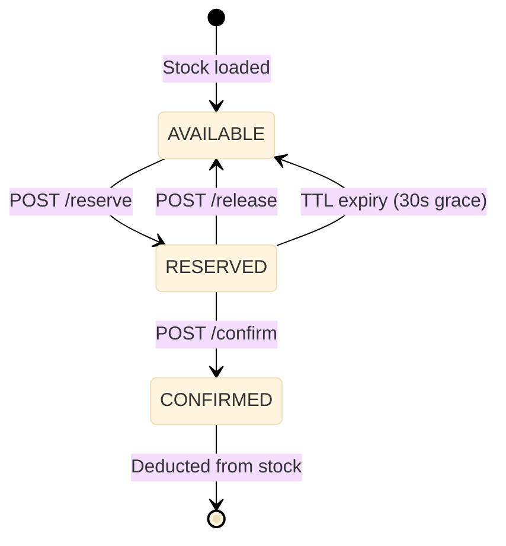

# Inventory Service

Redis Lua atomic reservation engine with a dual-store pattern: Redis for operational stock operations and Postgres as the system of record. Supports reserve, release, and confirm workflows with automatic TTL-based reaper for expired reservations.

Port **8101** | Package `inventory-service/`

## Architecture



### Reservation Lifecycle

Every reservation transitions through three states:

| State | Meaning | TTL |
|-------|---------|-----|
| **RESERVED** | Temporarily held — visible to the reserving user only | 30 seconds (grace) |
| **CONFIRMED** | Finalised — stock deducted from both Redis and Postgres | Permanent |
| **RELEASED** | Explicitly released — stock returned to pool | Immediate |
| **EXPIRED** | TTL elapsed — reaper returns stock automatically | 30 seconds |

### Stock Partitioning

Hot SKUs are split across `N=10` Redis keys (`sku:101:stock:0` through `sku:101:stock:9`). The service hashes a combination of user ID and order ID to select a primary bucket, then falls back sequentially on overflow.

```go
func bucketForKey(sku string, userID string, n int) string {
    h := fnv.New32a()
    h.Write([]byte(sku + ":" + userID))
    idx := int(h.Sum32()) % n
    return fmt.Sprintf("%s:stock:%d", sku, idx)
}
```

## Dual-Store Pattern

```
+--------+     +-------------------+     +----------+
| Client | --> | Redis (Operational)| --> | Postgres |
|        |     | TTL, Lua atomic    |     | SOR      |
+--------+     +-------------------+     +----------+
```

- **Redis**: All reserve, release, and confirm operations execute as Lua scripts for atomicity. Stock counts and reservations live in Redis with TTLs. Fast reads for GET /stock/:hub_id/:sku.
- **Postgres**: The system of record. After a reservation is confirmed, the mutation is written to Postgres. A reconciliation job periodically verifies Redis against Postgres.

## TTL-Based Reaper

Reservations that are neither confirmed nor released within 30 seconds are automatically returned to the available pool. A background goroutine scans Redis for expired reservation keys every 5 seconds.

```go
func (s *Service) reaperLoop(ctx context.Context) {
    ticker := time.NewTicker(5 * time.Second)
    defer ticker.Stop()
    for {
        select {
        case <-ctx.Done():
            return
        case <-ticker.C:
            s.releaseExpired(ctx)
        }
    }
}

func (s *Service) releaseExpired(ctx context.Context) {
    // Scan for reservation keys with TTL <= 0
    // Execute Lua script to atomically return stock
    script := redis.NewScript(`
        local stock_key = KEYS[1]
        local qty = redis.call("GET", stock_key .. ":reserved")
        if qty then
            redis.call("INCRBY", stock_key, qty)
            redis.call("DEL", stock_key .. ":reserved")
        end
        return 1
    `)
    script.Run(ctx, s.rdb, []string{sku})
}
```

## API Endpoints

| Method | Path | Description |
|--------|------|-------------|
| `GET` | `/stock/:hub_id/:sku` | Get available stock quantity for a SKU at a hub |
| `POST` | `/reserve` | Reserve stock atomically (Lua) |
| `POST` | `/release` | Release a previously held reservation |
| `POST` | `/confirm` | Confirm a reservation and deduct from Postgres |

### GET /stock/:hub_id/:sku

```json
// Response 200
{"data": {"hub_id": "hub_1", "sku": "sku_101", "available": 42, "partitioned": true, "buckets": 10}}
```

### POST /reserve

```json
// Request
{"hub_id": "hub_1", "sku": "sku_101", "qty": 2, "order_id": "ord_abc", "user_id": "usr_42"}

// Response 200
{"data": {"reservation_id": "res_xyz", "status": "reserved", "ttl_seconds": 30}}
```

## Key Algorithms

### Atomic Reserve (Lua)

```lua
-- KEYS[1] = hub:sku:stock, KEYS[2] = hub:sku:reserved
-- ARGV[1] = qty, ARGV[2] = ttl, ARGV[3] = reservation_id
local available = redis.call("GET", KEYS[1])
if not available or tonumber(available) < tonumber(ARGV[1]) then
    return redis.error_reply("INSUFFICIENT_STOCK")
end
redis.call("DECRBY", KEYS[1], ARGV[1])
redis.call("SET", KEYS[2], ARGV[1])
redis.call("EXPIRE", KEYS[2], ARGV[2])
return { ARGV[3], ARGV[1] }
```

### Stock Partitioning Strategy

| Concept | Detail |
|---------|--------|
| Buckets per hot SKU | 10 |
| Bucket selection | FNV-32a hash(userID + orderID) % N |
| Overflow | Sequential fallback to next bucket |
| Reserved overlay | Each bucket has companion key `sku:N:reserved` |

## Technical Decisions

- **Redis Lua for atomicity**: Lua scripts execute atomically on a single Redis node, eliminating race conditions between reserve checks and decrements without distributed locks.
- **10 stock buckets per SKU**: Reduces contention on hot SKUs during flash sales. Without partitioning, every reserve request for a popular SKU would hit the same Redis key, serialising all operations through a single Lua script instance.
- **30-second reservation TTL**: Balances customer holding time against inventory pressure. Long enough for the checkout saga to complete; short enough that abandoned checkouts release stock quickly.
- **Dual-store (Redis + Postgres)**: Redis handles the hot path with sub-millisecond latency. Postgres provides durability, audit trails, and reconciliation. The operational cost is eventual consistency between the two stores, managed by the reaper and a periodic reconciliation job.
- **Background reaper goroutine**: Polls every 5 seconds for expired reservations. The 30-second TTL plus 5-second scan interval means a maximum 35-second window between expiry and stock release — acceptable for q-commerce where re-order time is the bottleneck.
