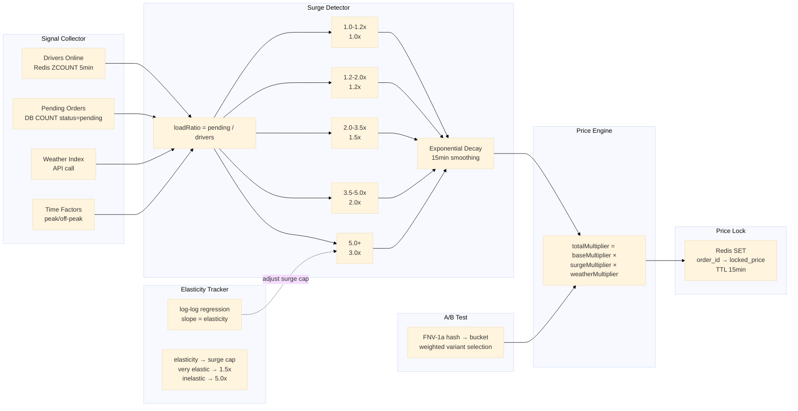

# Pricing Service

Dynamic delivery fee and surge pricing engine. Collects real-time market signals (drivers online, pending orders, weather, time), detects demand surges through cascading thresholds, computes a dynamic multiplier, locks prices in Redis with a 15-minute TTL for payment verification, and continuously learns elasticity to adjust surge caps per area.

Port **8111** | Package `pricing-service/`

## Architecture



## Signal Collector

The signal collector runs five concurrent goroutines to gather market state. Each has a 5-second timeout. If a signal source fails (e.g., weather API is down), the collector returns the last-known value rather than failing the entire request.

| Signal | Source | Timeout | Fallback |
|--------|--------|---------|----------|
| Drivers online | Redis sorted set (ZCOUNT, last 5 min) | 5s | Last known count |
| Pending orders | DB query (`WHERE status = 'pending'`) | 5s | Last known count |
| Weather index | External weather API | 5s | Neutral (1.0) |
| Time factor | Local time → peak/off-peak lookup | — | Off-peak (1.0) |
| Historical elasticity | Elasticity tracker cache | 5s | Default cap (3.0x) |

```go
type SignalCollector struct {
    driversOnline func(ctx context.Context) (int, error)
    pendingOrders func(ctx context.Context) (int, error)
    weatherIndex  func(ctx context.Context) (float64, error)
    timeFactor    func() float64
}

type MarketSignals struct {
    DriversOnline int     `json:"drivers_online"`
    PendingOrders int     `json:"pending_orders"`
    LoadRatio     float64 `json:"load_ratio"`
    Weather       float64 `json:"weather_multiplier"`
    TimeFactor    float64 `json:"time_factor"`
    Timestamp     time.Time `json:"timestamp"`
}

func (s *Service) collectSignals(ctx context.Context, areaID string) MarketSignals {
    ctx, cancel := context.WithTimeout(ctx, 5*time.Second)
    defer cancel()

    type result struct {
        drivers int
        pending int
        weather float64
    }

    ch := make(chan result, 1)
    go func() {
        d, _ := s.signalCollector.driversOnline(ctx)
        p, _ := s.signalCollector.pendingOrders(ctx)
        w, _ := s.signalCollector.weatherIndex(ctx)
        ch <- result{d, p, w}
    }()

    var r result
    select {
    case r = <-ch:
    case <-ctx.Done():
        // fallback to last-known values
        r = s.lastSignals[areaID]
    }

    loadRatio := 0.0
    if r.drivers > 0 {
        loadRatio = float64(r.pending) / float64(r.drivers)
    }

    signals := MarketSignals{
        DriversOnline: r.drivers,
        PendingOrders: r.pending,
        LoadRatio:     loadRatio,
        Weather:       r.weather,
        TimeFactor:    s.signalCollector.timeFactor(),
        Timestamp:     time.Now(),
    }

    s.lastSignals[areaID] = signals
    return signals
}
```

## Surge Detector

The surge detector translates the load ratio (pending orders per driver) into a dynamic multiplier using cascading thresholds.

### Cascading Thresholds

| Load Ratio Range | Surge Multiplier | Business State |
|------------------|------------------|----------------|
| 0.0 – 1.0        | 1.0x             | Normal |
| 1.0 – 1.2        | 1.0x             | Elevated — no surge yet |
| 1.2 – 2.0        | 1.2x             | Light surge |
| 2.0 – 3.5        | 1.5x             | Moderate surge |
| 3.5 – 5.0        | 2.0x             | Heavy surge |
| 5.0+             | 3.0x (cap)       | Critical surge |

```go
func surgeMultiplier(loadRatio float64) float64 {
    switch {
    case loadRatio >= 5.0:
        return 3.0
    case loadRatio >= 3.5:
        return 2.0
    case loadRatio >= 2.0:
        return 1.5
    case loadRatio >= 1.2:
        return 1.2
    default:
        return 1.0
    }
}
```

### Exponential Decay Smoothing

Raw surge multipliers can oscillate rapidly between thresholds. A 15-minute exponential moving average smooths transitions:

```go
type SurgeTracker struct {
    mu       sync.RWMutex
    smoothed map[string]float64 // areaID → smoothed multiplier
    alpha    float64            // smoothing factor (0.3)
}

func (st *SurgeTracker) Update(areaID string, raw float64, interval time.Duration) float64 {
    st.mu.Lock()
    defer st.mu.Unlock()

    prev, exists := st.smoothed[areaID]
    if !exists {
        st.smoothed[areaID] = raw
        return raw
    }

    // Exponential decay: st = alpha * raw + (1 - alpha) * prev
    decay := math.Exp(-interval.Minutes() / 15.0)
    alpha := 1.0 - decay
    smoothed := alpha*raw + (1-alpha)*prev

    // Hard cap at 3.0x
    if smoothed > 3.0 {
        smoothed = 3.0
    }

    st.smoothed[areaID] = smoothed
    return smoothed
}
```

The decay constant is `exp(-t / 15)` where `t` is the interval in minutes since the last update. At 15 minutes, the previous value's weight drops to ~37%; at 30 minutes, to ~14%. This prevents sudden spikes from reaching customers while still responding to sustained demand changes.

## Price Engine

The price engine combines all multipliers into the final delivery fee formula:

```
multiplerBawaan = baseMultiplier × surgeMultiplier × weatherMultiplier
biayaAkhir      = min(max((biayaDasar + biayaJarak × jarakKm) × multiplerBawaan, 5000), 75000)
```

Where:
- **baseMultiplier** = 1.0 (configurable per area; e.g., remote areas may start at 1.2)
- **surgeMultiplier** = output from surge detector (smoothed, 1.0 – 3.0)
- **weatherMultiplier** = from weather index (1.0 normal, up to 1.5 extreme weather)
- **biayaDasar** = 5000 IDR (configurable base fee)
- **biayaJarak** = 2000 IDR per km (configurable distance rate)
- **Cap final**: 5.0x total multiplier from base (enforced at the end). Caps are area-specific, learned from the Elasticity Tracker.

The total multiplier is capped at 5.0x regardless of individual components:

```go
func (s *Service) computeFinalFee(baseFee, distanceKm int32, multipliers Multipliers) int32 {
    totalMul := multipliers.Base * multipliers.Surge * multipliers.Weather
    if totalMul > s.maxTotalMultiplier(areaID) {
        totalMul = s.maxTotalMultiplier(areaID)
    }

    raw := float64(baseFee + distanceFee*distanceKm) * totalMul
    final := int32(math.Round(raw))

    if final < 5000 {
        final = 5000
    }
    if final > 75000 {
        final = 75000
    }
    return final
}
```

## Price Lock

Once computed, the price is locked in Redis with a 15-minute TTL. This ensures the fee shown at order placement matches the fee charged at payment, even if surge conditions change in between.

```go
func (s *Service) lockPrice(ctx context.Context, orderID string, fee int32) error {
    key := "price_lock:" + orderID
    err := s.rdb.Set(ctx, key, fee, 15*time.Minute).Err()
    if err != nil {
        // fail-open: log the error but let the order proceed
        log.Printf("price lock failed for %s: %v", orderID, err)
        return nil
    }
    return nil
}
```

### Fail-Open Behaviour

If Redis is unreachable, the lock function logs the error and returns `nil`. The order proceeds with the computed fee. This is a deliberate trade-off: availability over consistency for pricing. Without it, a Redis outage would block all orders.

### Payment Verification

At payment time, the checkout service retrieves the locked price:

```go
func (s *Service) getLockedPrice(ctx context.Context, orderID string) (int32, bool) {
    key := "price_lock:" + orderID
    fee, err := s.rdb.Get(ctx, key).Int()
    if err != nil {
        if errors.Is(err, redis.Nil) {
            // Lock expired — fall back to real-time computation
            return s.computePrice(ctx, orderID), false
        }
        // Redis error — fail-open: fall back to real-time
        return s.computePrice(ctx, orderID), false
    }
    return int32(fee), true
}
```

If the lock has expired (TTL exceeded), the service falls back to computing a fresh price. The boolean return indicates whether the price was locked (true) or freshly computed (false).

## Elasticity Tracker

The elasticity tracker learns how sensitive each area's demand is to price changes. It feeds the data back into adjusting the surge cap per area.

### Log-Log Regression

The tracker maintains a sliding window of (price, demand) observations and fits a log-log regression model:

```
ln(demand) = alpha + beta × ln(price)
```

The slope `beta` is the price elasticity of demand:
- **|beta| > 1.5**: Very elastic — customers are price-sensitive. Surge cap set to 1.5x to avoid deterring orders.
- **|beta| 0.5 – 1.5**: Moderately elastic. Surge cap set to 3.0x.
- **|beta| < 0.5**: Inelastic — customers tolerate price changes. Surge cap set to 5.0x.

```go
type ElasticityTracker struct {
    observations map[string][]PriceDemand  // areaID → sliding window
    windowSize   int                       // 500 observations
    caps         map[string]float64        // areaID → max total multiplier
}

func (et *ElasticityTracker) Update(areaID string, price int32, demand int) {
    et.observations[areaID] = append(et.observations[areaID], PriceDemand{
        Price:   float64(price),
        Demand:  float64(demand),
        Time:    time.Now(),
    })

    // Trim sliding window
    if len(et.observations[areaID]) > et.windowSize {
        et.observations[areaID] = et.observations[areaID][1:]
    }

    // Re-fit regression
    if len(et.observations[areaID]) >= 30 {
        beta := et.fitLogLog(areaID)
        et.caps[areaID] = elasticityToCap(beta)
    }
}

func (et *ElasticityTracker) fitLogLog(areaID string) float64 {
    obs := et.observations[areaID]
    n := float64(len(obs))

    var sumX, sumY, sumXY, sumX2 float64
    for _, o := range obs {
        lnP := math.Log(o.Price)
        lnD := math.Log(o.Demand)
        sumX += lnP
        sumY += lnD
        sumXY += lnP * lnD
        sumX2 += lnP * lnP
    }

    // beta = (n*sumXY - sumX*sumY) / (n*sumX2 - sumX*sumX)
    beta := (n*sumXY - sumX*sumY) / (n*sumX2 - sumX*sumX)
    return beta
}

func elasticityToCap(beta float64) float64 {
    absBeta := math.Abs(beta)
    switch {
    case absBeta > 1.5:
        return 1.5 // Very elastic — keep prices low
    case absBeta > 0.5:
        return 3.0 // Moderately elastic
    default:
        return 5.0 // Inelastic — can surge higher
    }
}
```

The sliding window keeps the last 500 observations, and regression is re-fit only when at least 30 data points are available.

## A/B Test Framework

The pricing service supports A/B testing of different pricing formulas. Each request is deterministically bucketed using FNV-1a hashing, ensuring the same user always sees the same variant.

```go
func abBucket(userID string, variants []ABVariant) *ABVariant {
    // FNV-1a hash of userID
    h := fnv.New32a()
    h.Write([]byte(userID))
    hash := h.Sum32()

    // Total weight
    totalWeight := 0
    for _, v := range variants {
        totalWeight += v.Weight
    }

    // Weighted selection
    bucket := int(hash % uint32(totalWeight))
    cumulative := 0
    for _, v := range variants {
        cumulative += v.Weight
        if bucket < cumulative {
            return &v
        }
    }

    return &variants[len(variants)-1]
}
```

| Parameter | Description |
|-----------|-------------|
| Bucketing | FNV-1a 32-bit hash of `userID` modulo total weight |
| Variant weight | Configurable percentage (e.g., control=80, treatment=20) |
| Deterministic | Same user → same variant every time |
| Evaluation | Logged with order ID for downstream analysis |

## API Endpoints

| Method | Path | Description |
|--------|------|-------------|
| `POST` | `/api/v1/delivery-fee` | Compute delivery fee with dynamic surge |
| `GET` | `/api/v1/locked-price?order_id=` | Get locked price for payment verification |
| `GET` | `/admin/signals/:area_id` | View current market signals (admin) |

### POST /api/v1/delivery-fee

```json
// Request
{
  "user_id": "usr_abc",
  "area_id": "area_jkt_01",
  "base_fee": 5000,
  "distance_km": 3.2
}

// Response 200
{
  "data": {
    "order_id": "ord_xyz",
    "final_fee": 13520,
    "multipliers": {
      "base": 1.0,
      "surge": 1.5,
      "weather": 1.0,
      "total": 1.5
    },
    "signals": {
      "drivers_online": 42,
      "pending_orders": 78,
      "load_ratio": 1.86,
      "weather": 1.0,
      "time_factor": 1.2
    },
    "price_locked": true,
    "lock_expires_at": "2026-06-22T10:45:00Z"
  }
}
```

### GET /api/v1/locked-price

```json
// Request
GET /api/v1/locked-price?order_id=ord_xyz

// Response 200
{
  "data": {
    "order_id": "ord_xyz",
    "locked_fee": 13520,
    "locked_at": "2026-06-22T10:30:00Z",
    "locked": true
  }
}

// Response 200 (expired lock)
{
  "data": {
    "order_id": "ord_xyz",
    "locked_fee": 14780,
    "locked": false
  }
}
```

### GET /admin/signals/:area_id

```json
// Response 200
{
  "data": {
    "area_id": "area_jkt_01",
    "signals": {
      "drivers_online": 42,
      "pending_orders": 78,
      "load_ratio": 1.86,
      "weather": 1.0,
      "time_factor": 1.2
    },
    "current_surge": 1.5,
    "elasticity_beta": -1.2,
    "surge_cap": 3.0,
    "updated_at": "2026-06-22T10:30:00Z"
  }
}
```

## Technical Decisions

- **Fail-open price lock**: Redis unavailability should not block orders. The lock function logs the error and returns nil, allowing the order to proceed with the computed fee. Payment verification falls back to real-time computation if the lock is missing. This prioritises availability over strict consistency for pricing.
- **Cascading thresholds over continuous function**: Discrete surge tiers (1.0x, 1.2x, 1.5x, 2.0x, 3.0x) are easier to communicate to drivers and customers than a continuous function. Each tier corresponds to an observable market condition (light, moderate, heavy, critical surge), making the system's behaviour transparent and auditable.
- **Exponential decay smoothing over step changes**: Without smoothing, the surge multiplier could oscillate between tiers as load ratio hovers near a boundary. Exponential decay with a 15-minute half-life dampens oscillations while still tracking sustained demand shifts. The asymmetric response (fast rise, slow fall) matches business expectations: surge should engage quickly during flash demand but decay gradually to avoid price shock when normalising.
- **Log-log elasticity regression**: Elasticity is inherently a multiplicative relationship — a 10% price change leads to a X% demand change. Log-log transformation linearises this relationship, making ordinary least squares regression valid. The 30-observation minimum prevents spurious regression on insufficient data.
- **FNV-1a deterministic bucketing**: A/B test consistency is critical — switching a user between control and treatment mid-order would invalidate the test. FNV-1a is fast (hardware-accelerated on modern CPUs), deterministic, and produces uniform distributions suitable for bucketing.
- **Hard cap on total multiplier (5.0x)**: Prevents extreme surge scenarios from creating unacceptably high fees. The cap is adjusted per area based on elasticity: price-sensitive areas get a lower cap (1.5x), while inelastic markets can surge higher (5.0x). This is a business safety net, not a technical limit.
- **Minimum fee floor (5000 IDR) and ceiling (75000 IDR)**: Ensures every delivery covers the platform's marginal cost (floor) while maintaining customer trust that fees will not exceed a reasonable maximum (ceiling). Both values are configurable per area.

## Source Code

[View on GitHub](https://github.com/faisalaffan/faisalaffan-design-system/blob/dev/services/pricing-service/main.go)
