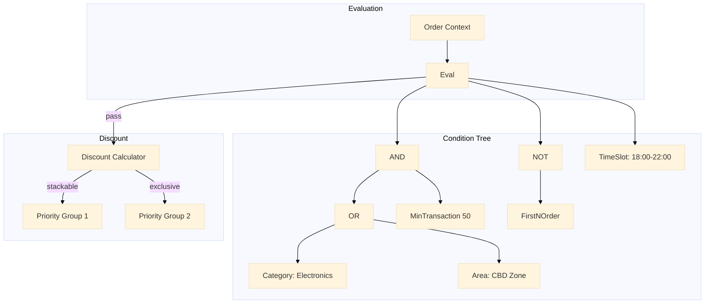

# Promo Engine

AST-based composable promotional rule engine. Defines conditions as a tree of AND/OR/NOT composite nodes with typed leaf conditions, executes them against order context, and calculates final discounts with stackable priority resolution.

Port **8105** | Package `promo-engine/`

## Architecture



### Condition Tree Structure

Conditions are modelled as a composite pattern with typed leaf nodes.

```go
type Condition interface {
    Evaluate(ctx *OrderContext) (bool, error)
}

type CompositeCondition struct {
    Op     Operator    // AND | OR | NOT
    Children []Condition
}

type MinTransactionCondition struct {
    MinAmount float64
}
```

## Condition Types

| Condition | Leaf Type | Description |
|-----------|-----------|-------------|
| MinTransaction | Leaf | Order subtotal must exceed threshold |
| Area | Leaf | Delivery area must match |
| Category | Leaf | Order contains items from a category |
| FirstNOrder | Leaf | User's first N orders (new user promo) |
| TimeSlot | Leaf | Current time within a defined window |

### AND/OR/NOT Evaluation

```go
func (c *CompositeCondition) Evaluate(ctx *OrderContext) (bool, error) {
    switch c.Op {
    case AND:
        for _, child := range c.Children {
            ok, err := child.Evaluate(ctx)
            if err != nil {
                return false, err
            }
            if !ok {
                return false, nil
            }
        }
        return true, nil
    case OR:
        for _, child := range c.Children {
            ok, err := child.Evaluate(ctx)
            if err != nil {
                return false, err
            }
            if ok {
                return true, nil
            }
        }
        return false, nil
    case NOT:
        if len(c.Children) != 1 {
            return false, ErrInvalidNotArity
        }
        ok, err := c.Children[0].Evaluate(ctx)
        return !ok, err
    }
    return false, ErrUnknownOperator
}
```

## Redis Lua Multi-Counter

Conditions that depend on counters (total usage, daily usage, per-user usage) are evaluated atomically in a single Redis Lua script.

```lua
-- KEYS[1] = promo:total_used, KEYS[2] = promo:daily_used, KEYS[3] = promo:user_used:<user_id>
-- ARGV[1] = max_total, ARGV[2] = max_daily, ARGV[3] = max_per_user
local total = tonumber(redis.call("GET", KEYS[1]) or "0")
local daily = tonumber(redis.call("GET", KEYS[2]) or "0")
local user  = tonumber(redis.call("GET", KEYS[3]) or "0")

if total >= tonumber(ARGV[1]) then return redis.error_reply("TOTAL_CAP_REACHED") end
if daily >= tonumber(ARGV[2]) then return redis.error_reply("DAILY_CAP_REACHED") end
if user  >= tonumber(ARGV[3]) then return redis.error_reply("USER_CAP_REACHED") end

redis.call("INCR", KEYS[1])
redis.call("INCR", KEYS[2])
redis.call("INCR", KEYS[3])
return { total + 1, daily + 1, user + 1 }
```

## Stackable Priority Resolution

When multiple promotions apply, the engine resolves the final discount using priority groups:

| Group | Behaviour | Example |
|-------|-----------|---------|
| **Exclusive** | Only one promo from this group applies (highest discount wins) | "FIRST_ORDER_50" and "WELCOME_30" |
| **Stackable** | Promos apply sequentially on the remaining amount | "FREE_SHIPPING" + "CASHBACK_10" |

### Example Resolution

```
Order subtotal: Rp 100,000

Group: Exclusive
  - Promo A (FIRST_ORDER_50%): Rp 50,000  ← highest, selected
  - Promo B (WELCOME_30%):     Rp 30,000

Group: Stackable
  - Promo C (FREE_SHIPPING):   Rp 10,000    ← applied on remaining
  - Promo D (CASHBACK_10%):    Rp 4,000     ← applied on remaining: 100k - 50k - 10k = 40k

Final discount: Rp 64,000
Final total:    Rp 36,000
```

## Fraud Detection

The promo engine detects abuse using two techniques:

| Technique | Detail |
|-----------|--------|
| Device fingerprint hash | Promo usage is tracked per device fingerprint hash. Rapid reuse from the same fingerprint triggers an alert. |
| Jaccard similarity on addresses | New addresses are compared against previously used addresses using bigram Jaccard similarity. Score >0.85 suggests the same physical address with minor modifications. |

```go
func jaccardBigramSimilarity(a, b string) float64 {
    bigramsA := extractBigrams(strings.ToLower(a))
    bigramsB := extractBigrams(strings.ToLower(b))

    intersection := 0
    for bg := range bigramsA {
        if bigramsB[bg] {
            intersection++
        }
    }
    union := len(bigramsA) + len(bigramsB) - intersection
    if union == 0 {
        return 1.0
    }
    return float64(intersection) / float64(union)
}
```

## API Endpoints

| Method | Path | Description |
|--------|------|-------------|
| `POST` | `/validate` | Validate which promotions apply to an order |
| `POST` | `/apply` | Apply promotions and compute final total |
| `POST` | `/admin/rules` | Create or update a promotion rule |

### POST /validate

```json
// Request
{"user_id": "usr_42", "items": [{"sku": "sku_101", "category": "electronics", "price": 100000}], "area": "cbd"}

// Response 200
{"data": {"applicable_promos": [{"id": "promo_1", "name": "CBD ELECTRO 10%", "discount": 10000}]}}
```

### POST /apply

```json
// Request
{"user_id": "usr_42", "promo_ids": ["promo_1", "promo_2"], "subtotal": 100000}

// Response 200
{"data": {"subtotal": 100000, "total_discount": 14000, "final_total": 86000, "breakdown": [{"promo_id": "promo_1", "amount": 10000}, {"promo_id": "promo_2", "amount": 4000}]}}
```

## Technical Decisions

- **AST composite pattern**: The composite pattern maps naturally to tree-structured condition evaluation. Adding a new condition type requires only implementing the `Condition` interface — no changes to the evaluator. The trade-off is that deeply nested trees can be hard to debug, mitigated by a JSON serialisation format that preserves the tree structure verbatim.
- **Redis Lua multi-counter atomic check**: Usage caps (total, daily, per-user) are checked and incremented in a single Lua trip. Without this, the service would need three separate Redis round-trips and a distributed lock to prevent races between check and increment.
- **Exclusivity groups + stackable resolution**: Groups prevent conflicting promotions from stacking (e.g., two 50%-off coupons). Within stackable groups, promos apply sequentially on the remaining amount, ensuring predictable discount calculation. The resolution order is deterministic: exclusivity winners selected first, then stackable promos applied.
- **Jaccard bigram similarity for address fraud**: Bigram Jaccard is simple to implement and effective at catching address manipulation ("Jl. Sudirman No. 5" vs "Jalan Sudirman Nomor 5" score ~0.55; "Jl. Sudirman No. 5" vs "Jl. Sudirman No. 15" score ~0.69). The 0.85 threshold catches near-identical addresses while tolerating legitimate variations.
- **Device fingerprint hashing**: Fingerprints are stored as HMAC-SHA256 hashes, not plaintext, preventing PII leakage if the database is compromised. The hash is deterministic per device, enabling replay detection without storing raw biometric or hardware identifiers.

## Source Code

[View on GitHub](https://github.com/faisalaffan/faisalaffan-design-system/blob/dev/services/promo-engine/main.go)
