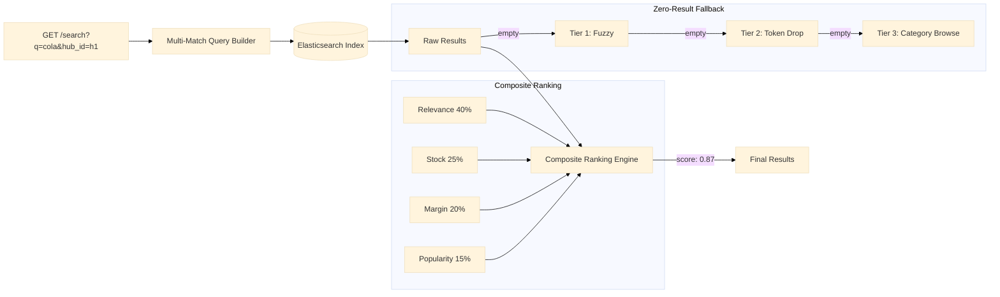

# Search Service

Multi-field full-text search engine with a composite ranking system. Builds queries against name, category, brand, tags, and description fields with weighted boosting. Supports autocomplete via a trie with top-K frequency retrieval and a three-tier zero-result fallback chain.

Port **8108** | Package `search-service/`

## Architecture



## Multi-Match Query Builder

The query builder constructs an Elasticsearch `multi_match` query targeting weighted fields:

```go
type SearchQuery struct {
    Query   string
    Fields  []string
    Weights []float64
}

func (s *Service) buildQuery(q string, hubID string) map[string]interface{} {
    return map[string]interface{}{
        "query": map[string]interface{}{
            "bool": map[string]interface{}{
                "must": []map[string]interface{}{
                    {
                        "multi_match": map[string]interface{}{
                            "query":  q,
                            "fields": []string{
                                "name^3",        // Title weight: 3x
                                "category^2",    // Category weight: 2x
                                "brand^2",       // Brand weight: 2x
                                "tags",           // Tags: 1x
                                "description",    // Description: 1x
                            },
                            "type":       "best_fields",
                            "fuzziness":  "AUTO",
                        },
                    },
                },
                "filter": []map[string]interface{}{
                    {"term": map[string]interface{}{"hub_id": hubID}},
                },
            },
        },
    }
}
```

| Field | Weight | Rationale |
|-------|--------|-----------|
| `name` | 3x | Product name is the strongest relevance signal |
| `category` | 2x | Category match suggests high relevance |
| `brand` | 2x | Brand-name searches should match branded products |
| `tags` | 1x | Tags provide secondary signal |
| `description` | 1x | Full-text signal, lowest precision |

## Composite Ranking Engine

Raw search results are re-ranked using a weighted composite score:

```
final_score = 0.40 * relevance + 0.25 * stock_factor + 0.20 * margin_score + 0.15 * popularity_zscore
```

### Non-Linear Stock Factor

Stock availability uses a logarithmic factor to prevent stock from dominating ranking while still penalising near-zero stock:

```go
func stockFactor(availableQty int) float64 {
    if availableQty <= 0 {
        return 0
    }
    return math.Log10(float64(availableQty)+1) / 2.0
}
```

This produces the following curve:

| Available Qty | Factor |
|---------------|--------|
| 0 | 0.00 |
| 1 | 0.15 |
| 5 | 0.39 |
| 10 | 0.52 |
| 100 | 1.00 |

### Popularity Z-Score

Popularity is normalised as a z-score across all products in the hub:

```go
func popularityScore(productPopularity int, mean float64, stddev float64) float64 {
    if stddev == 0 {
        return 0.5
    }
    z := (float64(productPopularity) - mean) / stddev
    // Clamp to [0, 1] using sigmoid-like mapping
    return 1.0 / (1.0 + math.Exp(-z/2.0))
}
```

## Autocomplete Trie

The autocomplete feature uses a trie with pre-computed top-K frequency lists at each node. Insertions and lookups are O(k) where k is the query length.

```go
type TrieNode struct {
    Children    map[rune]*TrieNode
    IsEnd       bool
    Frequency   int
    TopK        []string // Pre-computed top-K completions
}

func (t *TrieNode) Autocomplete(prefix string, k int) []string {
    node := t
    for _, ch := range prefix {
        if node.Children[ch] == nil {
            return []string{}
        }
        node = node.Children[ch]
    }
    if len(node.TopK) > k {
        return node.TopK[:k]
    }
    return node.TopK
}
```

## Three-Tier Zero-Result Fallback

When a search returns no results, the service degrades through three tiers:

| Tier | Strategy | Example |
|------|----------|---------|
| 1 | **Fuzzy expansion** | "cocnut" → "coconut" |
| 2 | **Token drop** | "organic coconut milk 1L" → "coconut milk" → "coconut" |
| 3 | **Category browse** | Show all products in the same category |

```go
func (s *Service) searchWithFallback(ctx context.Context, q string, hubID string) ([]Product, error) {
    // Tier 0: Primary search
    results, err := s.searchProducts(ctx, q, hubID)
    if err != nil || len(results) > 0 {
        return results, err
    }

    // Tier 1: Fuzzy expansion
    fuzzyQ := s.expandFuzzy(ctx, q)
    results, _ = s.searchProducts(ctx, fuzzyQ, hubID)
    if len(results) > 0 {
        return results, nil
    }

    // Tier 2: Token drop
    tokens := strings.Fields(q)
    for len(tokens) > 1 {
        tokens = tokens[:len(tokens)-1]
        results, _ = s.searchProducts(ctx, strings.Join(tokens, " "), hubID)
        if len(results) > 0 {
            return results, nil
        }
    }

    // Tier 3: Category browse
    return s.browseCategory(ctx, hubID, s.inferCategory(q))
}
```

## API Endpoints

| Method | Path | Description |
|--------|------|-------------|
| `GET` | `/search?q=&hub_id=` | Full-text search with ranking |
| `GET` | `/autocomplete?q=` | Autocomplete suggestions |
| `POST` | `/admin/products` | Index or update a product |

### GET /search?q=organic+coconut&hub_id=hub_1

```json
// Response 200
{"data": {"products": [{"sku": "sku_101", "name": "Organic Coconut Milk 1L", "price": 25000, "score": 0.87, "stock": 42}], "total": 1, "tier": 0}}
```

### GET /autocomplete?q=coc

```json
// Response 200
{"data": {"suggestions": [{"text": "coconut oil", "frequency": 150}, {"text": "coconut milk", "frequency": 120}, {"text": "cocoa powder", "frequency": 80}]}}
```

## Technical Decisions

- **Multi-match with field boosting (name^3, category^2)**: Term frequency is weighted by field importance — a "cola" match in the product name is stronger than the same match in the description. This is the standard approach for e-commerce search and maps directly to Elasticsearch's `multi_match` query.
- **Composite ranking (40/25/20/15)**: Relevance is the dominant factor, but stock availability, margin, and popularity prevent irrelevant or unavailable products from ranking high. The weight distribution is configurable per deployment.
- **Logarithmic stock factor**: A linear stock factor would let stock-dominant products (e.g., water with 1000 units) outrank everything. The `log10` curve compresses the range — the difference between 1 and 10 units matters more than between 100 and 1000.
- **Trie-based autocomplete with top-K cache**: Each trie node stores a pre-computed list of the K most frequent completions. This makes autocomplete response times independent of the corpus size — only the prefix length matters for traversal.
- **Three-tier zero-result fallback**: Fuzzy expansion catches typos, token drop handles long queries with no matches, and category browse is the ultimate fallback — showing the user something rather than nothing. Each tier is logged so the product team can identify missing index entries or unexpected queries.
- **Hub-scoped filtering**: Every search includes a `hub_id` filter to ensure results are only from the user's delivery hub. This is critical for q-commerce where inventory varies per hub.
