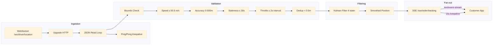

# Tracking Service

Real-time driver GPS ingestion and customer-facing order tracking. Drivers push location updates via WebSocket; the service validates, filters (Kalman), and fans out to customers via Server-Sent Events (SSE).

Port **8109** | Package `tracking-service/`

## Architecture



## WebSocket Driver Ingestion

Drivers connect via WebSocket and send periodic JSON location updates. The server upgrades the HTTP connection to a WebSocket, then enters a read loop.

```go
func (s *Service) handleDriverWS(ctx *gin.Context) {
    conn, err := upgrader.Upgrade(ctx.Writer, ctx.Request, nil)
    if err != nil {
        return
    }
    defer conn.Close()

    go s.pingLoop(conn)

    for {
        _, msg, err := conn.ReadMessage()
        if err != nil {
            break
        }

        var update LocationUpdate
        if err := json.Unmarshal(msg, &update); err != nil {
            continue
        }

        if s.validateLocation(&update) {
            smoothed := s.kalmanFilter(update.DriverID, update)
            s.broadcastLocation(update.OrderID, smoothed)
        }
    }
}
```

### Ping/Pong Keepalive

```go
func (s *Service) pingLoop(conn *websocket.Conn) {
    ticker := time.NewTicker(30 * time.Second)
    defer ticker.Stop()

    for range ticker.C {
        if err := conn.WriteMessage(websocket.PingMessage, nil); err != nil {
            return
        }
    }
}
```

## 6-Factor Location Validation

Every location update passes through six validation checks before entering the Kalman filter:

| Factor | Constraint | Rationale |
|--------|-----------|-----------|
| Bounds | Within city bounding box | Reject obviously invalid coordinates |
| Speed | ≤ 55.6 m/s (200 km/h) | Scooters can't exceed this with cargo |
| Accuracy | GPS accuracy 0-500m | Reject unusable GPS readings |
| Staleness | Timestamp ≤ 30s old | Discard delayed updates |
| Throttle | ≥ 2s since last update | Prevent flooding |
| Dedup | Movement ≥ 0.5m from last | Skip stationary pings |

```go
func (s *Service) validateLocation(loc *LocationUpdate) bool {
    return loc.Lat >= s.bounds.MinLat && loc.Lat <= s.bounds.MaxLat &&
        loc.Lng >= s.bounds.MinLng && loc.Lng <= s.bounds.MaxLng &&
        loc.Speed <= 55.6 &&
        loc.Accuracy >= 0 && loc.Accuracy <= 500 &&
        time.Since(loc.Timestamp) <= 30*time.Second &&
        time.Since(loc.ReceivedAt) >= 2*time.Second &&
        haversine(loc.Lat, loc.Lng, loc.lastLat, loc.lastLng) > 0.0005
}
```

## Kalman Filter

A 4-state Kalman filter smooths GPS noise and estimates velocity. States: `[lat, lng, v_lat, v_lng]`.

### State Vector

```
x = [lat, lng, v_lat, v_lng]
```

### Prediction Step

```go
func (kf *KalmanFilter) Predict(dt float64) {
    // State transition matrix (constant velocity model)
    kf.x[0] += kf.x[2] * dt  // lat += v_lat * dt
    kf.x[1] += kf.x[3] * dt  // lng += v_lng * dt
    // x[2], x[3] (velocity) unchanged

    // Process noise
    kf.P[0][0] += kf.Q[0][0] * dt
    kf.P[1][1] += kf.Q[1][1] * dt
}
```

### Update Step

The measurement noise covariance `R` is adapted from the GPS-reported accuracy:

```go
func (kf *KalmanFilter) Update(lat, lng float64, accuracy float64) {
    // Adaptive measurement noise from GPS accuracy
    kf.R[0][0] = accuracy * accuracy
    kf.R[1][1] = accuracy * accuracy

    // Innovation (measurement - prediction)
    y0 := lat - kf.x[0]
    y1 := lng - kf.x[1]

    // Innovation covariance
    s00 := kf.P[0][0] + kf.R[0][0]
    s11 := kf.P[1][1] + kf.R[1][1]

    // Kalman gain
    k00 := kf.P[0][0] / s00
    k11 := kf.P[1][1] / s11

    // Update state
    kf.x[0] += k00 * y0
    kf.x[1] += k11 * y1

    // Update covariance
    kf.P[0][0] *= (1 - k00)
    kf.P[1][1] *= (1 - k11)
}
```

## SSE Fan-Out

Customers subscribe to order tracking updates via SSE. The service maintains a map of `orderID → []chan LocationUpdate` and fans out each validated location update to all subscribers.

```go
func (s *Service) handleSSETracking(ctx *gin.Context) {
    orderID := ctx.Param("order_id")

    ctx.Header("Content-Type", "text/event-stream")
    ctx.Header("Cache-Control", "no-cache")
    ctx.Header("Connection", "keep-alive")

    ch := s.subscribe(orderID)
    defer s.unsubscribe(orderID, ch)

    ticker := time.NewTicker(15 * time.Second)
    defer ticker.Stop()

    for {
        select {
        case loc := <-ch:
            data, _ := json.Marshal(loc)
            fmt.Fprintf(ctx.Writer, "data: %s\n\n", data)
            ctx.Writer.Flush()
        case <-ticker.C:
            fmt.Fprintf(ctx.Writer, ": keepalive\n\n")
            ctx.Writer.Flush()
        case <-ctx.Request.Context().Done():
            return
        }
    }
}
```

## API Endpoints

| Method | Path | Description |
|--------|------|-------------|
| `GET` | `/ws/driver/location` | WebSocket endpoint for driver location updates |
| `GET` | `/sse/order/tracking/:order_id` | SSE endpoint for customer tracking view |
| `GET` | `/tracking/history/:order_id` | Get the complete location history for an order |

### GET /ws/driver/location

```
WebSocket Upgrade → JSON read loop

→ {"driver_id": "drv_42", "order_id": "ord_xyz", "lat": -6.2088, "lng": 106.8456, "speed": 8.5, "accuracy": 12, "timestamp": "2026-06-22T10:30:00Z"}
→ {"driver_id": "drv_42", "order_id": "ord_xyz", "lat": -6.2095, "lng": 106.8460, "speed": 9.2, "accuracy": 10, "timestamp": "2026-06-22T10:30:05Z"}
```

### GET /sse/order/tracking/ord_xyz

```
Content-Type: text/event-stream

data: {"lat": -6.2088, "lng": 106.8456, "speed": 8.5, "timestamp": "2026-06-22T10:30:00Z"}

data: {"lat": -6.2095, "lng": 106.8460, "speed": 9.2, "timestamp": "2026-06-22T10:30:05Z"}

: keepalive
```

## Technical Decisions

- **WebSocket for driver ingestion, SSE for customer consumption**: WebSocket is bidirectional — the server needs to receive updates (driver GPS) and can also send acknowledgements. SSE is unidirectional (server to client), which is perfect for customer tracking views. SSE also auto-reconnects natively in browsers, unlike raw WebSocket.
- **6-factor validation**: Each factor catches a different class of bad data — bounds for entirely wrong coordinates, speed for anomalous jumps, accuracy for poor GPS, staleness for delayed updates, throttle for abusive clients, dedup for stationary periods. All six must pass before the update enters the Kalman filter.
- **4-state Kalman filter (lat, lng, v_lat, v_lng)**: The velocity states allow the filter to predict the next position based on momentum, producing smooth trajectories even when GPS updates are noisy or intermittent. The constant-velocity model is appropriate for scooter/car movement at 1-5 second intervals.
- **Adaptive measurement noise (R from GPS accuracy)**: GPS-reported accuracy varies from 3m (good) to 50m+ (poor). By adapting R per update, the filter trusts high-accuracy readings more and smooths low-accuracy readings aggressively.
- **Per-order serial pipeline**: Each order's location updates are processed serially through validation, Kalman filter, and broadcast. This prevents out-of-order processing within a single order's timeline. Different orders can be processed concurrently.
- **15-second SSE keepalive**: SSE connections can be dropped by proxies and load balancers that timeout idle connections. A 15-second comment-only keepalive (`: keepalive`) keeps the connection alive without sending actual data. The comment format is designed to be ignored by SSE parsers.
- **Ping/pong WebSocket keepalive (30s)**: Driver connections may be on mobile networks with NAT timeouts. The 30-second ping interval keeps the connection alive through typical carrier NAT timeouts (30-60s).
