# Arsitektur

## Desain Tingkat Tinggi

```mermaid
%%{init: {"theme": "base", "themeVariables": {"background": "#ffffff"}}}%%
flowchart TB
    subgraph "Batch 1 -- Core"
        US["url-shortener :8080"]
        RL["rate-limiter :8081"]
    end
    subgraph "Batch 2 -- Data"
        ID["unique-id-generator :8084"]
        KV["key-value-store :8085"]
        AC["search-autocomplete :8086"]
    end
    subgraph "Batch 3 -- Realtime"
        CS["chat-system :8082"]
        NS["notification-system :8083"]
    end
    subgraph "Batch 4 -- Scale"
        NF["news-feed :8087"]
        WC["web-crawler :8088"]
    end
    subgraph "Batch 5 -- Storage"
        YT["youtube :8089"]
        GD["google-drive :8090"]
    end
    subgraph "Shared"
        KIT["pkg/kit"]
        CH["pkg/consistenthash"]
    end
    US --> KIT
    RL --> KIT
    ID --> KIT
    KV --> KIT
    KV --> CH
    AC --> KIT
    CS --> KIT
    NS --> KIT
    NF --> KIT
    WC --> KIT
    YT --> KIT
    GD --> KIT
```

## Paket Bersama

### pkg/kit
Gin factory, config loader, helper respons JSON, tipe AppError, dan middleware (recovery, logging, rate-limit bridge).

### pkg/consistenthash
Hash ring dengan 150 virtual node per physical node. Hashing `crc32`. Digunakan oleh key-value-store untuk pemetaan shard-ke-node.

## Filosofi Desain

- **Interface-first**: setiap layanan mendefinisikan interface `Storage`. Default in-memory, dapat diganti ke Redis/Postgres.
- **Modul tunggal**: satu `go.mod` di root. Semua layanan berbagi versi dependensi yang sama.
- **Graceful shutdown**: setiap layanan menangani SIGINT/SIGTERM dengan timeout 5 detik.
- **Gin Gonic**: framework HTTP yang konsisten di semua layanan.
