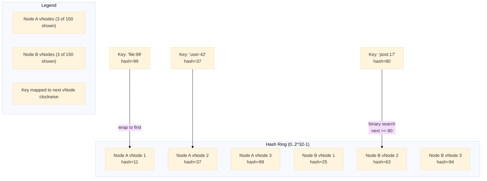

# pkg/consistenthash -- Hash Ring

Consistent hashing ring dengan 150 virtual node per physical node, hashing kunci `crc32`, dan pencarian node O(log N) melalui binary search. Digunakan oleh key-value store untuk penempatan shard terdistribusi.

## Arsitektur



Ring adalah irisan terurut dari nilai hash integer. Setiap node fisik direplikasi sebanyak `replicas` kali dengan kunci `strconv.Itoa(i) + node` untuk menghasilkan distribusi yang seragam di sekitar ring. Pencarian kunci berjalan searah jarum jam ke vNode terdekat melalui binary search, melingkar ke indeks 0 ketika target melebihi hash maksimum.

## API

```go
func New(replicas int) *HashRing
func (h *HashRing) Add(node string)
func (h *HashRing) Remove(node string)
func (h *HashRing) Get(key string) string
```

### Konstruktor

Jumlah replica default adalah 150 ketika nilai nol atau negatif diberikan.

```go
ring := consistenthash.New(150)
ring.Add("node-a")
ring.Add("node-b")
ring.Add("node-c")

node := ring.Get("user:42") // Mengembalikan salah satu dari node-a, node-b, node-c
```

### Add

Menyisipkan `replicas` virtual node ke dalam ring kunci yang terurut.

```go
func (h *HashRing) Add(node string) {
    for i := 0; i < h.replicas; i++ {
        hash := int(crc32.ChecksumIEEE([]byte(strconv.Itoa(i) + node)))
        h.keys = append(h.keys, hash)
        h.hashMap[hash] = node
    }
    sort.Ints(h.keys)
}
```

### Remove

Menghapus semua virtual node milik node fisik tertentu dan membangun ulang irisan kunci yang terurut.

```go
func (h *HashRing) Remove(node string) {
    for i := 0; i < h.replicas; i++ {
        hash := int(crc32.ChecksumIEEE([]byte(strconv.Itoa(i) + node)))
        delete(h.hashMap, hash)
    }
    var newKeys []int
    for _, k := range h.keys {
        if _, ok := h.hashMap[k]; ok {
            newKeys = append(newKeys, k)
        }
    }
    h.keys = newKeys
    sort.Ints(h.keys)
}
```

### Get

Binary search untuk vNode berikutnya >= hash kunci. Mengembalikan node fisik yang sesuai.

```go
func (h *HashRing) Get(key string) string {
    if len(h.keys) == 0 {
        panic("hash ring is empty")
    }
    hash := int(crc32.ChecksumIEEE([]byte(key)))
    idx := sort.Search(len(h.keys), func(i int) bool {
        return h.keys[i] >= hash
    })
    if idx == len(h.keys) {
        idx = 0 // wrap around
    }
    return h.hashMap[h.keys[idx]]
}
```

## Keputusan Teknis

- **150 virtual node**: Menyeimbangkan keseragaman distribusi dengan jejak memori. Setiap vNode memakan ~24 byte (kunci int + entri map), jadi 150 vNode x 10 node = ~36 KB. Meningkatkan ke 300 memberikan hasil yang semakin berkurang untuk kasus penggunaan key-value store.
- **crc32 dibanding md5/sha1**: Hash non-kriptografis sudah cukup untuk distribusi. crc32 dipercepat perangkat keras pada CPU modern dan menghasilkan rentang 32-bit penuh.
- **Binary search dibanding red-black tree**: Irisan kunci bersifat append-only selama Add dan diurutkan sekali. Binary search pada irisan terurut (`sort.Search`) adalah O(log N) dan ramah-cache. Red-black tree akan menambah kompleksitas tanpa keuntungan yang terukur pada jumlah replica ini.
- **Panic pada ring kosong**: Eksplisit daripada nilai nol diam-diam. Get pada ring kosong selalu merupakan kesalahan pemrograman dan harus gagal dengan keras.
- **Remove membangun ulang irisan kunci**: Alih-alih menghapus dari tengah irisan (pergeseran O(N)), kita melakukan iterasi sekali dan mengiris ulang. Ini menjaga kode tetap sederhana dan kebenaran jelas.
