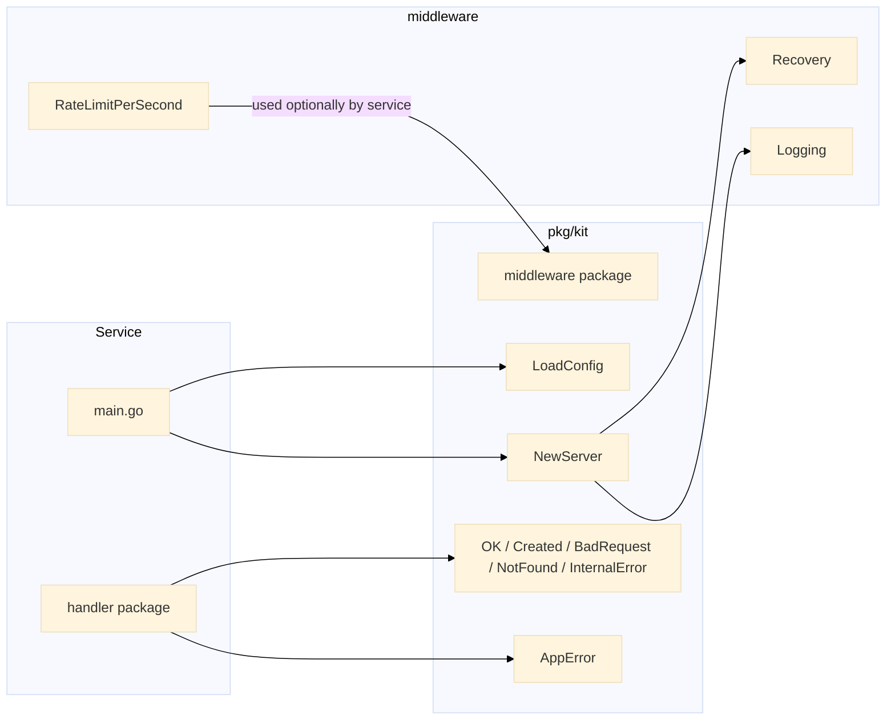

# pkg/kit -- Gin Server Factory

Gin-based HTTP server factory, configuration loader, helper respons JSON, error bertipe, dan middleware bawaan -- digunakan bersama oleh setiap layanan di monorepo.

## Arsitektur



## Komponen

### Config Loader

`LoadConfig()` membaca variabel lingkungan `PORT` dan `ENV` dengan nilai default yang wajar. Digunakan oleh setiap `main.go` layanan.

```go
type Config struct {
    Port string
    Env  string
}

func LoadConfig() Config {
    port := os.Getenv("PORT")
    if port == "" {
        port = "8080"
    }
    env := os.Getenv("ENV")
    if env == "" {
        env = "development"
    }
    return Config{Port: port, Env: env}
}
```

### Server Factory

`NewServer` membuat engine Gin yang sudah dikonfigurasi dengan middleware recovery dan logging, mode debug/release/test berdasarkan `Config.Env`, dan endpoint `/health`.

```go
func NewServer(cfg Config) *gin.Engine {
    gin.SetMode(ginMode(cfg.Env))
    g := gin.New()
    g.Use(middleware.Recovery(), middleware.Logging())
    g.GET("/health", func(c *gin.Context) {
        OK(c, gin.H{"status": "ok"})
    })
    return g
}
```

### Response Helpers

| Fungsi | HTTP Status | Deskripsi |
|---|---|---|
| `OK` | 200 | Payload sukses standar |
| `Created` | 201 | Resource dibuat |
| `BadRequest` | 400 | Validasi / input salah |
| `NotFound` | 404 | Resource tidak ditemukan |
| `InternalError` | 500 | Kegagalan di sisi server |

Semua respons berbagi format JSON yang konsisten:

```go
type Response struct {
    Data  interface{} `json:"data,omitempty"`
    Error string      `json:"error,omitempty"`
    Meta  interface{} `json:"meta,omitempty"`
}
```

### AppError

Menyatukan penanganan error di seluruh lapisan layanan dan handler dengan kode error, pesan yang dapat dibaca manusia, dan penyebab terbungkus opsional.

```go
type AppError struct {
    Code    int
    Message string
    Err     error
}

func (e *AppError) Error() string {
    if e.Err != nil {
        return fmt.Sprintf("[%d] %s: %v", e.Code, e.Message, e.Err)
    }
    return fmt.Sprintf("[%d] %s", e.Code, e.Message)
}

func (e *AppError) Unwrap() error { return e.Err }
```

### Middleware

#### Recovery

Menangkap panic, mencatat stack trace melalui `debug.Stack()`, dan merespons dengan 500 alih-alih membuat proses crash.

```go
func Recovery() gin.HandlerFunc {
    return func(c *gin.Context) {
        defer func() {
            if err := recover(); err != nil {
                log.Printf("panic recovered: %v\n%s", err, debug.Stack())
                c.AbortWithStatusJSON(http.StatusInternalServerError, gin.H{
                    "error": "internal server error",
                })
            }
        }()
        c.Next()
    }
}
```

#### Logging

Mencatat setiap permintaan dengan method, path, kode status, dan durasi.

```go
func Logging() gin.HandlerFunc {
    return func(c *gin.Context) {
        start := time.Now()
        c.Next()
        log.Printf("%s %s %d %s",
            c.Request.Method,
            c.Request.URL.Path,
            c.Writer.Status(),
            time.Since(start).Round(time.Millisecond),
        )
    }
}
```

#### RateLimit Bridge

Menempelkan algoritma rate-limiter ke rute mana pun. Digunakan oleh layanan rate-limiter dan tersedia sebagai pengaman serba guna.

```go
func RateLimitPerSecond(algo algorithm.Algorithm, limit int) gin.HandlerFunc {
    return func(c *gin.Context) {
        key := c.ClientIP()
        if !algo.Allow(key, limit, time.Second) {
            c.AbortWithStatusJSON(http.StatusTooManyRequests, gin.H{
                "error": "rate limit exceeded",
            })
            return
        }
        c.Next()
    }
}
```

## Endpoints

| Method | Path | Deskripsi |
|---|---|---|
| GET | `/health` | Health check, mengembalikan `{"data": {"status": "ok"}}` |

## Keputusan Teknis

- **Gin dibanding net/http**: Pilihan framework yang konsisten di semua 12 layanan. Binding, validasi, dan middleware chaining bawaan.
- **gin.New() dibanding gin.Default()**: Registrasi middleware eksplisit menghindari penyertaan tak terduga dari `gin.Logger()` dan `gin.Recovery()` dengan format output berbeda.
- **Logging dibanding structured logger**: `log.Printf` menjaga permukaan dependensi tetap minimal. Layanan yang membutuhkan output terstruktur dapat menambahkan logger nanti tanpa mengubah antarmuka middleware.
- **Response envelope**: Struct `Response` tunggal dengan `Data`, `Error`, dan `Meta` opsional membuat parsing di sisi klien seragam. Tidak ada konvensi yang bersaing antar layanan.
- **Pola AppError**: Membungkus penyebab dengan `fmt.Errorf` untuk rantai error tanpa stack. `Unwrap()` memungkinkan `errors.Is` / `errors.As` di situs pemanggil.

## Source Code

[View on GitHub](https://github.com/faisalaffan/faisalaffan-design-system/blob/dev/pkg/kit/server.go)
