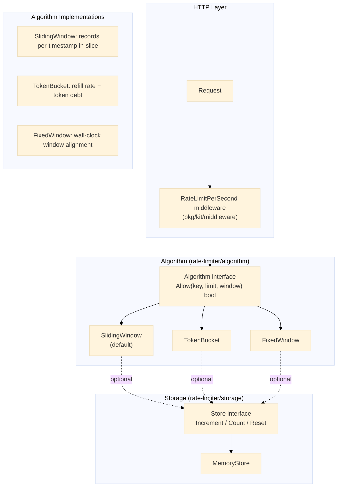

# Rate Limiter

Antarmuka algoritma yang dapat dipasang dengan tiga implementasi (sliding window, token bucket, fixed window) dan antarmuka penyimpanan opsional yang didukung oleh penyimpanan in-memory. Diekspos sebagai middleware Gin melalui `pkg/kit/middleware`.

## Arsitektur



## Algorithm Interface

```go
type Algorithm interface {
    Allow(key string, limit int, window time.Duration) bool
}
```

Semua algoritma melacak status per-kunci (biasanya IP klien). `Allow` mengembalikan `true` jika permintaan dalam batas dan `false` jika rate-limited.

### Sliding Window (default)

Melacak irisan timestamp nanodetik per kunci. Entri lama di luar jendela dipangkas pada setiap panggilan. Memberikan batas jendela yang paling akurat.

```go
func (sw *SlidingWindow) Allow(key string, limit int, window time.Duration) bool {
    now := time.Now().UnixNano()
    cutoff := now - window.Nanoseconds()

    w, ok := sw.windows[key]
    if !ok {
        sw.windows[key] = &slidingEntry{timestamps: []int64{now}}
        return true
    }

    var valid []int64
    for _, ts := range w.timestamps {
        if ts > cutoff {
            valid = append(valid, ts)
        }
    }
    if len(valid) < limit {
        valid = append(valid, now)
        w.timestamps = valid
        return true
    }
    w.timestamps = valid
    return false
}
```

### Token Bucket

Setiap kunci memiliki kumpulan token yang diisi ulang secara terus-menerus pada `rate = limit / window.Seconds()`. Lonjakan hingga `limit` diizinkan.

```go
func (tb *TokenBucket) Allow(key string, limit int, window time.Duration) bool {
    b, ok := tb.buckets[key]
    if !ok {
        b = &bucket{tokens: float64(limit) - 1, lastRefill: time.Now()}
        tb.buckets[key] = b
        return true
    }
    rate := float64(limit) / window.Seconds()
    elapsed := time.Since(b.lastRefill).Seconds()
    b.tokens += elapsed * rate
    if b.tokens > float64(limit) {
        b.tokens = float64(limit)
    }
    b.lastRefill = time.Now()
    if b.tokens >= 1 {
        b.tokens--
        return true
    }
    return false
}
```

### Fixed Window

Menyelaraskan jendela ke batas wall-clock (mis., 0:00--1:00, 1:00--2:00). Lebih sederhana tetapi memungkinkan lalu lintas ganda di batas.

```go
func (fw *FixedWindow) Allow(key string, limit int, window time.Duration) bool {
    now := time.Now().UnixNano()
    windowNano := window.Nanoseconds()
    currentWindow := now / windowNano * windowNano

    w, ok := fw.windows[key]
    if !ok || w.window != currentWindow {
        fw.windows[key] = &fixedEntry{count: 1, window: currentWindow}
        return true
    }
    if w.count < limit {
        w.count++
        return true
    }
    return false
}
```

## Storage Interface

Lapisan persistensi opsional untuk status rate-limit eksternal (mis., Redis).

```go
type Store interface {
    Increment(key string, window time.Duration) (int, error)
    Count(key string, window time.Duration) (int, error)
    Reset(key string) error
}
```

`MemoryStore` default menggunakan kedaluwarsa berbasis TTL per entri.

## Gin Middleware

Dijembatani melalui `pkg/kit/middleware` sebagai `RateLimitPerSecond`:

```go
srv.GET("/limited", kitmw.RateLimitPerSecond(algo, 5), func(c *gin.Context) {
    kit.OK(c, gin.H{"message": "within rate limit"})
})
```

Kunci diekstrak dari `c.ClientIP()`. Mengembalikan 429 Too Many Requests ketika terlampaui.

## Endpoints

| Method | Path | Deskripsi |
|---|---|---|
| `GET` | `/limited` | Rute dengan rate limit (default: 5 req/s) |
| `GET` | `/unlimited` | Tidak ada rate limit |
| `POST` | `/admin/reset` | Mengatur ulang rate limit untuk IP tertentu |

## Keputusan Teknis

- **Sliding window sebagai default**: Akurasi terbaik untuk rate limiting. Fixed window memiliki bias batas; token bucket memungkinkan lonjakan pendek. Sliding window memberikan perilaku paling dapat diprediksi untuk sebagian besar kasus penggunaan.
- **Presisi nanodetik**: `time.Now().UnixNano()` menghindari artefak collision yang dapat disebabkan oleh presisi milidetik di bawah konkurensi tinggi dalam satu detik.
- **Map per-kunci dengan mutex**: Map dalam proses menjaga implementasi tetap mandiri dengan nol dependensi eksternal. Kontensi dapat diabaikan untuk granularitas per-IP yang tipikal (satu goroutine per permintaan).
- **Algorithm interface sebagai titik sambung**: Algoritma baru (mis., sliding window counter dari Redis) dapat ditambahkan dengan mengimplementasikan `Allow(key, limit, window)`. Tidak ada perubahan pada kode middleware atau handler.
- **Storage interface untuk penggunaan produksi**: Status algoritma bersifat sementara. Deployment produksi mengganti `MemoryStore` dengan Redis menggunakan interface `Store`, membuat rate limit bertahan dari restart dan berskala lintas instance.

## Source Code

[View on GitHub](https://github.com/faisalaffan/faisalaffan-design-system/blob/dev/services/rate-limiter/main.go)
