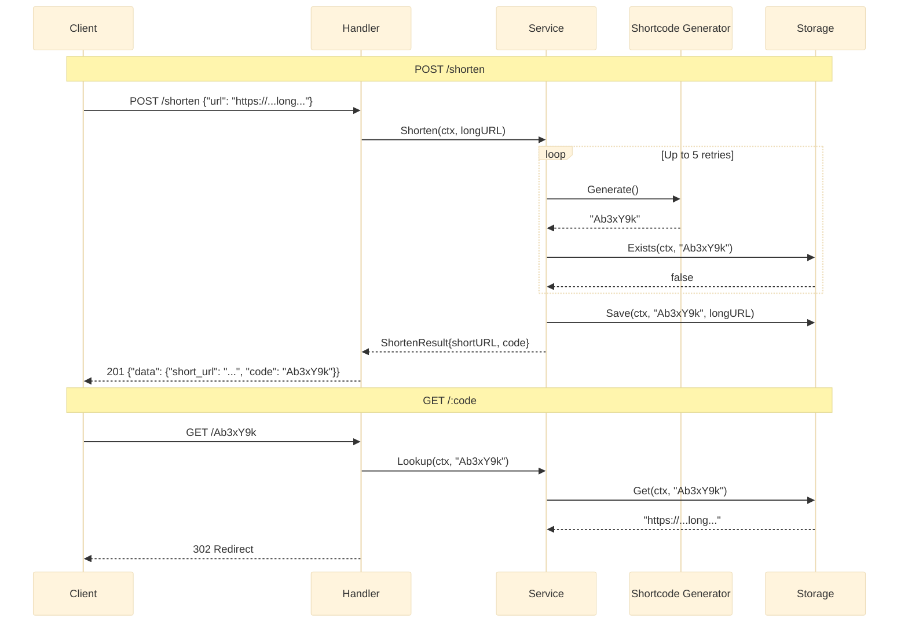

# URL Shortener

Base62 7-karakter generator shortcode acak dengan collision retry (hingga 5 percobaan) dan redirect HTTP 302. Arsitektur empat lapis: Handler, Service, Storage, Shortcode.

## Arsitektur



## Endpoints

| Method | Path | Deskripsi |
|---|---|---|
| `POST` | `/shorten` | Membuat URL pendek dari URL panjang |
| `GET` | `/:code` | Redirect ke URL panjang asli |

### POST /shorten

```json
// Request
{"url": "https://example.com/very/long/url"}

// Response 201
{"data": {"short_url": "http://localhost:8080/Ab3xY9k", "code": "Ab3xY9k"}}
```

### GET /:code

Merespons dengan HTTP 302 (Found) dan header `Location` diatur ke URL asli. Mengembalikan 404 jika shortcode tidak ada.

## Lapisan

### Handler

Memvalidasi body JSON, mengekstrak parameter path `code`, dan mendelegasikan ke service. Menggunakan `kit.BadRequest`, `kit.Created`, `kit.NotFound` untuk respons JSON yang konsisten.

### Service -- Shorten & Lookup

```go
type ShortenService struct {
    store   storage.Storage
    baseURL string
}

func (s *ShortenService) Shorten(ctx context.Context, longURL string) (*ShortenResult, error) {
    for attempts := 0; attempts < 5; attempts++ {
        code, err := shortcode.Generate()
        if err != nil {
            return nil, fmt.Errorf("generate shortcode: %w", err)
        }
        exists, err := s.store.Exists(ctx, code)
        if err != nil {
            return nil, fmt.Errorf("check exists: %w", err)
        }
        if exists {
            log.Printf("collision: %s, retrying", code)
            continue
        }
        if err := s.store.Save(ctx, code, longURL); err != nil {
            return nil, fmt.Errorf("save: %w", err)
        }
        return &ShortenResult{
            ShortURL: s.baseURL + "/" + code,
            Code:     code,
        }, nil
    }
    return nil, fmt.Errorf("failed to generate unique code after 5 attempts")
}
```

### Shortcode Generator

String acak 7-karakter secara kriptografis dari alfabet 62 karakter (a-z, A-Z, 0-9). Menggunakan `crypto/rand` untuk keamanan acak.

```go
const alphabet = "abcdefghijklmnopqrstuvwxyzABCDEFGHIJKLMNOPQRSTUVWXYZ0123456789"
const codeLength = 7

func Generate() (string, error) {
    code := make([]byte, codeLength)
    for i := range code {
        n, err := rand.Int(rand.Reader, big.NewInt(int64(len(alphabet))))
        if err != nil {
            return "", err
        }
        code[i] = alphabet[n.Int64()]
    }
    return string(code), nil
}
```

### Storage Interface

```go
type Storage interface {
    Save(ctx context.Context, code string, url string) error
    Get(ctx context.Context, code string) (string, error)
    Exists(ctx context.Context, code string) (bool, error)
}
```

Implementasi default adalah `storage.MemoryStore` -- map in-memory thread-safe yang dilindungi oleh `sync.RWMutex`.

## Keputusan Teknis

- **7-karakter base62** = 62^7 = ~3,5 triliun kombinasi, yang membuat probabilitas collision dapat diabaikan pada skala realistis mana pun. Collision retry diimplementasikan sebagai jaring pengaman, bukan jalur kode yang diharapkan.
- **302 (Found) dibanding 301 (Moved Permanently)**: 302 memberi pemilik layanan fleksibilitas untuk mengubah URL target atau menonaktifkan redirect. Browser menyimpan cache respons 301 secara agresif, membuat pembaruan tidak terlihat oleh pengguna.
- **crypto/rand dibanding math/rand**: Shortcode tidak boleh dapat diprediksi. Menggunakan `crypto/rand` mencegah serangan enumerasi di mana penyerang mengiterasi shortcode sekuensial.
- **Hingga 5 collision retry**: Setelah 5 collision berturut-turut (probabilitas: (1/3,5T)^5 = efektif nol), layanan mengembalikan error daripada melakukan looping selamanya. Ini adalah pagar pengaman kebenaran, bukan masalah performa.
- **Pemisahan empat lapis**: Handler memiliki urusan HTTP (parsing JSON, kode status), Service memiliki logika bisnis (retry, perakitan URL), Storage memiliki persistensi, Shortcode memiliki pembuatan. Setiap lapisan dapat diuji dan diganti secara independen.
