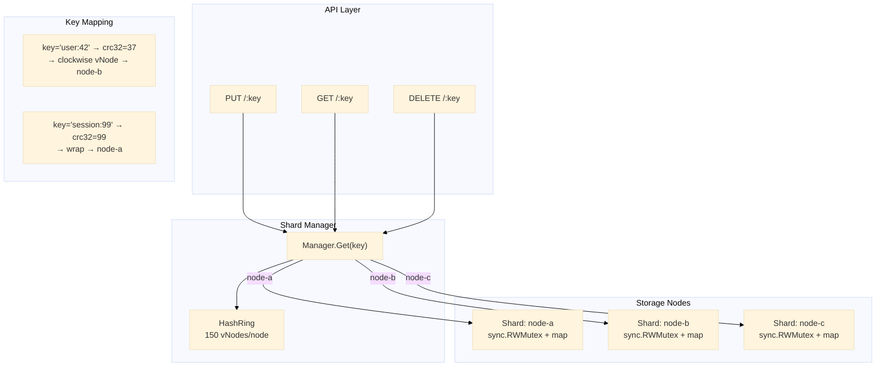

# Key-Value Store

Penyimpanan key-value terdistribusi berbasis consistent hashing. `shard.Manager` menggunakan `pkg/consistenthash` untuk memetakan kunci ke node, dengan penyimpanan in-memory per shard.

## Arsitektur



Shard manager menerima setiap operasi kunci, melakukan hash kunci melalui `crc32`, menemukan vNode yang bertanggung jawab pada hash ring melalui binary search, dan mendelegasikan ke penyimpanan in-memory shard yang sesuai.

## Endpoints

| Method | Path | Deskripsi |
|---|---|---|
| `GET` | `/:key` | Mengambil nilai untuk sebuah kunci |
| `PUT` | `/:key` | Menyimpan nilai (raw request body) |
| `DELETE` | `/:key` | Menghapus sebuah kunci |

### PUT /my-key

```http
PUT /my-key HTTP/1.1
Content-Type: text/plain

hello world
```

```json
{"data": {"key": "my-key", "stored": true}}
```

### GET /my-key

```json
{"data": {"key": "my-key", "value": "hello world"}}
```

### DELETE /my-key

```json
{"data": {"key": "my-key", "deleted": true}}
```

## Shard Manager

```go
type Manager struct {
    ring   *consistenthash.HashRing
    shards map[string]storage.Store
}

func NewManager(nodes []string) *Manager {
    ring := consistenthash.New(150)
    shards := make(map[string]storage.Store)
    for _, n := range nodes {
        ring.Add(n)
        shards[n] = storage.NewMemoryStore()
    }
    return &Manager{ring: ring, shards: shards}
}
```

### Key Routing

```go
func (m *Manager) getShard(key string) storage.Store {
    node := m.ring.Get(key) // consistent hash lookup
    return m.shards[node]
}
```

Setiap panggilan `Get`, `Put`, dan `Delete` menyelesaikan kunci ke shard melalui `getShard`. Menambah atau menghapus node hanya memetakan ulang kunci secara proporsional dengan bagian node dari ring (kunci K/N untuk N node) -- properti pemetaan ulang minimal dari consistent hashing.

### Konfigurasi Node

Node dikonfigurasi melalui variabel lingkungan `KV_NODES` sebagai daftar yang dipisahkan koma:

```bash
KV_NODES=node-a,node-b,node-c go run ./services/key-value-store
```

Ketika variabel kosong, satu node `default` digunakan.

## Storage Interface

```go
type Store interface {
    Get(ctx context.Context, key string) (string, error)
    Put(ctx context.Context, key string, value string) error
    Delete(ctx context.Context, key string) error
}
```

`MemoryStore` default menggunakan `sync.RWMutex` dengan `map[string]string`. Operasi baca memperoleh read lock (konkuren), operasi tulis memperoleh write lock (eksklusif).

## Keputusan Teknis

- **Consistent hashing dibanding modulo N**: Modulo N membutuhkan hashing ulang setiap kunci ketika node ditambah atau dihapus. Consistent hashing hanya memindahkan kunci K/N. Ini penting untuk produksi di mana keanggotaan node berubah secara teratur (rolling deploy, autoscaling).
- **150 vNodes per node**: Sesuai dengan default `pkg/consistenthash`. 150 memberikan distribusi seragam di seluruh ring sambil menjaga irisan kunci terurut tetap kecil (~150 * 10 = 1.500 entri) untuk binary search yang cepat.
- **Raw body PUT**: Body permintaan disimpan apa adanya tanpa parsing JSON. Ini membuat penyimpanan agnostik terhadap format data -- dapat menyimpan JSON, teks biasa, protobuf serial, atau string byte apa pun.
- **Tanpa TTL / kedaluwarsa**: Implementasi awal adalah map key-value biasa. TTL dapat ditambahkan di lapisan penyimpanan tanpa mengubah shard manager atau handler.
- **Penyimpanan memori lokal shard**: Setiap shard adalah map yang dilindungi `sync.RWMutex` yang terisolasi. Tidak ada komunikasi lintas-shard, replikasi, atau konsensus. Deployment produksi akan mengganti `MemoryStore` dengan engine penyimpanan persisten (RocksDB, SQLite) atau penyimpanan tereplikasi (Redis Cluster, etcd).

## Source Code

[View on GitHub](https://github.com/faisalaffan/faisalaffan-design-system/blob/dev/services/key-value-store/main.go)
