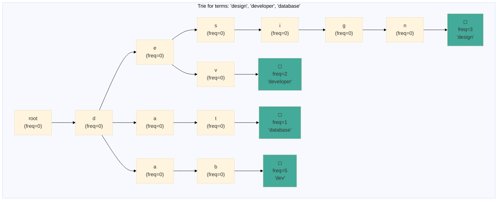
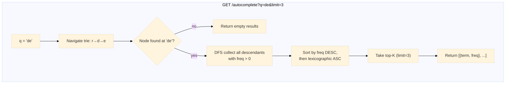

# Search Autocomplete

Prefix-tree (Trie) dengan penghitung frekuensi per-node, peringkat hasil top-K berdasarkan frekuensi, dan pemutus seri leksikografis. Mengekspos `POST /train` untuk mempelajari istilah dan `GET /autocomplete?q=...` untuk pencarian prefiks.

## Arsitektur

### Struktur Trie



Setiap tepi adalah karakter dalam alfabet. Node terminal (kotak terisi di atas) membawa penghitung frekuensi yang dinaikkan melalui `Insert` atau `Increment`. Pohon prefiks mengompresi prefiks bersama sehingga `"design"` dan `"developer"` berbagi jalur `"d"`, `"e"`.

### Alur Pencarian



## Endpoints

| Method | Path | Deskripsi |
|---|---|---|
| `GET` | `/autocomplete` | Mencari saran prefiks |
| `POST` | `/train` | Menaikkan frekuensi satu istilah |
| `POST` | `/train/bulk` | Menaikkan beberapa istilah sekaligus |

### GET /autocomplete?q=de&limit=3

```http
GET /autocomplete?q=de&limit=3
```

```json
{
  "data": {
    "query": "de",
    "results": [
      {"term": "developer", "freq": 5},
      {"term": "design", "freq": 3}
    ]
  }
}
```

### POST /train

```json
// Request
{"term": "golang"}
// Response
{"data": {"trained": "golang"}}
```

### POST /train/bulk

```json
// Request
{"terms": ["golang", "gin", "goroutine"]}
// Response
{"data": {"trained": 3}}
```

## Implementasi Trie

```go
type node struct {
    children map[rune]*node
    freq     int
}

type Trie struct {
    mu   sync.RWMutex
    root *node
}

func New() *Trie {
    return &Trie{root: &node{children: make(map[rune]*node)}}
}

func (t *Trie) Insert(term string, freq int) {
    cur := t.root
    for _, ch := range term {
        if cur.children[ch] == nil {
            cur.children[ch] = &node{children: make(map[rune]*node)}
        }
        cur = cur.children[ch]
    }
    cur.freq += freq
}

func (t *Trie) Search(prefix string, limit int) []Result {
    cur := t.root
    for _, ch := range prefix {
        if cur.children[ch] == nil {
            return nil
        }
        cur = cur.children[ch]
    }

    var results []Result
    collect(cur, prefix, &results)

    sort.Slice(results, func(i, j int) bool {
        if results[i].Freq == results[j].Freq {
            return results[i].Term < results[j].Term
        }
        return results[i].Freq > results[j].Freq
    })

    if limit > 0 && len(results) > limit {
        results = results[:limit]
    }
    return results
}
```

Handler juga menyediakan endpoint train massal untuk ingest batch:

```go
type bulkTrainRequest struct {
    Terms []string `json:"terms" binding:"required"`
}

func (h *AutocompleteHandler) TrainBulk(c *gin.Context) {
    var req bulkTrainRequest
    if err := c.ShouldBindJSON(&req); err != nil {
        kit.BadRequest(c, "terms array is required")
        return
    }
    for _, term := range req.Terms {
        h.trie.Increment(term)
    }
    kit.OK(c, gin.H{"trained": len(req.Terms)})
}
```

## Keputusan Teknis

- **Trie dibanding inverted index**: Trie adalah struktur data kanonik untuk autocomplete prefiks. Waktu pencarian adalah O(panjang(prefiks) + jumlah node turunan) terlepas dari ukuran kamus. Inverted index akan memerlukan lapisan kueri prefiks terpisah.
- **Map per-node dibanding array of 26**: `map[rune]*node` mendukung karakter Unicode arbitrer (China, Arab, emoji). Array ukuran tetap akan membatasi alfabet ke ASCII. Overhead memori dari map dapat diterima pada skala ini.
- **Top-K berdasarkan frekuensi, pemutus seri leksikografis**: Pengurutan dua tahap menghasilkan hasil deterministik. Tanpa fallback leksikografis, hasil dengan frekuensi yang sama akan berada dalam urutan iterasi map yang non-deterministik.
- **Koleksi DFS dibanding saran yang telah dihitung sebelumnya**: Menghitung top-K per prefiks sebelumnya akan mempercepat pencarian dengan mengorbankan memori dan kompleksitas pembaruan. Pendekatan saat ini menjaga struktur data tetap sederhana dan benar. Sistem produksi pada skala besar dapat menambahkan lapisan cache di depan Trie.
- **RWMutex untuk akses konkuren**: Trie menggunakan read-write mutex. `Search` memperoleh read lock (pembaca konkuren), sementara `Insert` / `Increment` memperoleh write lock (eksklusif). Ini memaksimalkan throughput di bawah beban kerja autocomplete yang didominasi baca.
- **Seed terms di main.go**: Layanan melakukan pre-populasi istilah umum (`"design"`, `"developer"`, `"database"`, `"distributed"`, `"docker"`, `"deploy"`) sehingga endpoint autocomplete mengembalikan hasil yang berguna segera tanpa pelatihan.
