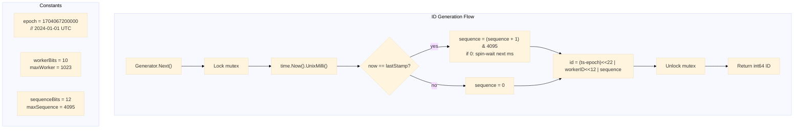

# Unique ID Generator

Generator ID unik 64-bit gaya Snowflake dengan timestamp 41-bit (epoch 2024-01-01), worker ID 10-bit, dan nomor urut 12-bit. Menghasilkan hingga 4.096 ID per milidetik per worker.

## Arsitektur

### Tata Letak Bit ID

```
 0                   1                   2                   3
 0 1 2 3 4 5 6 7 8 9 0 1 2 3 4 5 6 7 8 9 0 1 2 3 4 5 6 7 8 9 0 1
├───────────────────────────────────────────────┬────────────┬──────┤
│                  Timestamp                      │  WorkerID  │ Seq  │
│                  41 bits                        │  10 bits   │12bit │
│              ~69 years                          │ 0 - 1023   │0-4095│
└───────────────────────────────────────────────┴────────────┴──────┘
```

- **Bit 63** (tidak ditampilkan): Tidak digunakan (sign bit, selalu 0).
- **Bits 22--62 (41 bits)**: Milidetik sejak epoch 2024-01-01T00:00:00Z. Mendukung ~69 tahun hingga 2093.
- **Bits 12--21 (10 bits)**: ID node worker (0--1023).
- **Bits 0--11 (12 bits)**: Nomor urut per milidetik (0--4095).



## Implementasi

```go
const (
    epoch         = 1704067200000 // 2024-01-01T00:00:00Z in ms
    workerBits    = 10
    sequenceBits  = 12
    maxWorker     = 1<<workerBits - 1  // 1023
    maxSequence   = 1<<sequenceBits - 1 // 4095

    timestampShift = workerBits + sequenceBits // 22
    workerShift    = sequenceBits              // 12
)

type Generator struct {
    mu        sync.Mutex
    workerID  int64
    sequence  int64
    lastStamp int64
}

func New(workerID int64) (*Generator, error) {
    if workerID < 0 || workerID > maxWorker {
        return nil, fmt.Errorf("worker ID must be between 0 and %d", maxWorker)
    }
    return &Generator{workerID: workerID}, nil
}

func (g *Generator) Next() (int64, error) {
    g.mu.Lock()
    defer g.mu.Unlock()

    now := time.Now().UnixMilli()
    if now < g.lastStamp {
        return 0, fmt.Errorf("clock moved backwards, refusing to generate ID")
    }

    if now == g.lastStamp {
        g.sequence = (g.sequence + 1) & maxSequence
        if g.sequence == 0 {
            for now <= g.lastStamp {
                now = time.Now().UnixMilli()
            }
        }
    } else {
        g.sequence = 0
    }

    g.lastStamp = now

    id := (now-epoch)<<timestampShift |
        g.workerID<<workerShift |
        g.sequence

    return id, nil
}
```

## Endpoints

| Method | Path | Deskripsi |
|---|---|---|
| `GET` | `/id` | Menghasilkan ID 64-bit unik |

### Response

```json
{"data": {"id": 7277771434402209792}}
```

Worker ID dikonfigurasi melalui variabel lingkungan `WORKER_ID` (default: 0).

## API

```go
func New(workerID int64) (*Generator, error)
func (g *Generator) Next() (int64, error)
```

## Keputusan Teknis

- **Timestamp 41-bit / worker 10-bit / urut 12-bit**: Tata letak Snowflake standar. 41 bit pada granularitas milidetik menghasilkan ~69 tahun keunikan dari epoch. 10 bit (1024 worker) mencakup ukuran cluster realistis. 12 bit (4096 ID/ms) cukup untuk satu worker pada tingkat permintaan yang wajar.
- **Epoch 2024-01-01**: Epoch kustom memperpanjang masa pakai yang dapat digunakan dibandingkan dengan epoch asli Twitter 2010. ID lebih kecil (lebih sedikit bit timestamp yang dikonsumsi) dan overflow terjadi pada tahun 2093, bukan 2081.
- **Mutex dibanding atomic CAS**: Kesederhanaan. CAS dengan loop retry pada overflow urutan sedikit lebih cepat tetapi menambahkan masalah kebenaran halus seputar pemeriksaan jam monotonik. Mutex menjamin linearizability dari jalur pembuatan.
- **Deteksi drift jam**: Jika jam sistem mundur, generator mengembalikan error alih-alih menghasilkan ID duplikat. Ini adalah fail-safe: deployment produksi harus menggunakan NTP dengan `-x` (slew bertahap) daripada `-g` (langkah), dan memonitor pergeseran jam.
- **Worker ID dari lingkungan**: Tidak diperlukan layanan koordinasi (ZooKeeper / etcd) untuk deployment node tunggal. Deployment multi-worker dapat menggunakan variabel lingkungan yang diatur pada waktu deployment (ordinal Kubernetes StatefulSet, variabel Terraform, dll.).

## Source Code

[View on GitHub](https://github.com/faisalaffan/faisalaffan-design-system/blob/dev/services/unique-id-generator/main.go)
