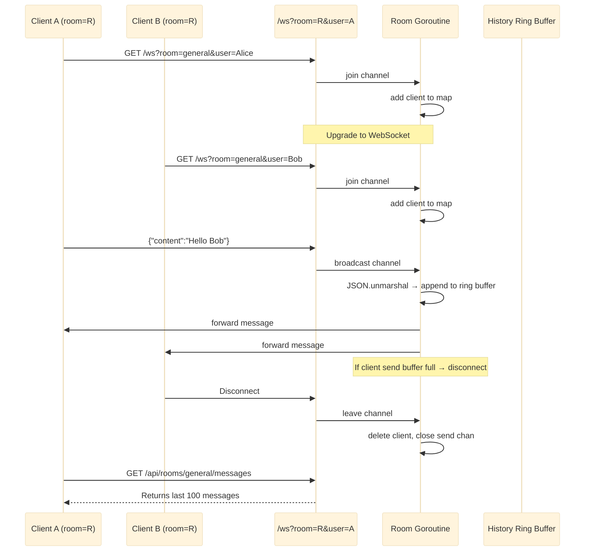

# Chat System

Chat real-time berbasis WebSocket dengan manajemen ruangan, event loop goroutine, dan riwayat pesan menggunakan ring buffer.

Port **8082** | Paket `chat-system/`

---

## Arsitektur



### Room Event Loop

Goroutine `Room.run()` melakukan serialisasi semua mutasi status melalui tiga channel, menghilangkan masalah tulis konkuren tanpa penguncian berbutir halus di jalur panas.

```go
func (r *Room) run() {
    for {
        select {
        case client := <-r.join:
            r.mu.Lock()
            r.clients[client] = true
            r.mu.Unlock()

        case client := <-r.leave:
            r.mu.Lock()
            delete(r.clients, client)
            close(client.Send)
            r.mu.Unlock()

        case msg := <-r.broadcast:
            var m Message
            if err := json.Unmarshal(msg, &m); err != nil {
                continue
            }
            r.mu.Lock()
            r.history = append(r.history, m)
            if len(r.history) > r.maxHistory {
                r.history = r.history[len(r.history)-r.maxHistory:]
            }
            for c := range r.clients {
                select {
                case c.Send <- msg:
                default:
                    delete(r.clients, c)
                    close(c.Send)
                }
            }
            r.mu.Unlock()
        }
    }
}
```

---

## API Endpoints

| Method | Path | Deskripsi |
|--------|------|-------------|
| `GET` | `/ws?room=R&user=U` | Upgrade ke WebSocket di ruang R sebagai pengguna U |
| `GET` | `/api/rooms` | Mendaftar semua ruangan dan jumlah klien mereka |
| `GET` | `/api/rooms/:room/messages` | Mendapatkan riwayat pesan untuk sebuah ruangan |

### Format Pesan WebSocket

```json
{
    "user": "Alice",
    "room": "general",
    "content": "Hello Bob",
    "timestamp": 1719912345678
}
```

---

## Keputusan Teknis

### Event Loop Berbasis Goroutine

Setiap ruangan menjalankan goroutine khusus dengan tiga channel (`join`, `leave`, `broadcast`). Pola actor-model ini menyediakan:

- **Akses terserialisasi**: semua mutasi status ruangan melalui select loop, sehingga tidak diperlukan mutex di jalur broadcast (meskipun `sync.RWMutex` melindungi pembacaan `history` dari endpoint REST).
- **Non-blocking send**: pola `select` + `default` pada `c.Send` menjatuhkan klien lambat alih-alih memblokir loop broadcast.

### Riwayat Ring Buffer

Irisan riwayat bertindak sebagai ring buffer dengan batas 100 pesan. Ketika batas tercapai, pesan tertua dipangkas:

```go
r.history = append(r.history, m)
if len(r.history) > r.maxHistory {
    r.history = r.history[len(r.history)-r.maxHistory:]
}
```

### Room Manager

Struct `Manager` menyediakan `GetOrCreate(name)` untuk pembuatan ruangan secara lazy. Ruangan `"general"` default dibuat sebelumnya saat startup.

---

## File Kunci

| File | Tujuan |
|------|---------|
| `room/room.go` | Struct Room, event loop, tipe Client |
| `room/manager.go` | Manajemen siklus hidup ruangan |
| `ws/handler.go` | Upgrade WebSocket dan pompa baca/tulis |
| `handler/handler.go` | HTTP handlers (WS upgrade, REST endpoints) |

## Source Code

[View on GitHub](https://github.com/faisalaffan/faisalaffan-design-system/blob/dev/services/chat-system/main.go)
