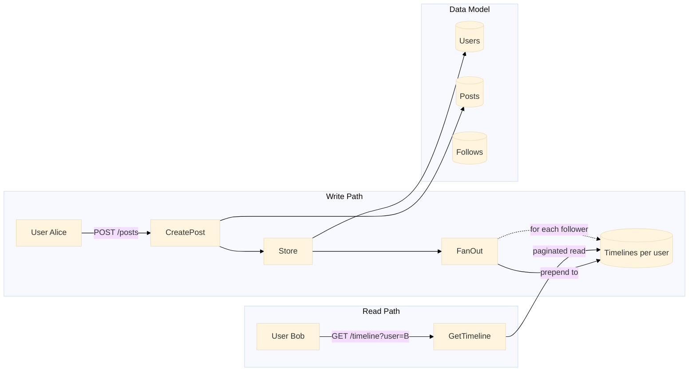

# News Feed

Sistem timeline fan-out on write. Ketika pengguna membuat postingan, postingan tersebut segera didorong ke timeline semua pengikutnya.

Port **8087** | Paket `news-feed/`

---

## Arsitektur



### Fan-Out on Write

Ketika pengguna membuat postingan, sistem mengiterasi semua pengguna, memeriksa siapa yang mengikuti poster, dan menambahkan postingan ke awal timeline setiap pengikut. Timeline poster sendiri juga menerima postingan tersebut.

```go
func (s *MemoryStore) CreatePost(userID, content string) *Post {
    s.mu.Lock()
    defer s.mu.Unlock()

    s.postSeq++
    p := &Post{
        ID:        userID + "_" + time.Now().Format("20060102150405"),
        UserID:    userID,
        Content:   content,
        CreatedAt: time.Now().UnixMilli(),
    }

    s.posts[userID] = append(s.posts[userID], p)

    // Fan-out: push to follower timelines
    for followerID := range s.follows {
        if s.follows[followerID][userID] {
            s.timeline[followerID] = append([]*Post{p}, s.timeline[followerID]...)
        }
    }
    // Also add to own timeline
    s.timeline[userID] = append([]*Post{p}, s.timeline[userID]...)

    return p
}
```

---

## API Endpoints

| Method | Path | Deskripsi |
|--------|------|-------------|
| `POST` | `/users` | Membuat pengguna (body: `{"id": "alice"}`) |
| `POST` | `/posts` | Membuat postingan (body: `{"user_id": "...", "content": "..."}`) |
| `POST` | `/follow` | Mengikuti pengguna (body: `{"follower_id": "...", "followee_id": "..."}`) |
| `GET` | `/timeline?user=X&offset=0&limit=20` | Mendapatkan timeline terpaginasikan untuk pengguna |
| `GET` | `/users/:id/posts` | Mendapatkan semua postingan oleh pengguna tertentu |

### POST /follow

```json
{
    "follower_id": "bob",
    "followee_id": "alice"
}
```

### GET /timeline?user=bob

```json
{
    "timeline": [
        {"id": "alice_20250101120000_hello", "user_id": "alice", "content": "Hello!", "created_at": 1719912345678},
        {"id": "bob_20250101115900_gm",      "user_id": "bob",   "content": "GM",     "created_at": 1719912340678}
    ]
}
```

---

## Keputusan Teknis

### Fan-Out on Write vs. on Read

| Pendekatan | Trade-off |
|----------|-----------|
| **Fan-out on write** (dipilih) | Baca cepat, tulis lambat. Postingan ditulis sekali, lalu disalin ke N timeline pengikut pada saat menulis. Cocok untuk sistem dengan rasio baca-terhadap-tulis yang tinggi. |
| Fan-out on read | Baca lambat, tulis cepat. Postingan diambil dan digabungkan dari pengguna yang diikuti pada saat membaca. Lebih baik untuk pengguna dengan banyak pengikut (selebritas). |

Implementasi ini menggunakan fan-out on write. Pendekatan hibrida (fan-out ke pengguna biasa pada saat menulis, pull untuk selebritas pada saat membaca) akan menjadi langkah selanjutnya untuk skala produksi.

### Model Data

```
users:      map[string]*User              # userID → User
posts:      map[string][]*Post             # userID → posts (milik penulis)
follows:    map[string]map[string]bool     # followerID → set of followeeIDs
timeline:   map[string][]*Post             # userID → timeline (feed pra-komputasi)
```

### Pagination

Pembacaan timeline mendukung parameter kueri `offset` dan `limit` untuk pagination berbasis offset tanpa cursor:

```go
func (s *MemoryStore) GetTimeline(userID string, offset, limit int) []*Post {
    tl := s.timeline[userID]
    if offset >= len(tl) {
        return []*Post{}
    }
    end := offset + limit
    if end > len(tl) {
        end = len(tl)
    }
    result := make([]*Post, end-offset)
    copy(result, tl[offset:end])
    return result
}
```

### Konsistensi

Semua mutasi diserialisasikan melalui `sync.RWMutex`. Pembacaan timeline menggunakan `RLock` untuk pembacaan konkuren. Kunci tulis memastikan tidak ada timeline yang diperbarui sebagian ketika sebuah postingan melakukan fan-out.

---

## File Kunci

| File | Tujuan |
|------|---------|
| `store/store.go` | Model data in-memory, logika fan-out, pembacaan terpaginasikan |
| `handler/handler.go` | HTTP handlers untuk pengguna, postingan, follow, timeline |
