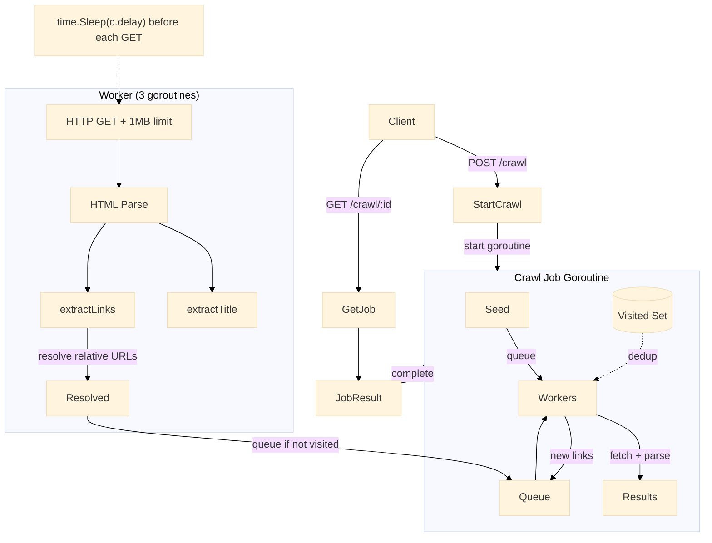

# Web Crawler

Web crawler berbasis BFS menggunakan worker goroutine untuk pengambilan halaman konkuren. Mengimplementasikan politeness delay, deduplikasi URL, dan ekstraksi tautan HTML melalui `golang.org/x/net/html`.

Port **8088** | Paket `web-crawler/`

---

## Arsitektur



### Crawl Loop

Crawler menggunakan pendekatan BFS: channel buffer berfungsi sebagai URL frontier, URL yang sudah dikunjungi dilacak dalam set thread-safe, dan beberapa goroutine worker mengonsumsi dari frontier secara paralel.

```go
func (c *Crawler) run(id string) {
    job := c.jobs[id]
    job.Status = "running"

    visited := newVisited()
    queue := make(chan string, job.MaxPages*2)
    results := make(chan *PageResult, job.MaxPages)
    var wg sync.WaitGroup

    queue <- job.SeedURL
    visited.tryVisit(job.SeedURL)

    workers := 3
    for i := 0; i < workers; i++ {
        wg.Add(1)
        go func() {
            defer wg.Done()
            for rawURL := range queue {
                result := c.fetch(rawURL)
                results <- result

                if result.StatusCode == 200 {
                    for _, link := range result.Links {
                        if visited.tryVisit(link) && visited.len() <= job.MaxPages {
                            select {
                            case queue <- link:
                            default:
                            }
                        }
                    }
                }
            }
        }()
    }

    time.Sleep(2 * time.Second)
    close(queue)
    wg.Wait()
    close(results)

    for r := range results {
        job.Pages = append(job.Pages, r)
    }
    job.Status = "completed"
}
```

### URL Fetch dengan Politeness

```go
func (c *Crawler) fetch(rawURL string) *PageResult {
    result := &PageResult{URL: rawURL}

    // Politeness delay before each request
    time.Sleep(c.delay)

    resp, err := c.client.Get(rawURL)
    if err != nil {
        result.Error = err.Error()
        return result
    }
    defer resp.Body.Close()

    result.StatusCode = resp.StatusCode
    if resp.StatusCode != 200 {
        return result
    }

    // 1MB response body limit
    body, _ := io.ReadAll(io.LimitReader(resp.Body, 1<<20))
    result.Title = extractTitle(string(body))
    result.Links = extractLinks(parsed, string(body))
    return result
}
```

### Ekstraksi Tautan HTML

```go
func extractLinks(base *url.URL, htmlStr string) []string {
    doc, _ := html.Parse(strings.NewReader(htmlStr))
    links := make(map[string]bool)

    var f func(*html.Node)
    f = func(n *html.Node) {
        if n.Type == html.ElementNode && n.Data == "a" {
            for _, attr := range n.Attr {
                if attr.Key == "href" {
                    ref, _ := url.Parse(attr.Val)
                    resolved := base.ResolveReference(ref)
                    if resolved.Scheme == "http" || resolved.Scheme == "https" {
                        resolved.Fragment = ""
                        links[resolved.String()] = true
                    }
                }
            }
        }
        for c := n.FirstChild; c != nil; c = c.NextSibling {
            f(c)
        }
    }
    f(doc)

    result := make([]string, 0, len(links))
    for link := range links {
        result = append(result, link)
    }
    return result
}
```

---

## API Endpoints

| Method | Path | Deskripsi |
|--------|------|-------------|
| `POST` | `/crawl` | Memulai pekerjaan crawl baru (body: `url`, `max_pages`) |
| `GET` | `/crawl/:id` | Mendapatkan hasil pekerjaan crawl dengan semua halaman yang sudah di-crawl |

### POST /crawl

```json
{
    "url": "https://example.com",
    "max_pages": 10
}
```

Response:

```json
{
    "job_id": "crawl_1",
    "status": "started"
}
```

### GET /crawl/:id

```json
{
    "job": {
        "id": "crawl_1",
        "status": "completed",
        "seed_url": "https://example.com",
        "max_pages": 10,
        "pages": [
            {
                "url": "https://example.com",
                "status_code": 200,
                "title": "Example Domain",
                "links": ["https://www.iana.org/domains/example"],
                "crawled_at": 1719912345678
            }
        ],
        "started_at": 1719912345000,
        "ended_at": 1719912346000
    }
}
```

---

## Keputusan Teknis

### BFS melalui Channel Frontier

URL frontier adalah channel Go buffer yang bertindak sebagai antrean BFS. Goroutine worker mengonsumsinya dan mengantrekan tautan yang baru ditemukan, menghormati batas `maxPages`.

### Politeness Delay

`time.Sleep(c.delay)` yang dapat dikonfigurasi sebelum setiap HTTP GET mencegah membanjiri server target. Default adalah 1 detik, dapat dikonfigurasi melalui variabel lingkungan `CRAWL_DELAY_MS`.

### Deduplikasi URL

Struct `visitedURLs` membungkus `map[string]struct{}` dengan mutex. `tryVisit()` secara atomik memeriksa dan menandai URL, mengembalikan `false` jika sudah dikunjungi -- ini mencegah pengambilan duplikat dan loop tak terbatas.

### Worker Pool

Tiga goroutine mengonsumsi dari channel frontier secara konkuren. `sync.WaitGroup` memastikan semua pekerja selesai sebelum pekerjaan ditandai selesai. Setelah periode drain 2 detik, antrean ditutup untuk memberi sinyal pekerja berhenti.

### Batas Body Response

`io.LimitReader(resp.Body, 1<<20)` membatasi setiap respons pada 1 MB untuk mencegah penggunaan memori tak terbatas pada halaman besar.

---

## File Kunci

| File | Tujuan |
|------|---------|
| `crawler/crawler.go` | Engine crawler: loop BFS, HTTP fetch, parsing HTML |
| `handler/handler.go` | HTTP handlers untuk memulai dan menanyakan pekerjaan crawl |
