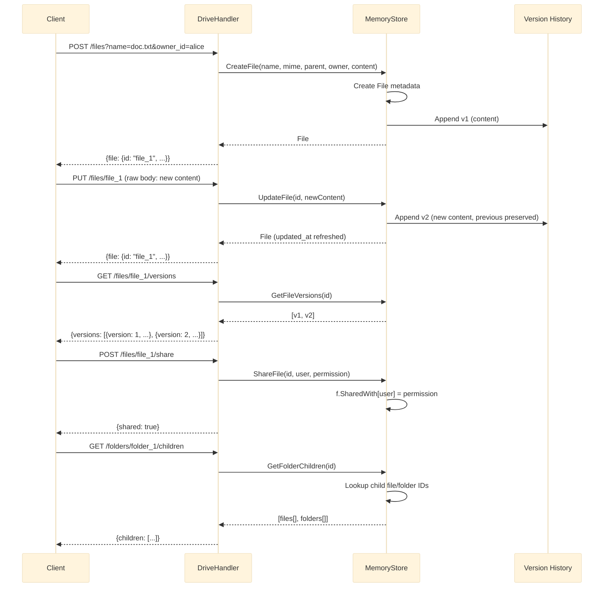

# Google Drive

Hierarki file dan folder dengan riwayat versi immutable dan izin berbagi tingkat pengguna.

Port **8090** | Paket `google-drive/`

---

## Arsitektur



### Riwayat Versi Immutable

Setiap pembaruan file menambahkan versi baru alih-alih menimpa. Seluruh riwayat dipertahankan dan dapat ditanyakan:

```go
type FileVersion struct {
    Version   int    `json:"version"`
    Content   []byte `json:"content"`
    Size      int64  `json:"size"`
    CreatedAt int64  `json:"created_at"`
}
```

```go
func (s *MemoryStore) UpdateFile(id string, content []byte) (*File, error) {
    f, ok := s.files[id]
    if !ok {
        return nil, fmt.Errorf("file not found")
    }

    versions := s.fileData[id]
    newVersion := len(versions) + 1
    s.fileData[id] = append(versions, &FileVersion{
        Version:   newVersion,
        Content:   content,
        Size:      int64(len(content)),
        CreatedAt: time.Now().UnixMilli(),
    })

    f.Size = int64(len(content))
    f.UpdatedAt = time.Now().UnixMilli()
    return f, nil
}
```

### Hirarki Folder

File dan folder membentuk pohon melalui `parentID`. Map `folderChildren` melacak keanggotaan anak untuk pencatatan yang efisien:

```go
type Folder struct {
    ID        string `json:"id"`
    Name      string `json:"name"`
    ParentID  string `json:"parent_id"`
    OwnerID   string `json:"owner_id"`
    CreatedAt int64  `json:"created_at"`
}
```

```go
func (s *MemoryStore) GetFolderChildren(folderID string) []interface{} {
    var children []interface{}
    for _, childID := range s.folderChildren[folderID] {
        if f, ok := s.files[childID]; ok {
            children = append(children, f)
        } else if f, ok := s.folders[childID]; ok {
            children = append(children, f)
        }
    }
    return children
}
```

### Izin Berbagi

```go
func (s *MemoryStore) ShareFile(fileID, userID, permission string) error {
    f, ok := s.files[fileID]
    if !ok {
        return fmt.Errorf("file not found")
    }
    f.SharedWith[userID] = permission
    return nil
}
```

---

## API Endpoints

| Method | Path | Deskripsi |
|--------|------|-------------|
| `POST` | `/files?name=N&owner_id=O&parent_id=P` | Membuat file baru (body: raw content atau multipart) |
| `GET` | `/files/:id` | Mendapatkan metadata file dan ukuran konten |
| `GET` | `/files/:id/download` | Mengunduh konten file mentah |
| `PUT` | `/files/:id` | Memperbarui konten file (menambahkan versi baru) |
| `DELETE` | `/files/:id` | Menghapus file dan semua versi |
| `GET` | `/files/:id/versions` | Mendaftar semua versi file |
| `POST` | `/files/:id/share` | Berbagi file dengan pengguna (body: user_id, permission) |
| `POST` | `/folders` | Membuat folder (body: name, owner_id, parent_id) |
| `GET` | `/folders/:id/children` | Mendaftar file dan sub-folder dalam folder |

### POST /files/:id/share

```json
{
    "user_id": "bob",
    "permission": "read"
}
```

Nilai izin: `"read"` atau `"write"`.

### POST /folders

```json
{
    "name": "Documents",
    "owner_id": "alice",
    "parent_id": ""
}
```

### GET /folders/:id/children

```json
{
    "children": [
        {"id": "file_1", "name": "doc.txt", "mime_type": "text/plain", ...},
        {"id": "folder_2", "name": "Photos", ...}
    ]
}
```

---

## Keputusan Teknis

### Riwayat Versi Immutable

Setiap `PUT /files/:id` menambahkan `FileVersion` baru daripada mengubah yang sebelumnya. Ini berarti:

- **Jejak audit lengkap**: semua konten sebelumnya dapat dipulihkan.
- **Time travel**: klien dapat mengambil versi historis mana pun.
- **Biaya penyimpanan**: tumbuh secara linear dengan jumlah pembaruan. Sistem produksi akan menambahkan kebijakan kompaksi atau batas retensi.

### Unifikasi File dan Folder

Handler mengembalikan file dan folder dari `GetFolderChildren`. Secara internal mereka disimpan dalam map terpisah, tetapi API menyajikan tampilan terpadu -- mirip dengan cara Google Drive memperlakukan folder sebagai tipe file khusus.

### Model Izin

Izin disimpan sebagai `map[string]string` pada setiap file (`userID -> "read"|"write"`). Ini adalah daftar kontrol akses (ACL) datar. Sistem produksi menambahkan:

- **Warisan**: anak mewarisi izin folder induk.
- **Grup**: izin ditetapkan ke grup daripada pengguna individu.
- **Hapus khusus pemilik**: hanya pemilik file yang dapat menghapus.

### Penyimpanan Konten

Konten file dan metadata disimpan secara terpisah. Map `fileData` menyimpan konten berversi sementara map `files` menyimpan metadata. Dalam produksi, konten akan disimpan di object store (S3, GCS) dengan metadata di basis data relasional.

---

## File Kunci

| File | Tujuan |
|------|---------|
| `store/store.go` | Model File, Folder, FileVersion; CRUD; riwayat versi; berbagi |
| `handler/handler.go` | HTTP handlers untuk file, folder, versi, berbagi, unduh |

## Source Code

[View on GitHub](https://github.com/faisalaffan/faisalaffan-design-system/blob/dev/services/google-drive/main.go)
