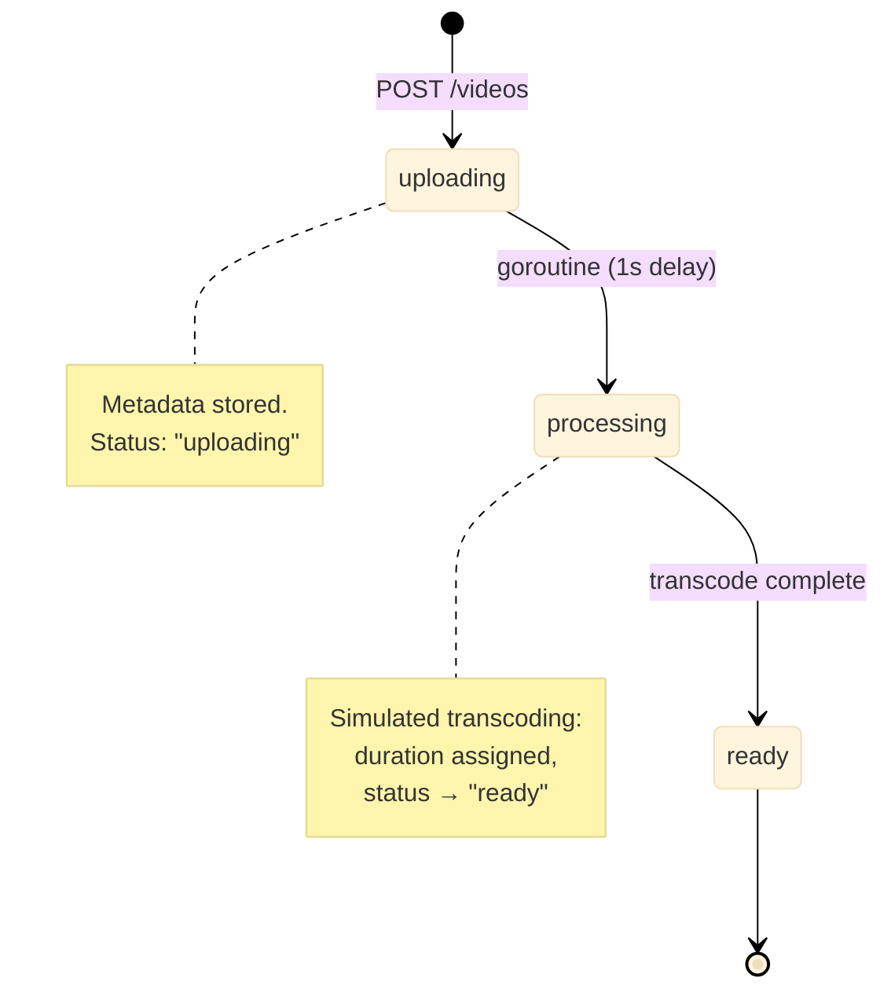

# YouTube

Manajemen metadata video dengan pipeline transcoding yang disimulasikan (uploading -> processing -> ready) dan pencarian teks lengkap di seluruh judul, deskripsi, dan tag.

Port **8089** | Paket `youtube/`

---

## Arsitektur



### Simulasi Transcoding

Ketika video dibuat, sebuah goroutine dibuat untuk mensimulasikan transcoding. Setelah penundaan 1 detik, status bertransisi dari `"uploading"` ke `"ready"` dan durasi acak (10-610 detik) ditetapkan.

```go
type MemoryStore struct {
    mu     sync.RWMutex
    videos map[string]*Video
    seq    int64
}

func (s *MemoryStore) Create(title, description string, tags []string) *Video {
    s.mu.Lock()
    defer s.mu.Unlock()

    s.seq++
    v := &Video{
        ID:          fmt.Sprintf("vid_%d", s.seq),
        Title:       title,
        Description: description,
        Tags:        tags,
        Status:      "uploading",
        UploadedAt:  time.Now().UnixMilli(),
    }

    s.videos[v.ID] = v

    // Simulate transcoding in background
    go s.transcode(v.ID)
    return v
}

func (s *MemoryStore) transcode(id string) {
    time.Sleep(1 * time.Second)

    s.mu.Lock()
    defer s.mu.Unlock()
    if v, ok := s.videos[id]; ok {
        v.Status = "ready"
        v.Duration = rand.Intn(600) + 10 // 10-610 seconds
    }
}
```

### Pencarian Teks Lengkap

Pencarian melakukan pemindaian linear melalui semua video dengan pencocokan case-insensitive terhadap judul, deskripsi, dan tag:

```go
func (s *MemoryStore) Search(query string) []*Video {
    s.mu.RLock()
    defer s.mu.RUnlock()

    q := strings.ToLower(query)
    var result []*Video
    for _, v := range s.videos {
        if strings.Contains(strings.ToLower(v.Title), q) ||
            strings.Contains(strings.ToLower(v.Description), q) ||
            containsTag(v.Tags, q) {
            result = append(result, v)
        }
    }
    sort.Slice(result, func(i, j int) bool {
        return result[i].UploadedAt > result[j].UploadedAt
    })
    return result
}

func containsTag(tags []string, q string) bool {
    for _, t := range tags {
        if strings.Contains(strings.ToLower(t), q) {
            return true
        }
    }
    return false
}
```

---

## API Endpoints

| Method | Path | Deskripsi |
|--------|------|-------------|
| `POST` | `/videos` | Mengunggah video baru (body: title, description, tags) |
| `GET` | `/videos` | Mendaftar semua video (diurutkan berdasarkan tanggal unggah, terbaru pertama) |
| `GET` | `/videos/:id` | Mendapatkan detail video (juga menaikkan hitungan tampilan) |
| `GET` | `/search?q=X` | Mencari video berdasarkan judul, deskripsi, atau tag |

### POST /videos

```json
{
    "title": "Introduction to Go Channels",
    "description": "A deep dive into Go's concurrency primitives",
    "tags": ["golang", "concurrency", "channels"]
}
```

Response:

```json
{
    "video": {
        "id": "vid_1",
        "title": "Introduction to Go Channels",
        "status": "uploading",
        "uploaded_at": 1719912345678
    }
}
```

### GET /videos/:id

```json
{
    "video": {
        "id": "vid_1",
        "title": "Introduction to Go Channels",
        "description": "A deep dive into Go's concurrency primitives",
        "tags": ["golang", "concurrency", "channels"],
        "status": "ready",
        "duration_secs": 342,
        "view_count": 7,
        "uploaded_at": 1719912345678
    }
}
```

### GET /search?q=channels

```json
{
    "videos": [
        {"id": "vid_1", "title": "Introduction to Go Channels", ...}
    ]
}
```

---

## Keputusan Teknis

### State Machine Video

```
uploading → processing → ready
```

Setiap video dimulai sebagai `"uploading"`, bertransisi melalui `"processing"` (disimulasikan oleh goroutine), dan mencapai `"ready"`. Dalam produksi, langkah pemrosesan akan melibatkan transcoding aktual (FFmpeg), pembuatan thumbnail, dan distribusi CDN.

### Transcoding Latar Belakang

Satu goroutine per video mensimulasikan transcoding async. Dalam produksi:
- Antrean pekerjaan (RabbitMQ, Redis) menggantikan goroutine untuk daya tahan.
- Worker transcoding berjalan di infrastruktur terpisah.
- Callback webhook atau polling memberitahu klien ketika pemrosesan selesai.

### Implementasi Pencarian

Pencarian saat ini adalah pemindaian linear in-memory. Ini cukup untuk demo tetapi akan digantikan oleh:
- **Pencarian teks lengkap Postgres** (`tsvector`/`tsquery`) untuk skala menengah.
- **Elasticsearch/Meilisearch** untuk pencarian skala produksi dengan peringkat relevansi, toleransi typo, dan pencarian facet.

### Penghitungan Tampilan

Setiap panggilan `GET /videos/:id` menaikkan penghitung tampilan. Ini sengaja dibuat naif -- sistem produksi menggunakan layanan penghitung terpisah atau penulisan batch untuk menghindari amplifikasi tulis pada setiap pembacaan.

---

## File Kunci

| File | Tujuan |
|------|---------|
| `store/store.go` | Model Video, CRUD, transcoding simulasi, pencarian |
| `handler/handler.go` | HTTP handlers untuk unggah, daftar, dapatkan, cari |
