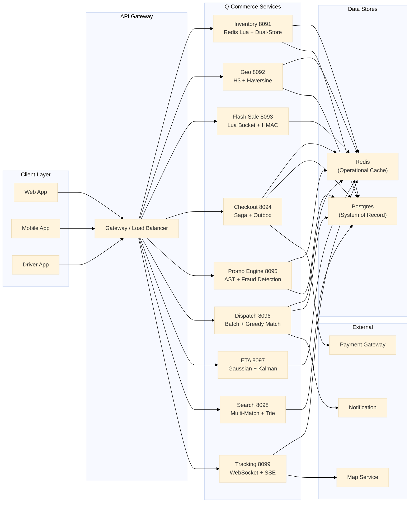

# Q-Commerce: Sistem Desain Quick Commerce

Dokumentasi untuk 10 layanan quick commerce (q-commerce) yang membentuk platform pengiriman barang cepat — dari inventaris hingga pelacakan real-time. Setiap layanan adalah binary Go mandiri yang menerapkan pola arsitektur sistem terdistribusi untuk memecahkan tantangan spesifik q-commerce.

**10 layanan | Port 8091-8100 | Pola inti: Redis Lua, SSE, H3, Kalman filter, Saga, AST**

---

## Ringkasan Layanan

| # | Layanan | Port | Pola Inti | Tanggung Jawab |
|---|---------|------|-------------|----------------|
| 1 | **Inventaris** | 8091 | Lua atomic reserve + dual-store + TTL reaper | Reservasi stok real-time, manajemen bucket, sinkronisasi Redis-Postgres |
| 2 | **Geo** | 8092 | H3 hexagon + haversine tie-breaking + fallback chain | Serviceability hub, penentuan hub terbaik, cache multi-level |
| 3 | **Flash Sale** | 8093 | Lua bucket + waiting room sorted set + HMAC attestation | Penjualan kilat, antrean pemrosesan, deteksi bot |
| 4 | **Checkout** | 8094 | Saga orchestration + idempotency SetNX + transactional outbox | Pemrosesan order, integrasi pembayaran, exactly-once processing |
| 5 | **Promo Engine** | 8095 | AST condition tree + Lua multi-boundary counter + fraud detection | Validasi promo, kalkulasi diskon, deteksi kecurangan |
| 6 | **Dispatch** | 8096 | Batch collector + greedy matcher + 7-state machine + backoff | Pencocokan driver-order, manajemen status driver, reassignment |
| 7 | **ETA** | 8097 | Concurrent goroutine + Gaussian noise + Kalman travel + p50-p95 | Estimasi waktu kedatangan multi-komponen, sticky cache |
| 8 | **Search** | 8098 | Multi-match query + composite rank + log10 stock + trie | Pencarian katalog, autocomplete, peringkat komposit |
| 9 | **Tracking** | 8099 | Websocket GPS + 6-factor validate + Kalman 4-state + SSE | Pelacakan driver real-time, streaming posisi ke pelanggan |
| 10 | **Katalog** | 8100 | (Dikelola oleh Search) | Manajemen data produk, kategori, harga |

---

## Arsitektur Sistem

## Pola Desain Lintas Layanan

### Redis sebagai Tulang Punggung Operasional

Semua layanan q-commerce menggunakan Redis untuk operasi yang membutuhkan latensi rendah. Pola penggunaan meliputi:

| Pola | Layanan | Contoh Penggunaan |
|------|---------|-------------------|
| **Lua script atomik** | Inventaris, Flash Sale, Promo | Reservasi stok, counter multi-batas |
| **Sorted set** | Flash Sale, Tracking | Waiting room, history trail |
| **SetNX / lock** | Checkout | Idempotency lock 5 detik |
| **Cache-aside** | Geo, ETA, Search | Cache hub, ETA, hasil pencarian |
| **Pub/sub** | Tracking | Distribusi event ke SSE |

### Postgres sebagai System of Record

Data yang membutuhkan durability dan konsistensi kuat disimpan di Postgres:

- Order dan statusnya (Checkout)
- Katalog produk dan harga (Search)
- Data hub dan konfigurasi (Geo)
- Log audit dan trail (semua layanan)
- Transactional outbox (Checkout)

### Komunikasi Antar Layanan

Layanan berkomunikasi secara tidak langsung melalui Redis atau database bersama, bukan melalui HTTP synchronous call. Ini menjaga coupling tetap longgar:

1. **Checkout -> Inventaris**: Melalui Redis (reservasi atomik Lua).
2. **Checkout -> Dispatch**: Melalui tabel `dispatch_queue` di Postgres.
3. **Dispatch -> Tracking**: Melalui assignment ID yang dibagikan di Redis.
4. **Checkout -> Promo**: Melalui evaluasi langsung (HTTP call internal).

## Referensi Cepat

| Topik | Detail |
|-------|--------|
| Port range | 8091 - 8100 |
| Redis | Semua layanan menggunakan Redis cluster untuk operasional |
| Postgres | System-of-record untuk data transaksional |
| Deployment | Binary Go mandiri, containerized |
| Service discovery | DNS-based (Kubernetes Service) |
| Observability | Structured logging + metrics endpoint per service |
| Keamanan | HMAC untuk webhook, atestasi token untuk flash sale, validasi multi-faktor untuk GPS |
