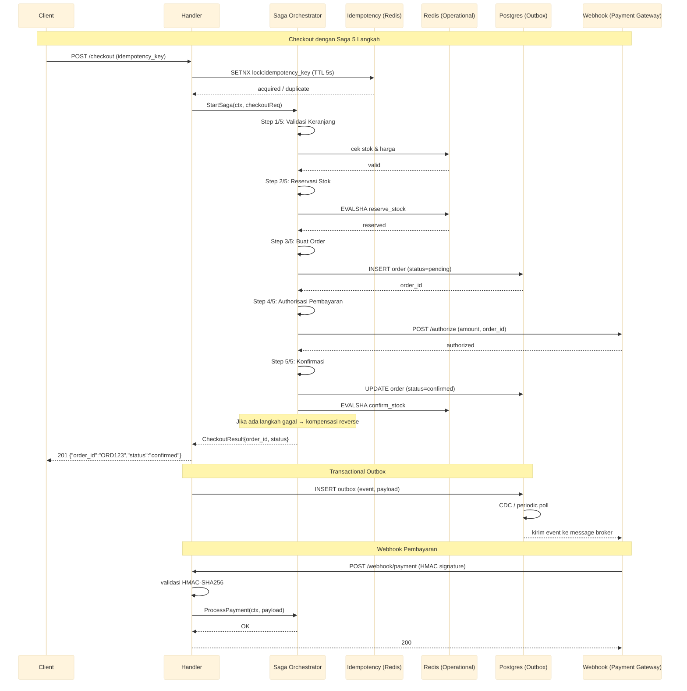

# Layanan Checkout

Layanan checkout dengan orkestrasi Saga 5 langkah, kompensasi reverse, idempotensi Redis (SetNX lock 5 detik), pola transactional outbox, dan verifikasi webhook HMAC untuk pemrosesan order yang andal.

Port **8094** | Paket `checkout-service/`

---

## Arsitektur



## Komponen

### Orkestrasi Saga 5 Langkah

Setiap checkout adalah saga dengan langkah maju dan kompensasi untuk setiap langkah yang sudah dieksekusi.

```go
type SagaStep struct {
    Name      string
    Execute   func(ctx context.Context, state *SagaState) error
    Compensate func(ctx context.Context, state *SagaState) error
}

var checkoutSaga = []SagaStep{
    {Name: "validate_cart", Execute: validateCart, Compensate: nil}, // tidak perlu kompensasi
    {Name: "reserve_stock", Execute: reserveStock, Compensate: releaseStock},
    {Name: "create_order", Execute: createOrder, Compensate: cancelOrder},
    {Name: "authorize_payment", Execute: authorizePayment, Compensate: voidPayment},
    {Name: "confirm_order", Execute: confirmOrder, Compensate: nil},
}

func (s *SagaOrchestrator) Execute(ctx context.Context, req CheckoutRequest) (*CheckoutResult, error) {
    state := NewSagaState(req)
    for i, step := range checkoutSaga {
        if err := step.Execute(ctx, state); err != nil {
            // rollback kompensasi reverse
            for j := i - 1; j >= 0; j-- {
                if checkoutSaga[j].Compensate != nil {
                    checkoutSaga[j].Compensate(ctx, state)
                }
            }
            return nil, fmt.Errorf("saga failed at step %q: %w", step.Name, err)
        }
    }
    return state.Result(), nil
}
```

### Idempotensi Redis (SetNX Lock 5 Detik)

Mencegah duplikasi order dari request yang sama.

```go
func acquireIdempotencyLock(ctx context.Context, key string) (bool, error) {
    lockKey := fmt.Sprintf("idempotency:%s", key)
    acquired, err := redis.SetNX(ctx, lockKey, "locked", 5*time.Second).Result()
    if err != nil {
        return false, err
    }
    return acquired, nil
}
```

Setelah order selesai diproses, hasilnya di-cache:

```go
func setIdempotencyResult(ctx context.Context, key string, result *CheckoutResult) error {
    data, _ := json.Marshal(result)
    return redis.Set(ctx, fmt.Sprintf("idempotency:%s:result", key), data, 24*time.Hour).Err()
}
```

### Pola Transactional Outbox

Event yang perlu dikirim ke sistem eksternal ditulis ke tabel `outbox` dalam transaksi database yang sama dengan mutasi status order. CDC atau poller periodik mengambil dan mengirim.

```go
type OutboxEvent struct {
    ID        string    `json:"id"`
    EventType string    `json:"event_type"`
    Payload   []byte    `json:"payload"`
    Status    string    `json:"status"` // pending, sent, failed
    CreatedAt time.Time `json:"created_at"`
}
```

```sql
-- INSERT dalam transaction yang sama dengan update order
BEGIN;
UPDATE orders SET status = 'confirmed' WHERE id = 'ORD123';
INSERT INTO outbox (event_type, payload, status)
VALUES ('order.confirmed', '{"order_id":"ORD123"}', 'pending');
COMMIT;
```

### Verifikasi Webhook HMAC

Webhook dari payment gateway diverifikasi dengan HMAC-SHA256 untuk menjamin integritas dan autentisitas.

```go
func verifyWebhookSignature(payload []byte, signature string, secret []byte) bool {
    mac := hmac.New(sha256.New, secret)
    mac.Write(payload)
    expected := hex.EncodeToString(mac.Sum(nil))
    return hmac.Equal([]byte(expected), []byte(signature))
}
```

## API Endpoints

| Method | Path | Deskripsi |
|--------|------|-------------|
| `POST` | `/checkout` | Memulai checkout dengan idempotency key |
| `POST` | `/webhook/payment` | Menerima notifikasi pembayaran dari payment gateway |
| `GET` | `/orders/:id` | Mendapatkan detail order |

### POST /checkout

```json
// Request
{
  "idempotency_key": "unique-key-123",
  "hub_id": "H1",
  "items": [
    {"sku": "SKU001", "qty": 2, "price": 15000}
  ],
  "payment_method": "credit_card",
  "customer_id": "CUST001"
}

// Response 201 (order baru)
{"order_id": "ORD123", "status": "confirmed", "total": 30000}

// Response 200 (duplicate / idempotent)
{"order_id": "ORD123", "status": "already_processed"}

// Response 409 (konflik)
{"error": "idempotency conflict, retry later"}
```

### POST /webhook/payment

```json
// Request (headers: X-Signature: abc123...)
{
  "event": "payment.success",
  "order_id": "ORD123",
  "transaction_id": "TXN789",
  "amount": 30000
}

// Response 200
{"status": "processed"}
```

### GET /orders/:id

```json
// Response 200
{
  "order_id": "ORD123",
  "status": "confirmed",
  "items": [...],
  "total": 30000,
  "created_at": "2025-01-15T10:30:00Z",
  "timeline": [
    {"step": "validated", "at": "10:30:00"},
    {"step": "reserved",  "at": "10:30:01"},
    {"step": "confirmed", "at": "10:30:02"}
  ]
}
```

## Algoritma Kunci

| Algoritma | Penggunaan |
|-----------|------------|
| Saga orchestration | Eksekusi 5 langkah berurutan + kompensasi reverse |
| Idempotency SetNX lock | Redis SETNX dengan TTL 5 detik + result cache 24 jam |
| Transactional outbox | INSERT outbox dalam transaksi DB yang sama |
| HMAC-SHA256 webhook | Validasi signature request masuk |
| Retry with backoff | Ulang langkah saga yang gagal (3x, exponential backoff) |

## Keputusan Teknis

- **Saga orchestration, bukan choreography**: Orchestrator tunggal memberikan visibilitas penuh ke status setiap langkah dan memudahkan implementasi kompensasi. Choreography (event-driven) lebih longgar tetapi sulit di-debug saat terjadi kegagalan.
- **Idempotency key dari klien**: Klien (mobile app / web) menghasilkan idempotency key, bukan server. Ini memungkinkan retry sisi klien tanpa risiko duplikasi. Server hanya perlu memeriksa SETNX.
- **SetNX 5 detik untuk lock**: Cukup untuk menyelesaikan sebagian besar saga (< 1 detik). Jika saga memakan waktu lebih dari 5 detik karena kegagalan, lock akan kedaluwarsa dan request kedua bisa masuk. Ini kasus tepi yang bisa diterima.
- **Transactional outbox, bukan dual-write langsung**: Menulis ke database dan mengirim event secara atomik menghindari masalah dual-write (DB commit berhasil, event gagal terkirim). Outbox memberikan exactly-once delivery semantics.
- **HMAC untuk webhook, bukan IP whitelist**: IP payment gateway bisa berubah tanpa pemberitahuan. HMAC dengan shared secret memberikan keamanan tanpa ketergantungan pada infrastruktur jaringan.

## Source Code

[View on GitHub](https://github.com/faisalaffan/faisalaffan-design-system/blob/dev/services/checkout-service/main.go)
