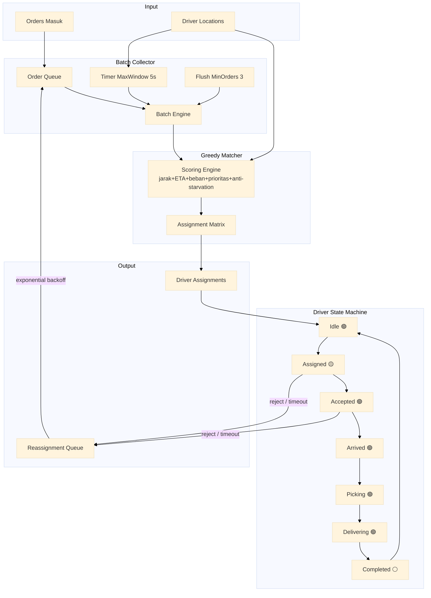
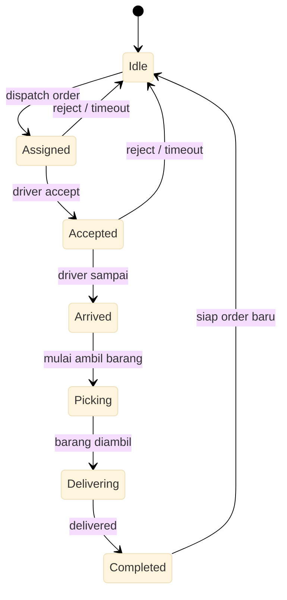

# Layanan Dispatch Order

Layanan dispatch order dengan pengumpul batch (timer MaxWindow + flush MinOrders), pencocok greedy driver-order (skor komposit: jarak+ETA+beban+prioritas+anti-starvation), mesin status driver 7 state, dan reassignment dengan exponential backoff.

Port **8096** | Paket `dispatch-service/`

---

## Arsitektur



## Komponen

### Pengumpul Batch (Batch Collector)

Order tidak langsung di-dispatch satu per satu, melainkan dikumpulkan dalam batch untuk optimasi pencocokan.

```go
type BatchCollector struct {
    mu         sync.Mutex
    queue      []Order
    maxWindow  time.Duration // 5 detik
    minOrders  int           // 3 order
    flushTimer *time.Timer
}

func (bc *BatchCollector) AddOrder(ctx context.Context, order Order) (<-chan Batch, error) {
    bc.mu.Lock()
    bc.queue = append(bc.queue, order)
    resultCh := make(chan Batch, 1)

    if len(bc.queue) >= bc.minOrders {
        batch := bc.drain()
        bc.mu.Unlock()
        go bc.dispatch(batch, resultCh)
        return resultCh, nil
    }

    if bc.flushTimer == nil {
        bc.flushTimer = time.AfterFunc(bc.maxWindow, func() {
            bc.mu.Lock()
            if len(bc.queue) > 0 {
                batch := bc.drain()
                bc.mu.Unlock()
                bc.dispatch(batch, resultCh)
            }
        })
    }

    bc.mu.Unlock()
    return resultCh, nil
}
```

| Parameter | Nilai | Deskripsi |
|-----------|-------|-----------|
| MaxWindow | 5 detik | Timer maksimal menunggu sebelum flush |
| MinOrders | 3 order | Jumlah minimum order untuk flush |

### Pencocok Greedy Driver-Order

Setelah batch terkumpul, pencocok menghitung skor komposit untuk setiap pasangan driver-order dan memilih yang terbaik.

```go
type MatchScore struct {
    DriverID     string
    OrderID      string
    Score        float64
    Distance     float64 // km
    ETA          float64 // menit
    DriverLoad   int
    WaitTime     time.Duration
}

func greedyMatch(drivers []Driver, orders []Order) []Assignment {
    var assignments []Assignment
    assignedDrivers := make(map[string]bool)
    assignedOrders := make(map[string]bool)

    for _, d := range drivers {
        if assignedDrivers[d.ID] {
            continue
        }
        var best *MatchScore
        for _, o := range orders {
            if assignedOrders[o.ID] {
                continue
            }
            score := computeScore(d, o)
            if best == nil || score.Score > best.Score {
                best = &score
            }
        }
        if best != nil {
            assignments = append(assignments, Assignment{
                DriverID: best.DriverID,
                OrderID:  best.OrderID,
                Score:    best.Score,
            })
            assignedDrivers[best.DriverID] = true
            assignedOrders[best.OrderID] = true
        }
    }
    return assignments
}
```

Skor komposit:

```go
func computeScore(d Driver, o Order) MatchScore {
    dist := haversine(d.Lat, d.Lng, o.PickupLat, o.PickupLng)
    eta := dist / d.AvgSpeed * 60 // menit
    loadFactor := float64(d.ActiveOrders) / float64(d.MaxOrders)

    // skor: semakin tinggi semakin baik
    distScore := 1.0 - (dist / maxDistance)
    etaScore := 1.0 - (eta / maxETA)
    loadScore := 1.0 - loadFactor
    priorityScore := float64(o.Priority) / 10.0

    // anti-starvation: order yang sudah menunggu lama dapat bonus
    waitScore := math.Min(o.WaitTime.Minutes()/30.0, 1.0) * 0.1

    score := 0.30*distScore + 0.25*etaScore + 0.20*loadScore + 0.15*priorityScore + 0.10*waitScore

    return MatchScore{
        DriverID:   d.ID,
        OrderID:    o.ID,
        Score:      score,
        Distance:   dist,
        ETA:        eta,
        DriverLoad: d.ActiveOrders,
        WaitTime:   o.WaitTime,
    }
}
```

| Faktor | Bobot | Deskripsi |
|--------|-------|-----------|
| Jarak | 30% | Haversine driver ke pickup |
| ETA | 25% | Perkiraan waktu tiba |
| Beban driver | 20% | Rasio order aktif vs. kapasitas |
| Prioritas order | 15% | Prioritas yang ditetapkan sistem |
| Anti-starvation | 10% | Bonus untuk order yang menunggu lama |

### Mesin Status Driver (7 State)



```go
type DriverState string

const (
    DriverIdle       DriverState = "idle"
    DriverAssigned   DriverState = "assigned"
    DriverAccepted   DriverState = "accepted"
    DriverArrived    DriverState = "arrived"
    DriverPicking    DriverState = "picking"
    DriverDelivering DriverState = "delivering"
    DriverCompleted  DriverState = "completed"
)

var validTransitions = map[DriverState][]DriverState{
    DriverIdle:       {DriverAssigned},
    DriverAssigned:   {DriverAccepted, DriverIdle},
    DriverAccepted:   {DriverArrived, DriverIdle},
    DriverArrived:    {DriverPicking},
    DriverPicking:    {DriverDelivering},
    DriverDelivering: {DriverCompleted},
    DriverCompleted:  {DriverIdle},
}
```

### Reassignment dengan Exponential Backoff

Ketika driver menolak atau timeout, order masuk ke antrean reassignment dengan backoff.

```go
type ReassignmentQueue struct {
    attempts map[string]int
    delays   []time.Duration // [2s, 4s, 8s, 16s, 30s]
}

func (rq *ReassignmentQueue) Schedule(assignmentID string) time.Duration {
    rq.attempts[assignmentID]++
    attempt := rq.attempts[assignmentID]
    if attempt > len(rq.delays) {
        return 0 // gagal, kembalikan ke manual assignment
    }
    delay := rq.delays[attempt-1]
    time.AfterFunc(delay, func() {
        rq.reassign(assignmentID)
    })
    return delay
}
```

Backoff schedule: 2 detik -> 4 detik -> 8 detik -> 16 detik -> 30 detik -> manual.

## API Endpoints

| Method | Path | Deskripsi |
|--------|------|-------------|
| `POST` | `/dispatch/order` | Kirim order untuk di-dispatch |
| `POST` | `/dispatch/driver/location` | Perbarui lokasi driver |
| `POST` | `/dispatch/driver/accept` | Driver menerima assignment |
| `POST` | `/dispatch/driver/reject` | Driver menolak assignment |

### POST /dispatch/order

```json
// Request
{
  "order_id": "ORD123",
  "pickup_lat": -6.2146,
  "pickup_lng": 106.8451,
  "priority": 5
}

// Response 202 (dalam antrean batch)
{
  "status": "queued",
  "batch_id": "BATCH001",
  "estimated_dispatch_ms": 2500
}
```

### POST /dispatch/driver/accept

```json
// Request
{
  "driver_id": "DRV001",
  "assignment_id": "ASG001"
}

// Response 200
{"status": "accepted", "order_id": "ORD123"}
```

### POST /dispatch/driver/reject

```json
// Request
{
  "driver_id": "DRV001",
  "assignment_id": "ASG001",
  "reason": "too_far"
}

// Response 200
{"status": "rejected", "reassignment_in_ms": 4000}
```

## Algoritma Kunci

| Algoritma | Penggunaan |
|-----------|------------|
| Batch collector | MaxWindow 5s + MinOrders 3 untuk optimasi batch |
| Greedy matching | Iterasi driver-order dengan skor komposit |
| Composite scoring | 30% jarak + 25% ETA + 20% beban + 15% prioritas + 10% anti-starvation |
| Driver state machine | 7 state dengan validasi transisi |
| Exponential backoff | 2s, 4s, 8s, 16s, 30s sebelum assign manual |

## Keputusan Teknis

- **Batch collector menggantikan dispatch langsung**: Mengumpulkan order dalam batch 5 detik / 3 order memungkinkan pencocokan yang lebih optimal secara global daripada dispatch satu per satu. Trade-off: order menunggu sedikit lebih lama (maks 5 detik) untuk kecocokan yang lebih baik.
- **Greedy matcher, bukan Hungarian algorithm**: Hungarian algorithm memberikan solusi optimal secara matematis tetapi kompleksitas O(n^3). Greedy O(n*m) cukup untuk ukuran batch tipikal (5-20 order, 10-50 driver) dan lebih mudah diimplementasikan serta di-debug.
- **Anti-starvation weight (10%)**: Mencegah order tertentu tidak pernah ter-assign karena selalu kalah skor. Bobot meningkat seiring waktu tunggu, mencapai maksimum setelah 30 menit. Ini memastikan keadilan tanpa mengorbankan efisiensi secara signifikan.
- **7 state driver dengan transisi eksplisit**: Setiap transisi divalidasi terhadap daftar state yang diizinkan. State ilegal (misalnya, `Idle -> Delivering`) ditolak. Ini mencegah bug due to race condition dari pembaruan status driver yang tidak sinkron.
- **Exponential backoff untuk reassignment**: Driver yang menolak atau timeout tidak langsung di-assign ulang ke driver yang sama. Backoff eksponensial (2s-30s) memberi waktu untuk situasi berubah (driver jadi tersedia, order dibatalkan) tanpa membanjiri notifikasi.
